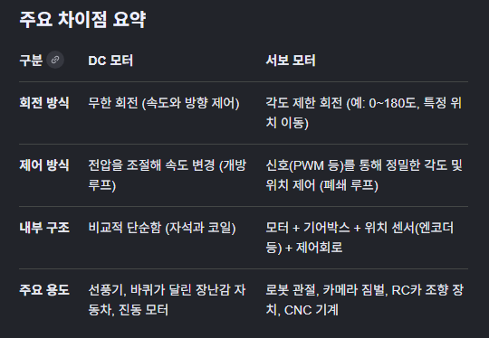
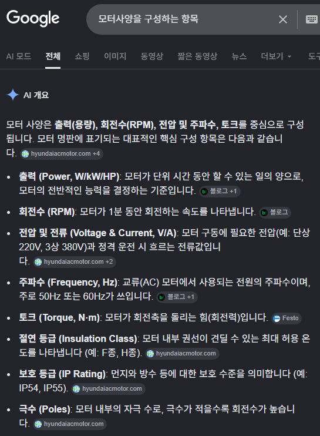

수행목표
핵심 부품 기구인 모터에 대해서 학습한다.

수행단계
1.모터에 대해서 다음 사항을 조사한다.
2.모터의 기본 유형 : DC 모터, 서보 모터
3.모터의 사양을 구성하는 항목
모터의 제어 원리 - 모터의 회전 속도 및 회전 방향을 바꾸는 방법
모터 드라이버에 대하여
조사한 내용은 형식 문서로 만들고 게시한다. 파일 이름은 2_mortor.md (마크다운 파일의 경우)로 한다.

참고사항
단계의 참고사항을 확인한다.

제약사항
각자 프로젝트 디렉토리를 생성하고, 디렉토리 아래에 단계 별 디렉토리를 생성한다.
각 문제의 산출물은 해당 디렉토리에 게시한다.
실습 환경에서 허용되는 범위 내에서, 이를 동료 학습자 및 평가자가 확인할 수 있는 형태로 공유한다.
깃허브 리파지토리를 활용해 공유하는 것을 추천하며, 비공개(Private) 리파지토리로 구성하는 경우, 동료 학습자 및 평가자가 이를 확인할 수 있도록 권한을 부여한다.

##1.조사결과{
    서보모터 kg*cm 용어정리
    kg·cm = 서보축에서 1cm 떨어진 곳에 몇 kg의 힘을 버틸 수 있는가

    서보모터 종류
    //https://blog.naver.com/fillnet/222667240957?photoView=5
    
    서보모터(전원/구동 방식 기준 :: 서보모터 분류)
        ├─ DC 서보모터//https://youtu.be/aslTzu_StSw?si=VZVhp2sGx7ZeZb_y
        ├─ AC 서보모터
        └─ 브러시리스 서보모터
        // BLDC(브러시 리스 DC 모터), 실제 제어는 3상굘처럼 다루는 경우가 존재하여
        //AC서보모터와경계가 애매한 구간이 존재

    서보모터(운동방식 기준 :: 서보모터 분류)
        ├─ 회전형 서보모터 //https://youtube.com/shorts/YBxQoqlEP2o?si=Bb3d5ls9HH_0RZ9B
        └─ 선형 서보모터 //https://youtube.com/shorts/VdsjZMKpL6E?si=4WMfkMbuIsOFSERB

    //추가적으로 알아두면 좋은것
    //서보모터 = 피드백을 이용해 목표 위치를 맞추는 모터
    //스테핑모터 = 정해진 각도 단위로 한 스텝씩 움직이는 모터
}

##2.조사결과{
    DC모터와 서보모터의 차이
        1.DC모터는 전원을 공급하면 일정한 방향으로 무한히 회전하는 모터

        2.Servo모터는 모터, 제어회로, 센서등을 결합해 특정각도 및 정학한 위치로 이동하고 멈출수 있게 정밀하게 제어하는 모터.

        주요 차이점 요약
} 

##3. 조사결과{
    모터사양을 구성하는 항목

}