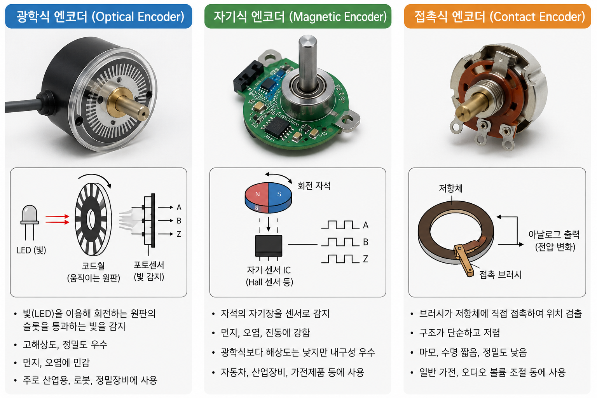

# 5_encoder.md

# 엔코더 모터에 대한 조사

## 1. 수행목표

엔코더의 개념과 사용법을 학습하고, 로봇 운반차에서 엔코더 모터를 이용하여 바퀴의 회전 수, 속도, 이동 거리 등을 계산하는 방법을 이해한다. 또한 엔코더 데이터와 실제 주행 결과 사이에 차이가 발생하는 이유와 이를 보정하는 방법을 조사한다.

---

## 2. 엔코더 모터의 정의

엔코더 모터란 일반 모터에 엔코더가 결합된 형태의 모터를 말한다. 모터는 전기 에너지를 회전 운동으로 바꾸는 장치이고, 엔코더는 모터 축이나 바퀴가 얼마나 회전했는지 측정하는 센서이다.

즉, 엔코더 모터는 단순히 회전만 하는 모터가 아니라, 회전한 정도를 전기적 신호로 출력할 수 있는 모터이다. 로봇에서는 이 신호를 이용해 바퀴가 몇 바퀴 돌았는지, 로봇이 얼마나 이동했는지, 현재 속도가 어느 정도인지 계산할 수 있다.

엔코더 모터는 다음과 같은 분야에서 많이 사용된다.

| 사용 분야 | 활용 목적 |
|---|---|
| 로봇 운반차 | 이동 거리, 속도, 방향 제어 |
| 모바일 로봇 | 위치 추정, 주행 제어 |
| 컨베이어 시스템 | 이동량 측정, 속도 제어 |
| CNC 장비 | 축 위치 제어 |
| 서보 시스템 | 위치 피드백 제어 |

로봇 운반차에서는 엔코더 모터를 사용하면 단순히 모터에 전압을 주어 움직이는 방식보다 더 정확한 주행 제어가 가능하다.

---

## 3. 엔코더 부의 역할

### 3.1 엔코더 부의 역할

엔코더 부는 모터의 회전 상태를 측정하여 제어기에게 전달하는 역할을 한다. 여기서 제어기는 보통 아두이노, 라즈베리파이, Jetson, STM32, Teensy 같은 마이크로컨트롤러 또는 임베디드 보드가 될 수 있다.

엔코더 부가 하는 역할은 다음과 같다.

| 역할 | 설명 |
|---|---|
| 회전량 측정 | 모터 축이나 바퀴가 얼마나 회전했는지 측정한다. |
| 회전 방향 판단 | A상, B상 신호의 순서를 이용해 정방향/역방향을 판단한다. |
| 속도 계산 | 일정 시간 동안 들어온 펄스 수를 이용해 회전 속도를 계산한다. |
| 위치 추정 | 바퀴 회전량을 누적하여 로봇의 이동 거리와 위치를 추정한다. |
| 피드백 제어 | 목표 속도와 실제 속도의 차이를 줄이는 제어에 사용된다. |

엔코더는 로봇이 실제로 얼마나 움직였는지 확인하는 피드백 센서이기 때문에, 정확한 주행 제어에서 매우 중요하다.

---

### 3.2 엔코더 부의 구성 방식

엔코더는 측정 방식에 따라 여러 종류가 있지만, 로봇 모터에서는 주로 광학식 엔코더와 자기식 엔코더가 많이 사용된다.

| 구분 | 구성 | 작동 방식 | 특징 |
|---|---|---|---|
| 광학식 엔코더 | 회전 디스크, LED, 포토센서 | 디스크의 구멍이나 패턴을 빛으로 감지 | 정밀도가 높지만 먼지와 오염에 약할 수 있다. |
| 자기식 엔코더 | 자석, 홀 센서 | 자석의 N극/S극 변화를 감지 | 구조가 비교적 단순하고 먼지에 강하다. |
| 접촉식 엔코더 | 브러시, 접점 패턴 | 접점이 닿는 위치에 따라 신호 발생 | 구조는 단순하지만 마모가 발생할 수 있다. |

소형 로봇이나 DC 기어드 모터에서는 자기식 엔코더가 많이 사용된다. 모터 축에 작은 자석이 붙어 있고, 자석이 회전하면 홀 센서가 자기장의 변화를 감지하여 펄스 신호를 만든다.

---

### 3.3 엔코더의 작동 원리

엔코더는 회전 운동을 전기적 펄스 신호로 바꾸는 장치이다. 모터 축이 회전하면 엔코더 내부의 디스크나 자석도 함께 회전한다. 이때 센서가 회전 패턴을 감지하고, 일정 각도마다 HIGH/LOW 신호를 출력한다.

이 HIGH/LOW 신호가 반복되면 펄스가 만들어진다. 제어기는 이 펄스의 개수를 세어 회전량을 계산한다.

예를 들어, 엔코더가 한 바퀴에 20개의 펄스를 출력한다면 다음과 같이 해석할 수 있다.

| 펄스 수 | 회전량 |
|---|---|
| 20펄스 | 모터 축 1바퀴 회전 |
| 10펄스 | 모터 축 0.5바퀴 회전 |
| 40펄스 | 모터 축 2바퀴 회전 |

엔코더가 A상과 B상 두 개의 신호를 출력하는 경우도 많다. 이를 쿼드러처 엔코더라고 한다. A상과 B상은 서로 약간의 위상 차이를 가지고 출력된다. 제어기는 두 신호 중 어느 신호가 먼저 변하는지를 확인하여 회전 방향을 판단할 수 있다.

ex-1)

A상이 B상보다 먼저 변하면 정방향, B상이 A상보다 먼저 변하면 역방향으로 판단하는 방식이다.

ex-2)
-실무기준
로봇이 앞으로 갈 때 엔코더 카운트가 증가하면 정방향
로봇이 뒤로 갈 때 엔코더 카운트가 감소하면 역방향
---

## 4. 펄스와 해상도의 개념 및 관계

### 4.1 펄스의 개념

펄스는 엔코더가 출력하는 디지털 신호의 한 번의 변화 또는 반복 신호를 의미한다. 엔코더는 회전할 때마다 일정한 간격으로 펄스를 출력한다. 제어기는 이 펄스를 카운트하여 회전량을 계산한다.

펄스 수가 많을수록 더 세밀하게 회전량을 측정할 수 있다.

---

### 4.2 해상도의 개념

해상도는 엔코더가 회전을 얼마나 세밀하게 나누어 측정할 수 있는지를 의미한다. 보통 PPR 또는 CPR이라는 단위로 표현한다.

#### 중요
펄스 = HIGH로 튀어오른 신호 부분
사이클 = LOW → HIGH → LOW 전체 반복

| 용어 | 의미 |
|---|---|
| PPR | Pulse Per Revolution, 1회전당 발생하는 펄스 수 |
| CPR | Count Per Revolution 또는 Cycle Per Revolution으로 사용되며, 문맥에 따라 의미를 확인해야 한다. 한 바퀴 회전할 때 발생하는 사이클 수|
| 해상도 | 회전 한 바퀴를 얼마나 작은 단위로 나누어 측정할 수 있는지 나타내는 값 |

| 용어 | 쉬운 의미 | 예시 |
|---|---|---|
| PPR<br>(Pulses Per Revolution) | 엔코더 축이 한 바퀴 돌 때 발생하는 펄스 수 | A상 HIGH 펄스가 100개 발생하면 100 PPR |
| CPR<br>(Cycles Per Revolution) | 엔코더 축이 한 바퀴 돌 때 신호 주기가 몇 번 반복되는지 | A상 파형이 100번 반복되면 100 CPR |
| Counts Per Revolution | 제어기나 프로그램이 실제로 세는 카운트 수 | 1체배는 100카운트, 2체배는 200카운트, 4체배는 400카운트 |

PPR = 깃발이 몇 개 지나갔는지
CPR = 깃발 신호 패턴이 몇 번 반복됐는지
Counts Per Revolution = 제어기가 실제로 몇 번 셌는지

PPR은 깃발 하나하나가 지나가는 펄스 수이다.
CPR은 바퀴가 한 바퀴 돌 때 신호 패턴이 몇 번 반복되는지이다.
Counts Per Revolution은 제어기가 실제로 카운팅한 수이다.

예를 들어 1회전에 100개의 펄스를 출력하는 엔코더는 1펄스당 3.6도씩 회전한 것으로 볼 수 있다.

```text
1펄스당 각도 = 360도 / PPR
1펄스당 각도 = 360도 / 100 = 3.6도
```

만약 PPR이 1000이라면 1펄스당 각도는 0.36도가 된다. 따라서 PPR이 높을수록 더 정밀한 측정이 가능하다.

---

### 4.3 펄스와 해상도의 관계

펄스와 해상도는 직접적인 관계가 있다. 한 바퀴를 돌 때 발생하는 펄스 수가 많을수록 해상도가 높다.

| PPR | 1펄스당 회전 각도 | 특징 |
|---|---|---|
| 20 PPR | 18도 | 해상도가 낮아 정밀 제어가 어렵다. |
| 100 PPR | 3.6도 | 일반적인 속도 측정에 사용할 수 있다. |
| 500 PPR | 0.72도 | 비교적 정밀한 위치 제어가 가능하다. |
| 1000 PPR | 0.36도 | 정밀 제어에 유리하다. |

또한 A상과 B상을 모두 사용하는 쿼드러처 엔코더에서는 신호를 읽는 방식에 따라 카운트 수가 증가할 수 있다.

| 읽는 방식 | 설명 | 카운트 수 |
|---|---|---|
| 1체배 | A상의 상승 에지만 카운트 | 기본 PPR |
| 2체배 | A상의 상승/하강 에지를 카운트 | 2배 |
| 4체배 | A상과 B상의 상승/하강 에지를 모두 카운트 | 4배 |

예를 들어 100 PPR 엔코더를 4체배로 읽으면 실제 제어기에서 1회전당 400카운트로 사용할 수 있다. 이 경우 더 정밀한 회전 측정이 가능하다.

---

## 5. 엔코더 데이터를 활용한 속도 계산 방법

### 5.1 회전 속도 계산

엔코더로 속도를 계산하려면 일정 시간 동안 들어온 펄스 수를 측정하면 된다.

기본 공식은 다음과 같다.

```text
초당 회전수(RPS) = 일정 시간 동안 측정한 펄스 수 / (PPR × 측정 시간)
분당 회전수(RPM) = RPS × 60
```

예를 들어 PPR이 100인 엔코더에서 1초 동안 50개의 펄스가 측정되었다면 다음과 같다.

```text
RPS = 50 / (100 × 1) = 0.5회전/초
RPM = 0.5 × 60 = 30RPM
```

즉, 모터는 1분에 30회전하고 있는 것이다.

---

### 5.2 바퀴 선속도 계산

로봇 운반차에서는 모터의 회전 속도보다 바퀴가 실제로 바닥 위를 얼마나 빠르게 이동하는지가 중요하다. 이를 선속도라고 한다.

바퀴의 둘레는 다음과 같이 계산한다.

```text
바퀴 둘레 = π × 바퀴 지름
```

그리고 바퀴 선속도는 다음과 같이 계산한다.

```text
선속도 = 초당 회전수(RPS) × 바퀴 둘레
```

예를 들어 바퀴 지름이 0.1m이고, 바퀴가 초당 2회전한다면 다음과 같다.

```text
바퀴 둘레 = 3.14 × 0.1 = 0.314m
선속도 = 2 × 0.314 = 0.628m/s
```

따라서 로봇은 이론적으로 초당 약 0.628m 이동한다.

---

## 6. 엔코더 데이터를 활용한 거리 계산 방법

### 6.1 이동 거리 계산

엔코더로 이동 거리를 계산하려면 누적 펄스 수를 이용한다.

기본 공식은 다음과 같다.

```text
바퀴 회전수 = 누적 펄스 수 / PPR
이동 거리 = 바퀴 회전수 × 바퀴 둘레
```

즉, 한 펄스당 이동 거리를 구한 뒤 누적 펄스 수에 곱해도 된다.

```text
1펄스당 이동 거리 = 바퀴 둘레 / PPR
이동 거리 = 누적 펄스 수 × 1펄스당 이동 거리
```

예를 들어 바퀴 지름이 0.1m이고 PPR이 100인 엔코더가 있다고 가정한다.

```text
바퀴 둘레 = 3.14 × 0.1 = 0.314m
1펄스당 이동 거리 = 0.314 / 100 = 0.00314m
```

이 상태에서 500개의 펄스가 측정되었다면 다음과 같다.

```text
이동 거리 = 500 × 0.00314 = 1.57m
```

따라서 로봇은 이론적으로 약 1.57m 이동한 것으로 계산할 수 있다.

---

### 6.2 기어비가 있는 경우

엔코더가 모터 축에 달려 있고 바퀴는 감속기 뒤쪽에 연결되어 있다면 기어비를 고려해야 한다.

예를 들어 모터축 엔코더가 1회전당 20펄스를 출력하고, 감속비가 1:30이라면 바퀴가 1회전하기 위해 모터축은 30회전해야 한다.

```text
바퀴 1회전당 펄스 수 = 모터축 PPR × 감속비
바퀴 1회전당 펄스 수 = 20 × 30 = 600펄스
```

따라서 실제 바퀴 이동 거리를 계산할 때는 모터축 PPR이 아니라 바퀴 1회전당 펄스 수를 기준으로 계산해야 한다.

---

## 7. 엔코더 데이터와 실제 주행 결과의 차이가 발생하는 이유

엔코더 데이터는 바퀴가 얼마나 회전했는지를 측정한다. 하지만 바퀴가 회전한 양과 로봇이 실제로 이동한 거리가 항상 정확히 일치하는 것은 아니다.

대표적인 오차 원인은 다음과 같다.

| 오차 원인 | 설명 |
|---|---|
| 바퀴 미끄러짐 | 바퀴가 회전했지만 바닥에서 미끄러지면 실제 이동 거리는 계산값보다 짧아진다. |
| 바퀴 지름 오차 | 실제 바퀴 지름이 계산에 사용한 값과 다르면 거리 계산에 오차가 생긴다. |
| 타이어 변형 | 하중 때문에 바퀴가 눌리면 실제 유효 반지름이 달라진다. |
| 바닥 상태 | 먼지, 경사, 요철, 미끄러운 바닥에서 오차가 커진다. |
| 좌우 바퀴 차이 | 좌우 바퀴의 지름이나 마찰 상태가 다르면 직진이 틀어진다. |
| 기어 백래시 | 기어 사이의 유격 때문에 회전 방향 전환 시 오차가 발생할 수 있다. |
| 엔코더 신호 누락 | 빠른 회전이나 노이즈로 인해 펄스를 제대로 읽지 못할 수 있다. |
| 샘플링 시간 오차 | 속도 계산 시 측정 시간이 부정확하면 속도 값이 흔들릴 수 있다. |

특히 모바일 로봇에서는 바퀴 미끄러짐이 큰 오차 원인이 된다. 엔코더는 바퀴가 회전했다는 사실은 알 수 있지만, 바퀴가 실제로 바닥을 밀고 로봇을 이동시켰는지는 직접 알 수 없기 때문이다.

---

## 8. 엔코더 오차 보정 방법

### 8.1 바퀴 지름 보정

바퀴 지름을 자로 측정한 값만 사용하면 오차가 생길 수 있다. 실제 주행 실험을 통해 유효 바퀴 지름을 보정할 수 있다.

예를 들어 로봇에게 1m를 이동하라고 명령했는데 실제로 0.95m만 이동했다면 계산에 사용한 바퀴 지름이나 펄스당 이동 거리를 조정해야 한다.

```text
보정 계수 = 실제 이동 거리 / 계산 이동 거리
```

이 보정 계수를 이동 거리 계산식에 곱하면 오차를 줄일 수 있다.

---

### 8.2 좌우 바퀴 보정

차동 구동 로봇에서는 좌우 바퀴의 차이가 크면 직진 명령을 내려도 한쪽으로 휘어진다. 이 경우 좌우 바퀴의 펄스당 이동 거리 또는 속도 명령을 따로 보정해야 한다.

예를 들어 오른쪽으로 휘어진다면 왼쪽 바퀴가 상대적으로 더 많이 이동했거나 오른쪽 바퀴가 덜 이동했을 가능성이 있다. 이때 오른쪽 바퀴의 속도를 약간 높이거나 왼쪽 바퀴의 속도를 약간 낮추는 방식으로 보정할 수 있다.

---

### 8.3 반복 주행 실험을 통한 보정

엔코더 보정은 한 번의 실험으로 끝내기보다 여러 번 반복하여 평균값을 사용하는 것이 좋다.

예시 보정 절차는 다음과 같다.

1. 바닥에 1m 또는 2m 기준선을 표시한다.
2. 로봇에게 기준 거리만큼 직진 명령을 내린다.
3. 실제 이동 거리를 측정한다.
4. 계산 이동 거리와 실제 이동 거리의 차이를 기록한다.
5. 여러 번 반복하여 평균 오차를 구한다.
6. 보정 계수를 계산식에 적용한다.

이 과정을 통해 엔코더 기반 거리 계산의 정확도를 높일 수 있다.

---

### 8.4 다른 센서와의 융합

엔코더만 사용하면 바퀴 미끄러짐이나 바닥 상태 변화에 약하다. 따라서 더 정확한 위치 추정을 위해 다른 센서와 함께 사용하는 경우가 많다.

| 센서 | 보완 역할 |
|---|---|
| IMU | 회전 각도, 기울기, 각속도 보정 |
| LiDAR | 주변 지도와 비교하여 위치 보정 |
| 카메라 | 시각 정보를 이용한 위치 추정 |
| GPS | 실외에서 전역 위치 보정 |
| 라인 센서 | 정해진 경로 주행 보정 |

로봇에서는 엔코더 데이터를 단독으로 사용하기보다 IMU, LiDAR, 카메라 등의 센서와 함께 사용하면 더 안정적인 주행이 가능하다.

---

## 9. 로봇 운반차에서 엔코더 모터를 사용할 때 고려사항

로봇 운반차에 엔코더 모터를 사용할 때는 다음 사항을 고려해야 한다.

| 고려사항 | 설명 |
|---|---|
| PPR | 필요한 위치 정밀도에 맞는 해상도를 선택해야 한다. |
| 기어비 | 모터축 기준 PPR과 바퀴축 기준 PPR을 구분해야 한다. |
| 바퀴 지름 | 거리 계산에 직접 영향을 주므로 정확히 측정해야 한다. |
| 제어 주기 | 너무 느리면 속도 계산이 부정확해질 수 있다. |
| 인터럽트 사용 | 빠른 펄스를 놓치지 않기 위해 인터럽트를 사용하는 것이 좋다. |
| 노이즈 대책 | 배선 정리, 풀업 저항, 필터링 등을 고려해야 한다. |
| 바닥 환경 | 미끄러운 바닥에서는 엔코더 오차가 커질 수 있다. |
| 하중 변화 | 적재물 무게에 따라 바퀴 눌림과 미끄러짐이 달라질 수 있다. |


#### 인터럽트 사용이유
실생활 비유

인터럽트 없이 엔코더를 읽는 건:

문 앞을 사람이 지나는지 내가 계속 눈으로 확인하는 방식

인터럽트로 읽는 건:

문에 자동 센서를 달아놓고 사람이 지나갈 때마다 알림이 울리는 방식

자동 센서가 있으면 내가 다른 일을 하고 있어도 사람이 지나간 것을 놓치지 않겠지?

엔코더 인터럽트도 똑같아.
모터가 빠르게 돌 때 펄스를 놓치지 않게 해 주는 역할을 해.

인터럽트 없이 읽는 경우
if (digitalRead(encoderA) == HIGH) {
    count++;
}

인터럽트 쓰는 경우
attachInterrupt(digitalPinToInterrupt(2), encoderISR, RISING);

void encoderISR() {
    count++;
}

---

## 10. 결론

엔코더 모터는 모터에 엔코더가 결합된 장치로, 모터의 회전량과 회전 방향을 측정할 수 있다. 로봇 운반차에서는 엔코더 데이터를 이용하여 바퀴의 회전 수, 속도, 이동 거리 등을 계산할 수 있으며, 이를 통해 보다 정확한 주행 제어가 가능하다.

엔코더는 펄스 신호를 출력하고, 제어기는 이 펄스를 카운트하여 회전량을 계산한다. PPR이 높을수록 해상도가 높아져 더 세밀한 측정이 가능하다. 또한 A상과 B상을 사용하는 쿼드러처 엔코더는 회전 방향 판단과 고해상도 측정에 유리하다.

하지만 엔코더 데이터와 실제 주행 결과는 항상 일치하지 않는다. 바퀴 미끄러짐, 바퀴 지름 오차, 바닥 상태, 하중 변화, 기어 백래시, 신호 누락 등으로 인해 오차가 발생할 수 있다. 따라서 실제 주행 실험을 통해 보정 계수를 구하고, 필요하면 IMU, LiDAR, 카메라 등의 센서와 함께 사용해야 한다.

결론적으로 엔코더 모터는 로봇 운반차의 속도 제어와 거리 계산에 매우 중요한 부품이며, 정확한 사용을 위해서는 펄스, 해상도, 기어비, 바퀴 지름, 오차 보정 방법을 함께 이해해야 한다.

---

## 11. 참고자료

| 소제목 | 참고 링크 |
|---|---|
| 2. 엔코더 모터의 정의 | https://www.dynapar.com/technology/encoder_basics/ |
| 3.1 엔코더 부의 역할 | https://www.omchsmps.com/what-is-rotary-encoder/ |
| 3.2 엔코더 부의 구성 방식 | https://www.digikey.com/en/blog/understanding-magnetic-encoders |
| 3.3 엔코더의 작동 원리 | https://www.usdigital.com/news/blog/what-is-quadrature/ |
| 4.1 펄스의 개념 | https://www.dynapar.com/technology/encoder_basics/ |
| 4.2 해상도의 개념 | https://en.wikipedia.org/wiki/Incremental_encoder |
| 4.3 펄스와 해상도의 관계 | https://www.usdigital.com/news/blog/what-is-quadrature/ |
| 5. 엔코더 데이터를 활용한 속도 계산 방법 | https://www.motioncontroltips.com/how-are-encoders-used-for-speed-measurement/ |
| 6. 엔코더 데이터를 활용한 거리 계산 방법 | https://zbotic.in/encoder-wheel-odometry-robot-distance-position-arduino/ |
| 7. 엔코더 데이터와 실제 주행 결과의 차이가 발생하는 이유 | https://blogs.ntu.edu.sg/scemdp-1920s2-g16/ |
| 8. 엔코더 오차 보정 방법 | https://www-personal.umich.edu/~johannb/Papers/paper58.pdf |
| 9. 로봇 운반차에서 엔코더 모터를 사용할 때 고려사항 | https://control.com/technical-articles/an-introduction-to-motor-encoder-types/ |
