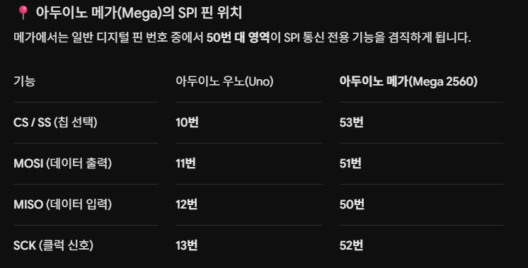
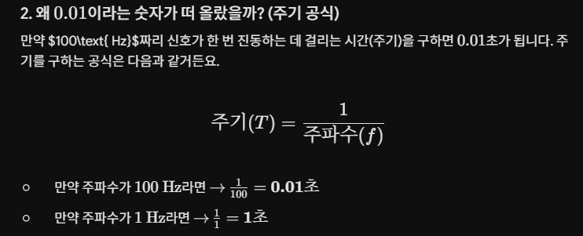
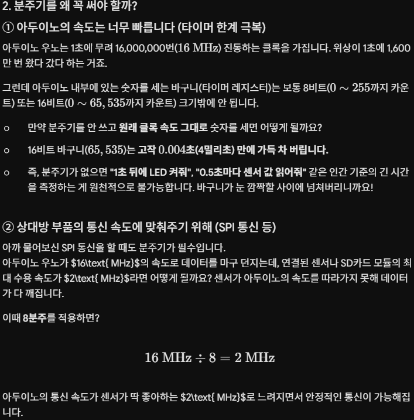

# 마이크로컨트롤러와 로봇 제어

## 1. 수행 목표

마이크로컨트롤러의 개념과 역할을 이해하고, 마이크로컨트롤러를 이용하여 로봇의 센서와 구동 장치를 제어하는 방법을 조사한다.

또한 PWM, 디지털 입출력, 아날로그 입력과 같은 기본 인터페이스와 UART, I2C, SPI 등의 통신 방식을 이해한다. 실시간 제어에 필요한 타이머의 개념과 사용 절차를 학습하고, 대표적인 마이크로컨트롤러 보드인 아두이노의 구조와 활용 방법을 알아본다.

---

# 2. 마이크로컨트롤러의 개념

## 2.1 마이크로컨트롤러란?

마이크로컨트롤러는 하나의 반도체 칩 안에 다음과 같은 기능을 포함한 소형 컴퓨터이다.

* 중앙처리장치인 CPU
* 데이터를 임시로 저장하는 RAM
* 프로그램을 저장하는 플래시 메모리
* 디지털 입출력 핀
* 아날로그 입력 장치
* 타이머
* 통신 장치
* 인터럽트 제어 장치

일반적인 컴퓨터가 문서 작성, 인터넷, 영상 처리 등 다양한 작업을 수행하도록 만들어진 것과 달리, 마이크로컨트롤러는 특정 장치를 제어하는 목적에 적합하게 만들어진다.

예를 들어 전자레인지, 세탁기, 자동차, 드론, 로봇, 스마트 조명, 온도 조절기 등에는 마이크로컨트롤러가 사용된다.

마이크로컨트롤러는 흔히 MCU라고 부른다.

> MCU는 Microcontroller Unit의 약자이다.

> 어느 특정한 목적을 가지고 특정 장치를 제어하는것에 대한 목적을 두고 만들어진 PCB판 같은거다.
---

## 2.2 마이크로프로세서와 마이크로컨트롤러의 차이

마이크로프로세서는 주로 CPU 기능을 중심으로 구성된다. 따라서 메모리, 저장장치, 입출력 장치 등을 외부에 추가해야 하는 경우가 많다.

반면 마이크로컨트롤러는 CPU, 메모리, 입출력 장치, 타이머, 통신 장치 등이 하나의 칩 안에 포함된다.

| 구분       | 마이크로프로세서           | 마이크로컨트롤러                 |
| -------- | ------------------ | ------------------------ |
| 주요 목적    | 고성능 계산 및 운영체제 실행   | 특정 장치 제어                 |
| 구성       | CPU 중심             | CPU, 메모리, 입출력 장치 통합      |
| 소비 전력    | 비교적 높음             | 비교적 낮음                   |
| 처리 성능    | 높음                 | 상대적으로 낮음                 |
| 대표 사용 사례 | PC, 노트북, 서버        | 로봇, 가전제품, 센서 제어          |
| 대표 장치    | Intel CPU, AMD CPU | ATmega328P, STM32, ESP32 |

| 구분          | 마이크로프로세서(MPU)              | 마이크로컨트롤러(MCU)                     |
| ----------- | -------------------------- | --------------------------------- |
| 칩 내부의 중심 구성 | 주로 CPU 중심                  | CPU + 메모리 + 입출력 장치                |
| RAM·저장공간    | 외부 칩이 필요한 경우가 많음           | 칩 내부에 포함                          |
| GPIO 핀      | 직접 제어용 핀이 적거나 별도 장치 필요     | 센서·LED·모터 제어용 GPIO 포함             |
| 타이머·PWM·ADC | 외부 부품이 필요할 수 있음            | 대부분 내부에 포함                        |
| 운영체제        | Linux, Windows 같은 OS 사용 가능 | 보통 특정 제어 프로그램을 바로 실행              |
| 성능          | 비교적 높음                     | 비교적 낮지만 제어에 적합                    |
| 소비전력        | 비교적 큼                      | 작음                                |
| 대표 예시       | PC CPU, Raspberry Pi의 프로세서 | Arduino의 ATmega328P, STM32, ESP32 |


라즈베리파이와 Jetson 같은 보드는 운영체제를 실행할 수 있는 마이크로프로세서 기반의 소형 컴퓨터에 가깝다.

반면 아두이노 우노는 ATmega328P 마이크로컨트롤러를 사용하는 제어용 보드이다.

---

# 3. 로봇에서 마이크로컨트롤러의 역할

마이크로컨트롤러는 로봇에서 센서 정보를 읽고, 프로그램의 조건에 따라 모터와 같은 출력 장치를 제어하는 역할을 한다.

기본적인 로봇 제어 흐름은 다음과 같다.

```text
센서 입력
   ↓
마이크로컨트롤러
   ↓
판단 및 제어 연산
   ↓
모터 드라이버
   ↓
DC 모터, 서보 모터, 스테핑 모터
```

예를 들어 라인 트레이싱 로봇은 다음과 같이 동작한다.

1. 적외선 센서로 바닥의 검은 선을 감지한다.
2. 마이크로컨트롤러가 센서 값을 읽는다.
3. 로봇이 선의 왼쪽 또는 오른쪽으로 벗어났는지 판단한다.
4. PWM 신호를 이용하여 왼쪽과 오른쪽 모터의 속도를 조절한다.
5. 로봇이 검은 선을 따라 이동한다.

마이크로컨트롤러가 로봇에서 담당하는 주요 역할은 다음과 같다.

## 3.1 센서 데이터 수집

마이크로컨트롤러는 로봇에 연결된 여러 센서의 값을 읽는다.

대표적인 센서는 다음과 같다.

* 적외선 센서
* 초음파 센서
* 온도 센서
* 습도 센서
* 조도 센서
* 컬러 센서
* 가속도 센서
* 자이로 센서
* 엔코더
* 거리 센서

센서에 따라 디지털 입력, 아날로그 입력 또는 통신 방식으로 데이터를 읽는다.

## 3.2 제어 연산

읽어온 센서 데이터를 이용하여 로봇의 동작을 결정한다.

예를 들어 초음파 센서에서 측정한 거리가 10cm 이하라면 로봇을 정지시키거나 회전하도록 프로그램할 수 있다.

```cpp
if (distance <= 10) {
    stopMotor();
} else {
    moveForward();
}
```

## 3.3 구동 장치 제어

마이크로컨트롤러는 모터, 부저, LED, 릴레이 등의 장치를 제어한다.

로봇에서 많이 사용되는 출력 장치는 다음과 같다.

* DC 모터
* 서보 모터
* 스테핑 모터
* 솔레노이드
* LED
* 부저
* 릴레이


| 장치     | 추천 자료                                                                                                                             | 자료에서 확인할 수 있는 내용                       |
| ------ | --------------------------------------------------------------------------------------------------------------------------------- | -------------------------------------- |
| DC 모터  | [Adafruit – DC Motors](https://learn.adafruit.com/use-dc-stepper-servo-motor-solenoid-rp2040-pico/dc-motors)                      | DC 모터 사진, 회전 방향, 속도 제어, H-브리지 사용 방법    |
| 서보 모터  | [Adafruit – Servo Motors](https://learn.adafruit.com/adafruit-motor-selection-guide/rc-servos)                                    | 서보 모터의 구조, 피드백 제어, 위치·각도 제어 특징         |
| 스테핑 모터 | [Adafruit – All About Stepper Motors](https://learn.adafruit.com/all-about-stepper-motors?view=all)                               | 스테핑 모터 사진, 코일 구조, 스텝 단위 회전, 종류와 구동 원리  |
| 솔레노이드  | [Adafruit – Solenoids](https://learn.adafruit.com/use-dc-stepper-servo-motor-solenoid-rp2040-pico/solenoids)                      | 솔레노이드 사진, 밀고 당기는 동작, 전자석 원리, MOSFET 연결 |
| LED    | [SparkFun – Light Emitting Diodes](https://learn.sparkfun.com/tutorials/light-emitting-diodes-leds/all)                           | LED 구조, 극성, 색상, 전류 제한 저항, 기본 회로        |
| 부저     | [SparkFun – Buzzer](https://learn.sparkfun.com/tutorials/activity-guide-for-sparkfun-tinker-kit/circuit-5-buzzer)                 | 부저 사진, 소리가 발생하는 원리, 음높이 변경, 아두이노 예제    |
| 릴레이    | [SparkFun – Using Relays](https://learn.sparkfun.com/tutorials/sik-experiment-guide-for-arduino---v33/experiment-13-using-relays) | 릴레이 내부 전자석, 스위치 원리, 배선도, 고전력 장치 제어     |

| 장치 | 주요 특징 | 대표적인 사용 분야 |
|---|---|---|
| DC 모터 | 전압을 가하면 연속 회전하며, 전압이나 PWM으로 속도를 조절할 수 있다. | 바퀴, 컨베이어, 팬, 펌프 |
| 서보 모터 | 내부 피드백 제어를 이용하여 지정한 각도나 위치로 움직인다. | 로봇팔, 조향장치, 카메라 짐벌 |
| 스테핑 모터 | 입력 펄스에 따라 일정한 각도씩 단계적으로 회전한다. | 3D 프린터, CNC, 정밀 위치 제어 |
| 솔레노이드 | 전자석을 이용하여 막대가 직선으로 밀리거나 당겨진다. | 전자 잠금장치, 밸브, 자동문 |
| LED | 전류가 흐르면 빛을 내는 반도체 소자이며 극성이 존재한다. | 상태 표시등, 조명, 신호등 |
| 부저 | 전기 신호를 진동과 소리로 변환한다. | 경고음, 알림음, 타이머 |
| 릴레이 | 작은 제어 신호로 더 높은 전압이나 전류의 회로를 켜고 끈다. | 모터, 조명, 히터, 산업 설비 제어 |


모터는 일반적으로 많은 전류를 필요로 하므로 마이크로컨트롤러 핀에 직접 연결하지 않는다. 마이크로컨트롤러와 모터 사이에 모터 드라이버를 연결하여 사용한다.

```text
마이크로컨트롤러 → 모터 드라이버 → 모터
```

## 3.4 장치 간 통신

마이크로컨트롤러는 다른 센서, 디스플레이, 컴퓨터 또는 제어 보드와 데이터를 주고받는다.

대표적인 통신 방식은 다음과 같다.

* UART
* I2C
* SPI
* CAN
* USB
* Bluetooth
* Wi-Fi

## 통신 방식의 종류와 특징

| 통신 방식 | 주요 특징 | 대표적인 사용 분야 | 참고 자료 |
|---|---|---|---|
| UART | 클록선 없이 TX와 RX 선을 이용하는 비동기 직렬 통신 방식이다. 두 장치가 같은 통신 속도인 보드레이트를 사용해야 한다. | 아두이노 시리얼 모니터, GPS, 블루투스 모듈, 마이크로컨트롤러 간 통신 | [SparkFun - Serial Communication with UART](https://learn.sparkfun.com/tutorials/serial-communication/uarts) |
| I2C | SDA와 SCL 두 개의 선으로 여러 장치를 연결할 수 있다. 각 장치는 고유한 주소를 사용한다. | 온도 센서, OLED, 자이로 센서, EEPROM | [SparkFun - I2C Tutorial](https://learn.sparkfun.com/tutorials/i2c/all) |
| SPI | 클록선과 송수신선을 사용하여 빠르게 데이터를 전달한다. 장치마다 별도의 선택선인 CS가 필요하다. | SD 카드, 디스플레이, 고속 센서, ADC | [SparkFun - SPI Tutorial](https://learn.sparkfun.com/tutorials/serial-peripheral-interface-spi/all) |
| CAN | 여러 장치가 하나의 통신선에 연결될 수 있으며, 노이즈에 강하고 오류 검출 기능이 뛰어나다. | 자동차 ECU, 산업용 장비, 로봇, 배터리 관리 시스템 | [Arduino - CAN Bus](https://docs.arduino.cc/learn/communication/can/) |
| USB | 하나의 케이블로 데이터 통신과 전원 공급을 함께 할 수 있다. 컴퓨터와 주변 장치를 연결하는 데 널리 사용된다. | 키보드, 마우스, 카메라, 저장장치, 개발 보드 | [USB-IF 공식 사이트](https://www.usb.org/) |
| Bluetooth | 근거리에서 장치끼리 무선으로 통신한다. Bluetooth Low Energy는 소비전력이 작아 센서와 IoT 장치에 적합하다. | 이어폰, 스마트폰, 웨어러블 장치, 무선 센서 | [Bluetooth SIG 공식 사이트](https://www.bluetooth.com/) |
| Wi-Fi | 무선 공유기나 액세스 포인트를 통해 비교적 빠른 속도로 네트워크와 인터넷에 연결할 수 있다. | 컴퓨터, 스마트폰, 카메라, IoT 장치, 로봇 원격 제어 | [Wi-Fi Alliance 공식 사이트](https://www.wi-fi.org/) |

| 통신 방식 | 주요 신호선 | 통신 형태 |
|---|---|---|
| UART | TX, RX | 주로 장치 2개 간 통신 |
| I2C | SDA, SCL | 하나의 버스에 여러 장치 연결 |
| SPI | SCLK, MOSI, MISO, CS | 주 장치와 여러 주변 장치 연결 |
| CAN | CAN_H, CAN_L | 여러 제어 장치가 하나의 버스 공유 |
| USB | D+, D-, 전원선 | 호스트와 주변 장치 연결 |
| Bluetooth | 물리적 신호선 없음 | 근거리 무선 통신 |
| Wi-Fi | 물리적 신호선 없음 | 무선 네트워크 통신 |

- UART: 장치 두 개를 간단하게 연결할 때 사용
- I2C: 적은 핀으로 여러 센서를 연결할 때 사용
- SPI: 센서나 디스플레이와 빠르게 통신할 때 사용
- CAN: 자동차나 산업 현장에서 안정적인 통신이 필요할 때 사용
- USB: 컴퓨터와 주변 장치를 연결할 때 사용
- Bluetooth: 가까운 거리에서 저전력 무선 통신을 할 때 사용
- Wi-Fi: 네트워크 또는 인터넷에 무선으로 연결할 때 사용

## 3.5 실시간 동작 처리

로봇은 센서 변화에 빠르게 반응해야 한다.

예를 들어 장애물이 나타났는데 로봇이 몇 초 후에 반응한다면 충돌할 수 있다. 따라서 마이크로컨트롤러는 일정한 주기로 센서를 읽고 모터를 제어해야 한다.

이를 실시간 제어라고 한다.

---

# 4. 마이크로컨트롤러의 기본 제어 방식과 인터페이스

## 4.1 디지털 신호

디지털 신호는 일반적으로 두 가지 상태만 표현한다.

* HIGH: 전압이 높은 상태
* LOW: 전압이 낮은 상태

아두이노 우노에서는 일반적으로 다음과 같이 이해할 수 있다.

| 상태   | 의미   |
| ---- | ---- |
| HIGH | 약 5V |
| LOW  | 약 0V |

다만 사용하는 마이크로컨트롤러에 따라 HIGH 전압은 3.3V 또는 5V가 될 수 있다.

예를 들어 아두이노 우노는 5V 논리를 사용하지만, ESP32와 일부 STM32 보드는 3.3V 논리를 사용한다.

서로 다른 전압을 사용하는 보드를 연결할 때는 전압 차이로 인해 회로가 손상될 수 있으므로 주의해야 한다.

---

## 4.2 디지털 입력

디지털 입력은 버튼이나 디지털 센서의 HIGH 또는 LOW 상태를 읽는 기능이다.

아두이노에서는 `digitalRead()` 함수를 사용한다.

```cpp
const int buttonPin = 2;

void setup() {
    pinMode(buttonPin, INPUT);
    Serial.begin(9600);
}

void loop() {
    int buttonState = digitalRead(buttonPin);
    Serial.println(buttonState);
}
```

버튼이 눌렸는지 확인하거나 장애물 감지 센서의 출력 상태를 확인할 때 사용할 수 있다.

디지털 입력 핀이 외부 회로와 제대로 연결되지 않으면 값이 불안정하게 변할 수 있다. 이를 플로팅 상태라고 한다.

이 문제를 방지하기 위해 풀업 저항 또는 풀다운 저항을 사용한다.

아두이노에서는 내부 풀업 저항을 사용할 수 있다.

```cpp
pinMode(buttonPin, INPUT_PULLUP);
```

`INPUT_PULLUP`을 사용하면 버튼을 누르지 않았을 때 HIGH, 버튼을 눌렀을 때 LOW가 입력되는 형태로 회로를 구성하는 경우가 많다.

---

## 4.3 디지털 출력

디지털 출력은 LED, 릴레이, 부저와 같은 장치에 HIGH 또는 LOW 신호를 전달하는 기능이다.

아두이노에서는 `digitalWrite()` 함수를 사용한다.

```cpp
const int ledPin = 13;

void setup() {
    pinMode(ledPin, OUTPUT);
}

void loop() {
    digitalWrite(ledPin, HIGH);
    delay(1000);

    digitalWrite(ledPin, LOW);
    delay(1000);
}
```

위 프로그램은 LED를 1초 동안 켜고 1초 동안 끄는 동작을 반복한다.

---

## 4.4 아날로그 신호

아날로그 신호는 디지털 신호와 달리 연속적인 전압 값을 가진다.

예를 들어 센서가 다음과 같은 전압을 출력할 수 있다.

```text
0V
1.2V
2.8V
4.1V
5V
```

그러나 마이크로컨트롤러는 내부적으로 디지털 값만 처리할 수 있다. 따라서 아날로그 신호를 디지털 값으로 변환하는 ADC를 사용한다.

> ADC는 Analog-to-Digital Converter의 약자이다.

---

## 4.5 아날로그 입력

아날로그 입력은 가변저항, 조도 센서, 일부 거리 센서 등에서 출력되는 연속적인 전압을 읽는 기능이다.

아두이노 우노의 ADC 해상도는 기본적으로 10비트이다.

10비트로 표현할 수 있는 값은 다음과 같다.

[
2^{10}=1024
]

따라서 0V부터 5V까지의 전압을 0부터 1023까지의 값으로 변환한다.

| 입력 전압  | ADC 값 |
| ------ | ----: |
| 0V     |     0 |
| 약 2.5V | 약 512 |
| 5V     |  1023 |

아두이노에서는 `analogRead()` 함수를 사용한다.

```cpp
const int sensorPin = A0;

void setup() {
    Serial.begin(9600);
}

void loop() {
    int sensorValue = analogRead(sensorPin);
    Serial.println(sensorValue);
    delay(100);
}
```

입력 전압은 다음과 같이 대략적으로 계산할 수 있다.

```cpp
float voltage = sensorValue * (5.0 / 1023.0);
```

---

## 4.6 PWM

PWM은 Pulse Width Modulation의 약자로, 펄스 폭 변조라고 한다.

PWM은 디지털 신호를 매우 빠르게 켜고 끄면서 평균 전압이 달라지는 것과 같은 효과를 만드는 방식이다.

PWM 신호 자체는 HIGH와 LOW로만 구성되지만, HIGH 상태가 유지되는 시간의 비율을 조절하여 출력의 세기를 변경한다.

이 비율을 듀티비라고 한다.

|  듀티비 | 출력 상태             |
| ---: | ----------------- |
|   0% | 항상 LOW            |
|  25% | 전체 시간 중 25%만 HIGH |
|  50% | 전체 시간 중 50%가 HIGH |
|  75% | 전체 시간 중 75%가 HIGH |
| 100% | 항상 HIGH           |

PWM은 다음과 같은 제어에 사용된다.

* DC 모터 속도 제어
* LED 밝기 제어
* 부저 음 생성
* 히터 출력 제어
* 일부 서보 모터의 위치 명령

## PWM을 활용한 제어 대상과 특징

| 제어 대상 | 주요 특징 | PWM이 하는 역할 | 참고 자료 |
|---|---|---|---|
| DC 모터 속도 제어 | DC 모터는 전원을 공급하면 연속적으로 회전한다. 모터 드라이버와 PWM 신호를 이용하면 회전 속도를 조절할 수 있다. | PWM 듀티비를 높이면 모터에 전달되는 평균 전력이 증가하여 속도가 빨라지고, 듀티비를 낮추면 속도가 느려진다. | [Arduino Project Hub - L298N을 이용한 DC 모터 PWM 제어](https://projecthub.arduino.cc/Fouad_Roboticist/dc-motors-control-using-arduino-pwm-with-l298n-h-bridge-25b3b3) |
| LED 밝기 제어 | LED는 흐르는 전류가 증가할수록 밝아진다. 마이크로컨트롤러에서는 PWM을 이용해 LED가 켜져 있는 시간의 비율을 조절한다. | 듀티비가 높을수록 LED가 켜져 있는 시간이 길어져 밝게 보이고, 듀티비가 낮으면 어둡게 보인다. | [WikiDocs - LED 밝기 제어하기](https://wikidocs.net/30789) |
| 부저 음 생성 | 수동 부저는 입력되는 신호의 주파수에 따라 서로 다른 높이의 소리를 낸다. 능동 부저는 전원만 공급하면 정해진 소리를 낸다. | PWM과 비슷한 형태의 주기적인 신호에서 주파수를 변경하여 음의 높낮이를 조절한다. | [에듀이노 - 아두이노 수동 부저 설명](https://eduino.kr/product/%EC%95%84%EB%91%90%EC%9D%B4%EB%85%B8-%EC%88%98%EB%8F%99-%EB%B6%80%EC%A0%80-%ED%94%BC%EC%97%90%EC%A1%B0-%EB%B6%80%EC%A0%80-arduino-passive-buzzer/237/) |
| 히터 출력 제어 | 히터는 전류가 흐르면 열을 발생시킨다. 히터는 소비 전류가 크기 때문에 마이크로컨트롤러에 직접 연결하지 않고 MOSFET, SSR 등의 전력 제어 장치를 사용한다. | 히터가 켜져 있는 시간과 꺼져 있는 시간의 비율을 조절하여 평균 발열량을 변경한다. | [ROHM TechWeb - PWM 제어의 기본 원리](https://techweb.rohm.co.kr/product/power-ic/dcdc/897/) |
| 일부 서보 모터의 위치 명령 | RC 서보 모터는 내부에 모터, 감속기, 위치 센서와 제어 회로가 포함되어 있어 지정한 각도로 이동할 수 있다. | 일반적으로 약 20ms 주기의 제어 펄스에서 펄스 폭을 바꾸어 목표 각도를 전달한다. | [WikiDocs - PWM 서보모터 제어](https://wikidocs.net/322379) |

아두이노에서는 `analogWrite()` 함수를 이용한다.

```cpp
const int pwmPin = 9;

void setup() {
    pinMode(pwmPin, OUTPUT);
}

void loop() {
    analogWrite(pwmPin, 128);
}
```

아두이노 우노의 `analogWrite()` 값은 일반적으로 0부터 255까지 사용한다.

| 설정값 | 대략적인 듀티비 |
| --: | -------: |
|   0 |       0% |
|  64 |      25% |
| 128 |      50% |
| 191 |      75% |
| 255 |     100% |

PWM을 이용한 DC 모터 제어 구조는 다음과 같다.

```text
아두이노 PWM 핀
       ↓
모터 드라이버
       ↓
DC 모터 속도 변화
```

---

## 4.7 PWM과 실제 아날로그 출력의 차이

`analogWrite()`라는 함수 이름 때문에 실제 아날로그 전압이 출력된다고 생각할 수 있다.

하지만 아두이노 우노의 PWM 핀은 일반적으로 실제 연속 전압을 출력하는 것이 아니다. 디지털 HIGH와 LOW를 빠르게 반복하여 평균적으로 아날로그와 비슷한 효과를 만든다.

실제 아날로그 전압을 출력하려면 DAC 기능이 필요하다.

> DAC는 Digital-to-Analog Converter의 약자이다.

일부 마이크로컨트롤러는 DAC 기능을 지원하지만, 아두이노 우노의 ATmega328P는 일반적인 DAC 출력을 지원하지 않는다.

---

# 5. 마이크로컨트롤러의 통신 방식

## 5.1 UART 통신

UART는 Universal Asynchronous Receiver/Transmitter의 약자이다.

UART는 두 장치가 직렬 방식으로 데이터를 주고받는 비동기 통신 방식이다.

주요 신호선은 다음과 같다.

* TX: 데이터 송신
* RX: 데이터 수신
* GND: 공통 접지

연결할 때는 한 장치의 TX를 다른 장치의 RX에 연결한다.

```text
장치 A TX → 장치 B RX
장치 A RX ← 장치 B TX
장치 A GND ↔ 장치 B GND
```

UART는 별도의 클록선을 사용하지 않는다. 대신 두 장치가 동일한 통신 속도를 설정해야 한다.

이 통신 속도를 보드레이트라고 한다.

대표적인 보드레이트는 다음과 같다.

* 9600bps
* 19200bps
* 38400bps
* 57600bps
* 115200bps

| 보드레이트      | 자주 쓰는 상황                | 사용 예시                                          |
| ---------- | ----------------------- | ---------------------------------------------- |
| 9600 bps   | 데이터 양이 적고 안정성이 중요한 경우   | 온도·습도 센서값 전송, GPS 모듈, 아두이노 초보 실습               |
| 19200 bps  | 9600보다 조금 빠른 통신이 필요한 경우 | 산업용 계측기, 일부 PLC·RS-232 장비                      |
| 38400 bps  | 중간 정도 속도의 장치 통신         | HC-05 블루투스 모듈의 AT 명령 모드, 일부 센서 모듈              |
| 57600 bps  | 센서값이나 로그를 비교적 자주 보내는 경우 | 로봇 상태 데이터, 아두이노 디버깅 로그, 일부 부트로더                |
| 115200 bps | 데이터 양이 많고 빠른 반응이 필요한 경우 | ROS와 마이크로컨트롤러 통신, IMU 데이터, Jetson·Arduino 간 통신 |


아두이노에서는 다음과 같이 사용한다.

```cpp
void setup() {
    Serial.begin(9600);
}

void loop() {
    Serial.println("Hello Arduino");
    delay(1000);
}
```

UART 통신은 다음과 같은 장치에 자주 사용된다.

* 컴퓨터와 아두이노 간 통신
* GPS 모듈
* 블루투스 모듈
* 일부 LiDAR
* 다른 마이크로컨트롤러
* Jetson 또는 라즈베리파이와의 통신

UART의 장점은 구조가 단순하고 사용하기 쉽다는 것이다.

단점은 여러 장치를 하나의 통신선에 연결하기 어렵고, 통신 거리가 길어지면 노이즈의 영향을 받을 수 있다는 것이다.

---

## 5.2 I2C 통신

I2C는 Inter-Integrated Circuit의 약자이다.

I2C는 두 개의 신호선을 이용하여 여러 장치를 연결할 수 있는 동기식 직렬 통신 방식이다.

주요 신호선은 다음과 같다.

* SDA: 데이터 전송선
* SCL: 클록 신호선

```text
마이크로컨트롤러 SDA ─ 센서 1 SDA
                      ├ 센서 2 SDA
                      └ 디스플레이 SDA

마이크로컨트롤러 SCL ─ 센서 1 SCL
                      ├ 센서 2 SCL
                      └ 디스플레이 SCL
```

I2C에서는 각 장치가 고유한 주소를 가진다.

예를 들어 다음과 같은 주소를 사용할 수 있다.

| 장치             | 예시 주소 |
| -------------- | ----- |
| OLED 디스플레이     | 0x3C  |
| PCA9685        | 0x40  |
| TCS34725 컬러 센서 | 0x29  |

실제 주소는 제품과 설정에 따라 달라질 수 있다.

아두이노에서는 `Wire` 라이브러리를 사용한다.

```cpp
#include <Wire.h>

void setup() {
    Wire.begin();
}

void loop() {
}
```

I2C의 장점은 두 개의 신호선만으로 여러 장치를 연결할 수 있다는 것이다.

단점은 장치의 주소가 중복될 수 있으며, 배선이 길어지거나 장치 수가 많아지면 통신이 불안정해질 수 있다는 것이다.

I2C 통신선에는 일반적으로 풀업 저항이 필요하다. 많은 센서 모듈에는 풀업 저항이 이미 포함되어 있다.

---

## 5.3 SPI 통신

SPI는 Serial Peripheral Interface의 약자이다.

SPI는 마이크로컨트롤러와 주변 장치 사이에서 빠르게 데이터를 전송하기 위한 동기식 직렬 통신 방식이다.

주요 신호선은 다음과 같다.

* SCK 또는 SCLK: 클록
* MOSI: 마스터에서 주변 장치로 데이터 전송
* MISO: 주변 장치에서 마스터로 데이터 전송
* CS 또는 SS: 통신할 장치 선택

```text
마이크로컨트롤러 SCK  → 주변 장치 SCK
마이크로컨트롤러 MOSI → 주변 장치 MOSI
마이크로컨트롤러 MISO ← 주변 장치 MISO
마이크로컨트롤러 CS   → 주변 장치 CS
```

SPI는 장치마다 별도의 CS 핀이 필요한 경우가 많다.

SPI 통신은 다음과 같은 장치에 사용된다.

1. SPI를 대화에 비유하면

마이크로컨트롤러를 선생님, 주변 장치를 학생이라고 생각해보자.

선생님: 마이크로컨트롤러
학생: 센서, SD 카드, 디스플레이 등

선생님이 여러 학생 중 한 명을 선택한 다음, 일정한 박자에 맞춰 질문하고 답을 받는 방식이 SPI야.
| SPI 신호선 | 비유              | 역할               |
| ------- | --------------- | ---------------- |
| SCK     | 박자              | 언제 데이터를 읽을지 알려줌  |
| MOSI    | 선생님이 학생에게 말하는 선 | 마이크로컨트롤러 → 주변 장치 |
| MISO    | 학생이 선생님에게 답하는 선 | 주변 장치 → 마이크로컨트롤러 |
| CS      | 학생 선택           | 어떤 장치와 통신할지 결정   |

4. MOSI와 MISO
MOSI

MOSI는 다음 뜻이야.

Master Out Slave In

즉:

마스터에서 데이터가 나가고, 주변 장치로 들어간다

예를 들어 아두이노가 디스플레이에 “이 글자를 화면에 표시해”라고 명령할 때 MOSI를 사용해.

아두이노 MOSI → 디스플레이
MISO

MISO는 다음 뜻이야.

Master In Slave Out

즉:

주변 장치에서 데이터가 나가고, 마스터로 들어간다

5. CS는 왜 필요한가?(Chip Select = 여러 장치 중에서 어떤 칩과 통신할지 선택하는 신호선)

SPI에서는 여러 주변 장치가 SCK, MOSI, MISO 선을 함께 사용할 수 있어.

예를 들어:

아두이노
├── SD 카드
├── 디스플레이
└── 센서

그런데 아두이노가 누구와 통신하는지 구분해야 해.

이때 사용하는 것이 CS야.

CS_SD       → SD 카드 선택
CS_DISPLAY  → 디스플레이 선택
CS_SENSOR   → 센서 선택

보통 CS는 LOW가 되면 선택돼.

CS = LOW  → 이 장치와 통신
CS = HIGH → 이 장치는 대기

예를 들어 SD 카드와 통신할 때:

SD 카드 CS       = LOW
디스플레이 CS    = HIGH
센서 CS          = HIGH

여기서 가장 중요한 반전! (CS 핀의 비밀)
질문하셨던 CS(Chip Select) 핀에 관해서는 10번 외에 엄청난 자유도가 있습니다.

11, 12, 13번 핀은 통신 데이터가 오가는 길이라서 무조건 고정으로 써야 합니다. 바꿀 수 없어요.

반면 CS 핀은 기기를 선택할 때 그냥 신호만 LOW나 HIGH로 바꿔주면 되는 단순한 역할입니다.

따라서 꼭 10번 핀이 아니더라도, 남는 디지털 핀(예: 4번, 7번, 8번 등) 아무 데나 연결해도 상관없습니다!

정리하자면:
11, 12, 13번은 SPI 통신을 쓸 때 무조건 강제로 써야 하는 전용 기능 핀이 되지만, CS 핀은 10번이 기본(하드웨어 표준)일 뿐 코드로 설정만 바꾸면 다른 어떤 일반 디지털 핀으로도 대체가 가능합니다. (그래서 여러 개의 기기를 연결할 때 CS 핀만 각각 다른 일반 핀에 꽂아서 사용하는 것이랍니다.)



2. 마스터와 주변 장치

SPI에는 보통 두 가지 역할이 있어.

역할	설명	예시
마스터	통신을 시작하고 클록을 생성	아두이노, STM32
주변 장치	마스터의 명령을 받고 응답	SD 카드, 센서, 디스플레이

* SD 카드
* 고속 ADC
* 디스플레이
* 플래시 메모리
* 일부 센서
* 무선 통신 모듈

SPI의 장점은 통신 속도가 빠르고 송신과 수신을 동시에 수행할 수 있다는 것이다.

단점은 I2C보다 사용하는 핀이 많고, 연결하는 장치가 많아질수록 CS 핀이 추가로 필요하다는 것이다.

아두이노에서는 `SPI` 라이브러리를 사용할 수 있다.

```cpp
#include <SPI.h>

void setup() {
    SPI.begin();
}

void loop() {
}
```

---

## 5.4 UART, I2C, SPI 비교

| 구분       | UART               | I2C       | SPI                 |
| -------- | ------------------ | --------- | ------------------- |
| 통신 방식    | 비동기 직렬 통신          | 동기식 직렬 통신 | 동기식 직렬 통신           |
| 기본 신호선   | TX, RX             | SDA, SCL  | SCK, MOSI, MISO, CS |
| 클록선      | 없음                 | 있음        | 있음                  |
| 여러 장치 연결 | 제한적                | 비교적 쉬움    | 가능하지만 CS 핀 필요       |
| 통신 속도    | 보통                 | 보통        | 빠름                  |
| 장치 구분    | 직접 연결              | 주소 사용     | CS 핀 사용             |
| 대표 용도    | PC, GPS, Bluetooth | 센서, OLED  | SD 카드, 고속 센서        |

통신 방식을 선택할 때는 다음 사항을 고려해야 한다.

* 필요한 통신 속도
* 연결할 장치 수
* 사용할 수 있는 핀 수
* 통신 거리
* 라이브러리 지원 여부
* 장치가 지원하는 통신 방식

---

# 6. 실시간 제어

## 6.1 실시간 제어의 개념

실시간 제어란 단순히 빠르게 실행하는 것을 의미하는 것이 아니다.

정해진 시간 안에 센서 값을 읽고, 필요한 계산을 수행하고, 출력 장치를 제어하는 것을 의미한다.

예를 들어 로봇의 제어 주기를 10ms로 설정했다면, 다음 작업이 10ms마다 반복되어야 한다.

1. 센서 값 읽기
2. 현재 상태 계산
3. 목표값과 현재값의 오차 계산
4. 제어 출력 계산
5. 모터에 명령 전달

```text
센서 측정 → 오차 계산 → 제어값 계산 → 모터 출력
       ↑                              ↓
       └──────── 일정 주기로 반복 ────────┘
```

라인 트레이싱 로봇, 드론, 균형 로봇, 로봇팔과 같은 시스템은 일정한 제어 주기를 유지하는 것이 중요하다.

---

## 6.2 실시간 제어가 필요한 이유

로봇이 일정하지 않은 시간 간격으로 제어되면 다음과 같은 문제가 발생할 수 있다.

* 모터 속도가 불안정해질 수 있다.
* 센서 값을 놓칠 수 있다.
* 로봇의 반응이 늦어질 수 있다.
* PID 제어 결과가 불안정해질 수 있다.
* 일정한 궤적을 따라가기 어려울 수 있다.
* 통신 데이터가 누락될 수 있다.

예를 들어 PID 제어에서는 이전 오차와 시간 간격을 이용하여 적분값과 미분값을 계산한다.

따라서 제어 주기가 계속 변하면 계산 결과도 달라질 수 있다.

---

## 6.3 하드 실시간과 소프트 실시간

실시간 시스템은 요구되는 시간 조건에 따라 하드 실시간과 소프트 실시간으로 구분할 수 있다.

### 하드 실시간

정해진 시간 안에 반드시 동작해야 하는 시스템이다.

제어 시간이 지연되면 심각한 고장이나 사고가 발생할 수 있다.

예시는 다음과 같다.

* 자동차 에어백 제어
* 산업용 안전 장치
* 항공기 제어
* 의료 장비
* 고속 모터 보호 장치

### 소프트 실시간

일부 지연이 발생해도 시스템 전체가 즉시 고장 나지는 않지만, 성능이 저하될 수 있는 시스템이다.

예시는 다음과 같다.

* 영상 스트리밍
* 사용자 인터페이스
* 일반적인 서비스 로봇
* 데이터 모니터링 시스템

---

# 7. 타이머

## 7.1 타이머의 개념

타이머는 마이크로컨트롤러 내부의 클록 신호를 이용하여 시간의 흐름을 측정하는 하드웨어 장치이다.

타이머는 일정한 클록 신호가 들어올 때마다 카운터 값을 증가시키거나 감소시킨다.

```text
시스템 클록 → 분주기 → 타이머 카운터 → 비교 또는 오버플로 이벤트
```

타이머를 이용하면 프로그램의 다른 작업을 수행하면서도 정확한 시간 간격으로 특정 동작을 실행할 수 있다.

---

## 7.2 타이머의 주요 사용 목적

타이머는 다음과 같은 작업에 사용된다.

* 일정 시간 간격 측정
* 주기적인 센서 데이터 수집
* PWM 신호 생성
* 서보 모터 신호 생성
* 부저 주파수 생성
* 모터 속도 측정
* 엔코더 펄스 측정
* 인터럽트 발생
* 통신 시간 제한
* 제어 주기 생성

---

## 7.3 타이머의 주요 용어

### 클록

마이크로컨트롤러가 동작하는 기준 신호이다.

예를 들어 아두이노 우노의 ATmega328P는 일반적으로 16MHz 클록을 사용한다.

16MHz는 1초에 약 1,600만 번의 클록 신호가 발생한다는 의미이다.

### 분주기

분주기는 빠른 클록 신호를 더 느린 속도로 나누는 기능이다.

예를 들어 16MHz 클록을 64로 분주하면 다음과 같다.

[
16,000,000 \div 64 = 250,000
]


타이머에는 1초에 250,000번의 클록이 입력된다.

### 카운터

카운터는 클록이 들어올 때마다 값이 증가하거나 감소하는 레지스터이다.

### 오버플로

타이머 카운터가 표현할 수 있는 최댓값을 넘어서 다시 0으로 돌아가는 현상이다.

8비트 타이머는 0부터 255까지 값을 표현할 수 있다.

```text
254 → 255 → 0
```

### 비교 일치

타이머 카운터 값이 미리 설정한 비교값과 같아지는 상태이다.

비교 일치가 발생하면 인터럽트를 실행하거나 출력 핀의 상태를 변경할 수 있다.

---

## 7.4 타이머 인터럽트

타이머 인터럽트는 일정한 시간이 지나면 현재 실행 중인 코드와 별개로 지정된 함수를 실행하는 기능이다.

예를 들어 10ms마다 타이머 인터럽트를 발생시키면 다음과 같은 작업을 수행할 수 있다.

* 센서 값 읽기
* 제어 출력 계산
* 주기 카운트 증가
* 데이터 기록

인터럽트가 발생했을 때 실행되는 함수를 ISR이라고 한다.

> ISR은 Interrupt Service Routine의 약자이다.

인터럽트 서비스 루틴은 가능한 한 짧게 작성해야 한다.

ISR 안에서 시간이 오래 걸리는 연산을 수행하면 다른 인터럽트가 지연되고 전체 시스템이 불안정해질 수 있다.

ISR에서는 다음과 같은 작업을 피하는 것이 좋다.

* 긴 반복문
* 긴 지연 함수
* 복잡한 계산
* 많은 양의 문자열 출력
* 느린 통신 처리

---

## 7.5 `delay()` 방식의 문제점

아두이노에서 가장 쉽게 시간을 제어하는 방법은 `delay()` 함수이다.

```cpp
digitalWrite(13, HIGH);
delay(1000);
digitalWrite(13, LOW);
delay(1000);
```

그러나 `delay()`가 실행되는 동안 프로그램은 다른 작업을 거의 수행하지 못한다.

예를 들어 `delay(5000)`을 실행하면 5초 동안 버튼이나 센서 입력에 즉시 반응하기 어렵다.

따라서 여러 작업을 동시에 처리하는 로봇에서는 `delay()`를 과도하게 사용하는 것이 좋지 않다.

---

## 7.6 `millis()`를 이용한 비차단 시간 제어(!!매우중요!!)

`millis()` 함수는 아두이노가 실행된 후 경과한 시간을 밀리초 단위로 반환한다.

`millis()`를 이용하면 프로그램을 멈추지 않고 일정 시간마다 작업을 실행할 수 있다.

```cpp
const int ledPin = 13;

unsigned long previousMillis = 0;
const unsigned long interval = 1000;

bool ledState = false;

void setup() {
    pinMode(ledPin, OUTPUT);
}

void loop() {
    unsigned long currentMillis = millis();

    if (currentMillis - previousMillis >= interval) {
        previousMillis = currentMillis;

        ledState = !ledState;
        digitalWrite(ledPin, ledState);
    }

    // 센서 읽기나 통신 등 다른 작업 수행 가능
}
```

이 방식은 `delay()`와 달리 LED의 시간을 확인하는 동안에도 다른 코드를 계속 실행할 수 있다.

---

## 7.7 `micros()`를 이용한 시간 측정

`micros()` 함수는 프로그램 실행 후 경과한 시간을 마이크로초 단위로 반환한다.

짧은 시간 간격을 측정하거나 빠른 제어 주기를 확인할 때 사용할 수 있다.

```cpp
unsigned long startTime;
unsigned long endTime;

void setup() {
    Serial.begin(9600);

    startTime = micros();

    for (int i = 0; i < 1000; i++) {
        // 측정할 작업
    }

    endTime = micros();

    Serial.println(endTime - startTime);
}

void loop() {
}
```

---

# 8. 타이머의 사용 절차

타이머를 사용하여 주기적인 제어를 수행하는 일반적인 절차는 다음과 같다.

## 8.1 제어 주기 결정

먼저 제어 작업을 얼마나 자주 수행할지 결정한다.

예를 들어 다음과 같이 설정할 수 있다.

| 제어 주기 |     실행 빈도 |
| ----: | --------: |
| 100ms |    초당 10회 |
|  20ms |    초당 50회 |
|  10ms |   초당 100회 |
|   1ms | 초당 1,000회 |

제어 주파수는 다음 식으로 계산한다.

[
f=\frac{1}{T}
]

여기서 `f`는 주파수이고 `T`는 주기이다.

예를 들어 주기가 10ms라면 다음과 같다.

[
10ms=0.01s
]

[
f=\frac{1}{0.01}=100Hz
]


따라서 10ms 주기는 100Hz 제어를 의미한다.

## 8.2 시스템 클록 확인

마이크로컨트롤러의 클록 주파수를 확인한다.

예를 들어 아두이노 우노는 일반적으로 16MHz로 동작한다.

## 8.3 분주비 설정

타이머에 입력되는 클록 속도를 조절하기 위해 분주비를 선택한다.

대표적인 분주비는 다음과 같다.

* 1
* 8
* 64
* 256
* 1024

사용 가능한 분주비는 마이크로컨트롤러와 타이머 종류에 따라 다르다.

## 8.4 카운터 또는 비교값 계산

목표 시간에 맞게 타이머의 비교값을 계산한다.

일반적으로 다음 관계를 이용한다.

[
비교값 \approx \frac{클록 주파수}{분주비 \times 목표 주파수}-1
]

예를 들어 16MHz 클록, 64 분주비, 1kHz 주파수를 사용한다면 다음과 같다.

[
비교값=\frac{16,000,000}{64 \times 1,000}-1
]

[
비교값=249
]

따라서 타이머 카운터가 249에 도달할 때마다 이벤트를 발생시키면 약 1ms 주기를 만들 수 있다.

## 8.5 타이머 모드 설정

필요한 기능에 맞게 타이머의 동작 모드를 설정한다.

대표적인 모드는 다음과 같다.

* 일반 카운트 모드
* 오버플로 모드
* CTC 모드
* Fast PWM 모드
* Phase Correct PWM 모드

## 8.6 인터럽트 활성화

타이머 비교 일치 또는 오버플로가 발생했을 때 ISR을 실행하도록 인터럽트를 설정한다.

## 8.7 ISR 작성

타이머 인터럽트가 발생할 때 수행할 작업을 작성한다.

```text
타이머 인터럽트 발생
        ↓
센서 데이터 읽기
        ↓
제어 계산
        ↓
출력값 갱신
```

## 8.8 제어 주기 확인

오실로스코프, 로직 애널라이저 또는 시리얼 출력 등을 이용하여 원하는 주기로 동작하는지 확인한다.

단, 시리얼 출력은 시간이 오래 걸릴 수 있으므로 고속 제어 루프 안에서 과도하게 사용하지 않아야 한다.

---

# 9. 아두이노

## 9.1 마이크로보드의 개념

마이크로보드는 마이크로컨트롤러를 사용하기 쉽게 만든 개발 보드이다.

마이크로컨트롤러 칩만 단독으로 사용하려면 다음과 같은 회로가 추가로 필요할 수 있다.

* 전원 회로
* 클록 회로
* 리셋 회로
* USB 통신 회로
* 프로그램 업로드 회로
* 입출력 핀 연결부

마이크로보드는 이러한 회로를 하나의 기판에 구성하여 사용자가 쉽게 프로그램을 작성하고 센서와 모터를 연결할 수 있도록 만든다.

대표적인 마이크로보드는 다음과 같다.

* Arduino Uno
* Arduino Mega
* Arduino Nano
* ESP32 개발 보드
* STM32 Nucleo
* Raspberry Pi Pico
* Teensy

---

## 9.2 아두이노의 개념

아두이노는 마이크로컨트롤러를 쉽게 학습하고 사용할 수 있도록 만든 오픈소스 전자 제작 플랫폼이다.

아두이노는 크게 다음과 같이 구성된다.

* 아두이노 하드웨어 보드
* 아두이노 IDE
* 아두이노 프로그래밍 언어 및 라이브러리
* 다양한 센서와 모듈
* 사용자 커뮤니티와 예제 자료

아두이노는 복잡한 레지스터 설정을 직접 하지 않아도 디지털 입출력, 아날로그 입력, PWM, 시리얼 통신 등을 비교적 쉽게 사용할 수 있도록 함수를 제공한다.

예를 들어 핀을 출력으로 설정하고 LED를 켜는 코드는 다음과 같다.

```cpp
pinMode(13, OUTPUT);
digitalWrite(13, HIGH);
```

---

## 9.3 아두이노 우노

아두이노 우노는 교육과 전자 제작 실습에서 가장 많이 사용되는 아두이노 보드 중 하나이다.

아두이노 우노의 대표적인 특징은 다음과 같다.

| 항목          | 내용             |
| ----------- | -------------- |
| 마이크로컨트롤러    | ATmega328P     |
| 동작 전압       | 5V             |
| 클록 주파수      | 16MHz          |
| 디지털 입출력 핀   | 14개            |
| PWM 사용 가능 핀 | 6개             |
| 아날로그 입력 핀   | 6개             |
| 플래시 메모리     | 32KB           |
| SRAM        | 2KB            |
| EEPROM      | 1KB            |
| 통신 방식       | UART, I2C, SPI |

아두이노 우노는 구조가 단순하고 예제 자료가 많기 때문에 마이크로컨트롤러 학습에 적합하다.

그러나 메모리와 처리 성능이 제한적이므로 영상 처리나 인공지능 추론과 같은 복잡한 작업에는 적합하지 않다.

---

## 9.4 아두이노 메가

아두이노 메가는 ATmega2560 마이크로컨트롤러를 사용하는 보드이다.

아두이노 우노보다 입출력 핀과 통신 포트가 많아 여러 센서와 모터를 연결하는 프로젝트에 적합하다.

| 항목        | 아두이노 우노 | 아두이노 메가 |
| --------- | ------: | ------: |
| 디지털 입출력 핀 |     14개 |     54개 |
| 아날로그 입력 핀 |      6개 |     16개 |
| UART 포트   |      1개 |      4개 |
| 플래시 메모리   |    32KB |   256KB |
| SRAM      |     2KB |     8KB |

서보 모터, 센서, 통신 모듈 등을 동시에 많이 사용하는 로봇에서는 아두이노 메가가 더 편리할 수 있다.

---

# 10. 아두이노의 인터페이스

## 10.1 디지털 핀

디지털 핀은 HIGH 또는 LOW 신호를 입력받거나 출력한다.

```cpp
pinMode(2, INPUT);
pinMode(13, OUTPUT);
```

대표적인 사용 예시는 다음과 같다.

* 버튼 입력
* 장애물 감지 센서
* LED 출력
* 릴레이 제어
* 모터 드라이버 방향 제어

---

## 10.2 아날로그 핀

아날로그 핀은 센서에서 출력되는 전압을 ADC 값으로 읽는다.

```cpp
int value = analogRead(A0);
```

대표적인 사용 예시는 다음과 같다.

* 가변저항
* 조도 센서
* 압력 센서
* 아날로그 온도 센서
* 가스 센서

---

## 10.3 PWM 핀

PWM 핀은 `analogWrite()`를 통해 PWM 신호를 출력한다.

아두이노 우노에서 PWM이 가능한 핀은 보드에 `~` 기호로 표시된다.

대표적으로 다음 핀이 PWM을 지원한다.

```text
3, 5, 6, 9, 10, 11
```

PWM은 DC 모터 속도와 LED 밝기를 제어하는 데 사용할 수 있다.

```cpp
analogWrite(9, 180);
```

---

## 10.4 전원 핀

아두이노 보드에는 외부 장치에 전원을 공급하거나 공통 접지를 연결하기 위한 핀이 있다.

대표적인 핀은 다음과 같다.

* 5V
* 3.3V
* GND
* VIN

센서나 모듈을 연결할 때는 해당 장치의 동작 전압과 소비 전류를 확인해야 한다.

특히 모터나 여러 개의 서보 모터는 아두이노의 5V 핀에서 직접 전원을 공급하면 안 된다.

모터는 별도의 외부 전원을 사용하고, 아두이노와 외부 전원의 GND를 공통으로 연결해야 한다.

```text
외부 전원 + → 모터 또는 서보 전원
외부 전원 - → 모터 또는 서보 GND
아두이노 GND ↔ 외부 전원 GND
```

---

## 10.5 인터럽트 핀

인터럽트 핀은 입력 신호의 변화를 즉시 감지하는 데 사용된다.

예를 들어 엔코더 펄스를 측정할 때 일반 반복문에서 핀을 계속 읽는 것보다 인터럽트를 사용하는 것이 정확할 수 있다.

```cpp
volatile long pulseCount = 0;

void countPulse() {
    pulseCount++;
}

void setup() {
    pinMode(2, INPUT_PULLUP);

    attachInterrupt(
        digitalPinToInterrupt(2),
        countPulse,
        RISING
    );
}

void loop() {
}
```

`volatile`은 인터럽트와 메인 프로그램에서 함께 사용하는 변수가 예상하지 못한 방식으로 최적화되는 것을 방지하기 위해 사용한다.

---

# 11. 아두이노의 통신 방식

## 11.1 시리얼 통신

아두이노는 UART 기반 시리얼 통신을 이용하여 컴퓨터나 다른 장치와 데이터를 주고받을 수 있다.

```cpp
void setup() {
    Serial.begin(9600);
}

void loop() {
    Serial.println("Sensor data");
    delay(1000);
}
```

시리얼 통신은 프로그램의 상태를 확인하거나 센서 값을 출력하는 디버깅 용도로도 많이 사용된다.

---

## 11.2 I2C 통신

아두이노 우노에서 I2C 통신은 일반적으로 다음 핀을 사용한다.

| 신호  | 아두이노 우노 핀 |
| --- | --------- |
| SDA | A4        |
| SCL | A5        |

아두이노 메가에서는 일반적으로 다음 핀을 사용한다.

| 신호  | 아두이노 메가 핀 |
| --- | --------- |
| SDA | 20        |
| SCL | 21        |

I2C 통신을 사용하는 대표적인 장치는 다음과 같다.

* OLED
* 컬러 센서
* 가속도 및 자이로 센서
* PCA9685 서보 드라이버
* RTC 모듈

## I2C 통신에 사용되는 대표적인 장치

| 장치 | 주요 특징 | I2C에서 하는 일 | 대표적인 사용 분야 | 참고 자료 |
|---|---|---|---|---|
| OLED | 글자, 숫자, 그림, 센서값 등을 표시하는 소형 디스플레이이다. 각 픽셀이 스스로 빛을 내므로 백라이트가 필요 없고, SSD1306 드라이버를 사용하는 제품이 많다. | 아두이노가 SDA와 SCL을 통해 표시할 문자와 이미지 데이터를 OLED에 전달한다. | 센서값 표시, 로봇 상태 화면, 간단한 메뉴, 시계 | [WikiDocs - OLED 디스플레이와 I2C 통신](https://wikidocs.net/322384) |
| 컬러 센서 | 물체에서 반사되는 빛을 측정하여 빨간색, 초록색, 파란색의 RGB 값을 구한다. TCS34725 센서가 대표적이다. | 센서가 측정한 R, G, B, Clear 값을 I2C를 통해 아두이노로 전달한다. | 색상 분류 컨베이어, 물체 색상 인식, 조명 측정 | [TCS34725 RGB 컬러 센서 설명](https://vctec.co.kr/product/tcs34725-rgb-%EC%BB%AC%EB%9F%AC-%EC%84%BC%EC%84%9C-tcs34725-rgb-color-sensor-for-arduino/10291/) |
| 가속도 및 자이로 센서 | 가속도 센서는 직선 방향의 움직임과 기울기를 측정하고, 자이로 센서는 회전 속도를 측정한다. MPU6050은 3축 가속도와 3축 자이로를 결합한 6축 센서이다. | X, Y, Z축의 가속도와 회전 속도 측정값을 아두이노에 전송한다. | 드론 자세 제어, 로봇 균형 제어, 기울기 감지, 모션 인식 | [WikiDocs - MPU6050 센서 상세 및 회로 구성](https://wikidocs.net/323824) |
| PCA9685 서보 드라이버 | 하나의 모듈에서 최대 16개의 PWM 신호를 생성할 수 있다. 아두이노의 PWM 핀이 부족하거나 여러 서보 모터를 제어할 때 사용한다. | 아두이노가 I2C로 각 채널의 PWM 설정값을 보내면 PCA9685가 서보 모터용 제어 신호를 생성한다. | 다관절 로봇팔, 사족보행 로봇, 다수의 서보 모터 제어 | [PCA9685 서보모터 드라이버 설명](https://duvallee.tistory.com/7) |
| RTC 모듈 | 현재 시간과 날짜를 계속 측정하는 실시간 시계 모듈이다. 보조 배터리가 있어 아두이노 전원이 꺼져도 시간이 유지된다. DS3231이 대표적이다. | 현재 초, 분, 시, 날짜, 요일 등의 정보를 아두이노에 전달한다. | 디지털시계, 예약 제어, 데이터 기록 시간 저장, 자동 급식기 | [DS3231 RTC 모듈 사용법](https://baessi.tistory.com/193) |

---

## 11.3 SPI 통신

아두이노 우노에서 SPI 통신은 일반적으로 다음 핀을 사용한다.

| 신호   | 아두이노 우노 핀 |
| ---- | --------: |
| SS   |        10 |
| MOSI |        11 |
| MISO |        12 |
| SCK  |        13 |

SPI 통신을 사용하는 대표적인 장치는 다음과 같다.

* SD 카드 모듈
* TFT LCD
* RFID 모듈
* 일부 무선 통신 모듈

## SPI 통신에 사용되는 대표적인 장치

| 장치 | 주요 특징 | SPI에서 하는 일 | 대표적인 사용 분야 | 참고 자료 |
|---|---|---|---|---|
| SD 카드 모듈 | 마이크로 SD 카드에 센서값, 문자, 이미지 등의 데이터를 저장하거나 읽을 수 있는 모듈이다. | 아두이노가 SPI를 통해 파일 생성, 데이터 기록, 파일 읽기 등의 명령과 데이터를 전달한다. | 센서 데이터 기록, 블랙박스, 측정값 저장, 이미지·음원 파일 저장 | [Arduino 공식 문서 - SD 라이브러리](https://docs.arduino.cc/libraries/sd/) |
| TFT LCD | 문자뿐 아니라 색상, 이미지, 도형 등을 표시할 수 있는 컬러 디스플레이이다. ST7735, ILI9341 등의 드라이버 칩이 많이 사용된다. | 아두이노가 MOSI 선을 통해 픽셀 색상과 화면 표시 명령을 빠르게 전송한다. | 로봇 상태 화면, 센서 그래프, 메뉴 화면, 터치 인터페이스 | [HardCopyWorld - TFT LCD 모듈 사용 방법](https://hardcopyworld.com/tft-lcd-%EB%AA%A8%EB%93%88-%EC%82%AC%EC%9A%A9%EB%B0%A9%EB%B2%95/) |
| RFID 모듈 | RFID 카드나 태그에 저장된 고유번호와 데이터를 비접촉 방식으로 읽는 장치이다. RC522 모듈이 대표적이다. | RFID 모듈이 읽은 카드 UID와 데이터를 SPI를 통해 아두이노로 전달한다. | 출입 통제, 전자 잠금장치, 학생 출석 확인, 물품 식별 | [인투피온 - 아두이노 RFID RC522 사용하기](https://intopionshop.tistory.com/203) |
| 일부 무선 통신 모듈 | 전파를 이용하여 두 개 이상의 마이크로컨트롤러 사이에서 데이터를 무선으로 송수신한다. nRF24L01이 대표적이다. | 아두이노가 SPI를 통해 무선 채널, 주소, 송신 데이터 등을 설정하고 모듈이 실제 무선 통신을 수행한다. | 무선 조종 자동차, 무선 센서, 로봇 간 통신, 원격 제어 | [KocoaFab - nRF24L01 아두이노 무선 통신](https://kocoafab.cc/tutorial/view/578) |

---

# 12. 아두이노 프로그램의 기본 구조

아두이노 프로그램은 기본적으로 `setup()` 함수와 `loop()` 함수로 구성된다.

```cpp
void setup() {
    // 전원이 켜지거나 리셋될 때 한 번 실행
}

void loop() {
    // setup 실행 후 계속 반복
}
```

## 12.1 `setup()` 함수

`setup()` 함수는 프로그램 시작 시 한 번만 실행된다.

주로 다음과 같은 초기화 작업을 수행한다.

* 핀 모드 설정
* 시리얼 통신 시작
* 센서 초기화
* 모터 초기화
* 통신 속도 설정

```cpp
void setup() {
    pinMode(13, OUTPUT);
    Serial.begin(9600);
}
```

## 12.2 `loop()` 함수

`loop()` 함수는 `setup()` 함수가 끝난 후 계속 반복해서 실행된다.

주로 다음과 같은 작업을 수행한다.

* 센서 읽기
* 조건 판단
* 모터 제어
* 데이터 전송
* 주기적인 상태 확인

```cpp
void loop() {
    int sensorValue = analogRead(A0);

    if (sensorValue > 500) {
        digitalWrite(13, HIGH);
    } else {
        digitalWrite(13, LOW);
    }
}
```

---

# 13. 아두이노를 이용한 간단한 로봇 제어 예시

## 13.1 센서 값에 따른 LED 제어

```cpp
const int sensorPin = A0;
const int ledPin = 13;

void setup() {
    pinMode(ledPin, OUTPUT);
    Serial.begin(9600);
}

void loop() {
    int sensorValue = analogRead(sensorPin);

    Serial.println(sensorValue);

    if (sensorValue > 500) {
        digitalWrite(ledPin, HIGH);
    } else {
        digitalWrite(ledPin, LOW);
    }

    delay(10);
}
```

이 프로그램은 아날로그 센서 값이 500보다 크면 LED를 켜고, 500 이하이면 LED를 끈다.

---

## 13.2 PWM을 이용한 DC 모터 속도 제어

```cpp
const int motorPwmPin = 9;
const int motorDirPin = 8;

void setup() {
    pinMode(motorPwmPin, OUTPUT);
    pinMode(motorDirPin, OUTPUT);

    digitalWrite(motorDirPin, HIGH);
}

void loop() {
    analogWrite(motorPwmPin, 100);
    delay(2000);

    analogWrite(motorPwmPin, 200);
    delay(2000);

    analogWrite(motorPwmPin, 0);
    delay(2000);
}
```

이 프로그램은 모터의 PWM 값을 변경하여 모터 속도를 조절한다.

실제 DC 모터는 아두이노에 직접 연결하지 않고 모터 드라이버를 사용해야 한다.

---

## 13.3 서보 모터 제어

```cpp
#include <Servo.h>

Servo robotServo;

void setup() {
    robotServo.attach(9);
}

void loop() {
    robotServo.write(0);
    delay(1000);

    robotServo.write(90);
    delay(1000);

    robotServo.write(180);
    delay(1000);
}
```

서보 모터는 일반적으로 목표 각도에 해당하는 제어 펄스를 입력받아 회전한다.

아두이노의 `Servo` 라이브러리를 사용하면 타이머와 펄스 폭을 직접 계산하지 않고도 각도를 지정할 수 있다.

---

# 14. 마이크로컨트롤러와 상위 컴퓨터의 역할 분담

복잡한 로봇은 마이크로컨트롤러만으로 모든 기능을 수행하지 않고 Jetson, 라즈베리파이 또는 PC와 함께 사용하는 경우가 많다.

```text
카메라, LiDAR
      ↓
Jetson 또는 라즈베리파이
- 영상 처리
- 인공지능
- SLAM
- 경로 계획
      ↓ UART, USB, CAN
마이크로컨트롤러
- 센서 측정
- PWM 출력
- 엔코더 처리
- 모터 제어
      ↓
모터 드라이버와 모터
```

상위 컴퓨터는 다음과 같은 복잡한 작업을 담당한다.

* 영상 처리
* 객체 인식
* 인공지능 추론
* 지도 작성
* SLAM
* 경로 계획
* 사용자 인터페이스
* 데이터 저장

마이크로컨트롤러는 다음과 같은 하위 제어 작업을 담당한다.

* PWM 생성
* 모터 속도 제어
* 엔코더 값 측정
* 주기적인 센서 측정
* 실시간 제어
* 안전 정지
* 하드웨어 인터페이스 처리

이처럼 역할을 분리하면 상위 컴퓨터의 높은 연산 성능과 마이크로컨트롤러의 빠르고 일정한 제어 특성을 함께 활용할 수 있다.

---

# 15. 마이크로컨트롤러 제어 시 주의사항

## 15.1 핀의 전압 확인

마이크로컨트롤러마다 사용하는 논리 전압이 다를 수 있다.

* 아두이노 우노: 주로 5V
* ESP32: 주로 3.3V
* Raspberry Pi GPIO: 주로 3.3V
* Jetson GPIO: 주로 3.3V

3.3V 입력 핀에 5V를 직접 입력하면 장치가 손상될 수 있다.

필요하면 레벨 시프터 또는 저항 분압 회로를 사용해야 한다.

## 15.2 출력 전류 제한

마이크로컨트롤러의 입출력 핀은 큰 전류를 공급할 수 없다.

따라서 다음 장치는 직접 연결하지 않는다.

* DC 모터
* 고출력 LED
* 솔레노이드
* 여러 개의 서보 모터
* 히터
* 펌프

트랜지스터, MOSFET, 릴레이 모듈 또는 모터 드라이버를 사용해야 한다.

## 15.3 공통 접지

외부 전원과 마이크로컨트롤러를 함께 사용할 때는 일반적으로 GND를 공통으로 연결해야 한다.

공통 접지가 없으면 신호 전압의 기준이 달라져 장치가 정상적으로 동작하지 않을 수 있다.

## 15.4 노이즈 대책

모터는 동작할 때 전기적인 노이즈를 발생시킬 수 있다.

노이즈는 센서 값과 통신 신호에 영향을 줄 수 있다.

노이즈를 줄이기 위한 방법은 다음과 같다.

* 모터 전원과 제어 전원을 분리한다.
* GND를 적절히 연결한다.
* 바이패스 커패시터를 사용한다.
* 모터 단자에 노이즈 억제용 커패시터를 사용한다.
* 신호선을 모터 전원선과 멀리 배치한다.
* 배선을 지나치게 길게 하지 않는다.
* 필요하면 실드 케이블을 사용한다.

## 15.5 타이머 기능 충돌

아두이노의 일부 라이브러리는 내부적으로 타이머를 사용한다.

예를 들어 다음 기능들이 같은 타이머를 사용하면 충돌할 수 있다.

* PWM
* Servo 라이브러리
* tone 함수
* 타이머 인터럽트 라이브러리

특정 라이브러리를 추가한 후 일부 PWM 핀이 정상적으로 동작하지 않는다면 타이머 자원 충돌을 확인해야 한다.

## 15.6 비차단 코드 작성

로봇 제어 프로그램에서 긴 `delay()`를 사용하면 센서 처리와 통신이 중단될 수 있다.

가능하면 `millis()`, 타이머 인터럽트 또는 상태 머신을 사용하여 여러 작업을 번갈아 수행하도록 구성하는 것이 좋다.

---

# 16. 결론

마이크로컨트롤러는 로봇의 센서 값을 읽고, 프로그램에 따라 판단한 뒤 모터와 출력 장치를 제어하는 핵심 장치이다.

디지털 핀은 HIGH와 LOW 신호를 처리하며, 아날로그 핀은 센서의 연속적인 전압을 ADC 값으로 변환한다. PWM은 디지털 신호의 듀티비를 조절하여 모터 속도나 LED 밝기를 제어하는 데 사용된다.

마이크로컨트롤러는 UART, I2C, SPI 등의 통신 방식을 이용하여 컴퓨터, 센서, 디스플레이 및 다른 제어 장치와 데이터를 주고받는다. UART는 구조가 간단하고, I2C는 적은 수의 선으로 여러 장치를 연결할 수 있으며, SPI는 비교적 빠른 통신에 적합하다.

로봇은 센서 변화에 일정한 시간 안에 반응해야 하므로 실시간 제어가 중요하다. 타이머를 이용하면 일정한 주기로 센서를 읽고 제어 연산을 수행하거나 PWM 신호와 인터럽트를 생성할 수 있다.

아두이노는 마이크로컨트롤러를 쉽게 학습하고 사용할 수 있도록 만든 대표적인 개발 플랫폼이다. 디지털 입출력, 아날로그 입력, PWM, 타이머 및 통신 기능을 비교적 간단한 프로그램으로 사용할 수 있어 로봇 제어 입문과 시제품 제작에 적합하다.

복잡한 로봇 시스템에서는 Jetson이나 라즈베리파이 같은 상위 컴퓨터가 영상 처리, 인공지능, SLAM 및 경로 계획을 담당하고, 아두이노나 STM32와 같은 마이크로컨트롤러가 모터와 센서의 실시간 제어를 담당하도록 역할을 분리할 수 있다.

---

# 17. 참고 자료

1. Arduino Documentation, Arduino Language Reference.
2. Microchip Technology, ATmega328P Microcontroller Datasheet.
3. Arduino, Arduino Uno Rev3 Hardware Documentation.
4. Arduino, Arduino Mega 2560 Rev3 Hardware Documentation.
5. Microchip Technology, AVR Microcontroller Timers and Interrupts Documentation.
6. Texas Instruments, UART, I2C and SPI Serial Communication Interface Documentation.
7. Simon Monk, *Programming Arduino: Getting Started with Sketches*, McGraw-Hill.
8. Michael Margolis, Brian Jepson, Nicholas Robert Weldin, *Arduino Cookbook*, O'Reilly Media.
