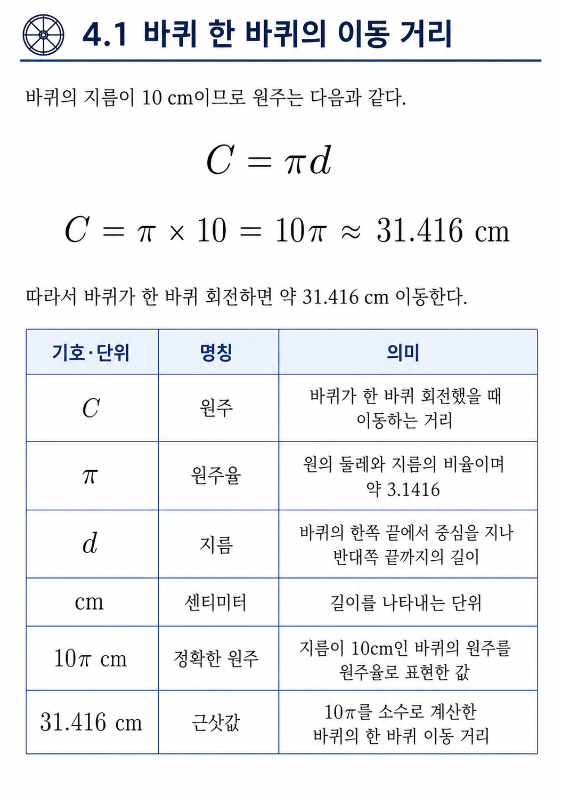
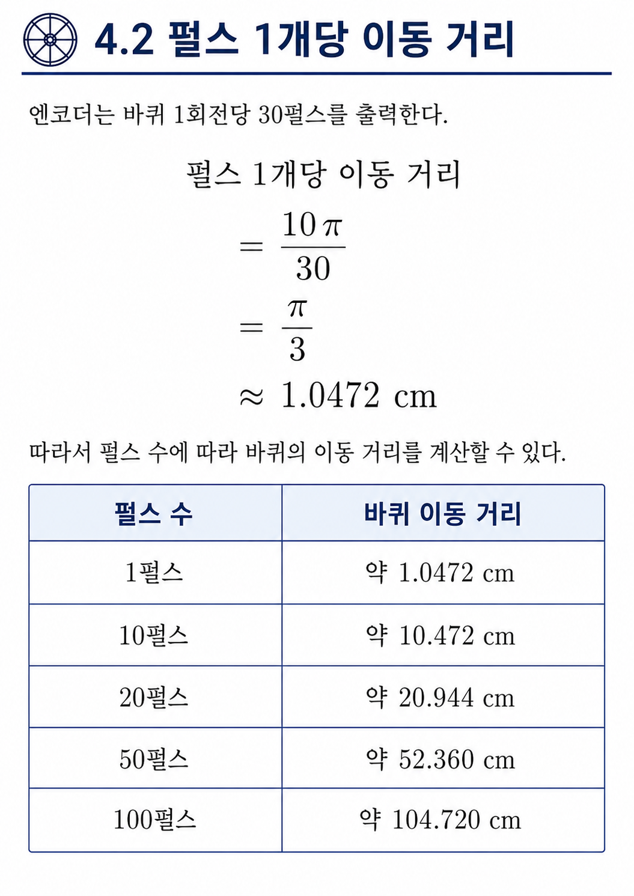
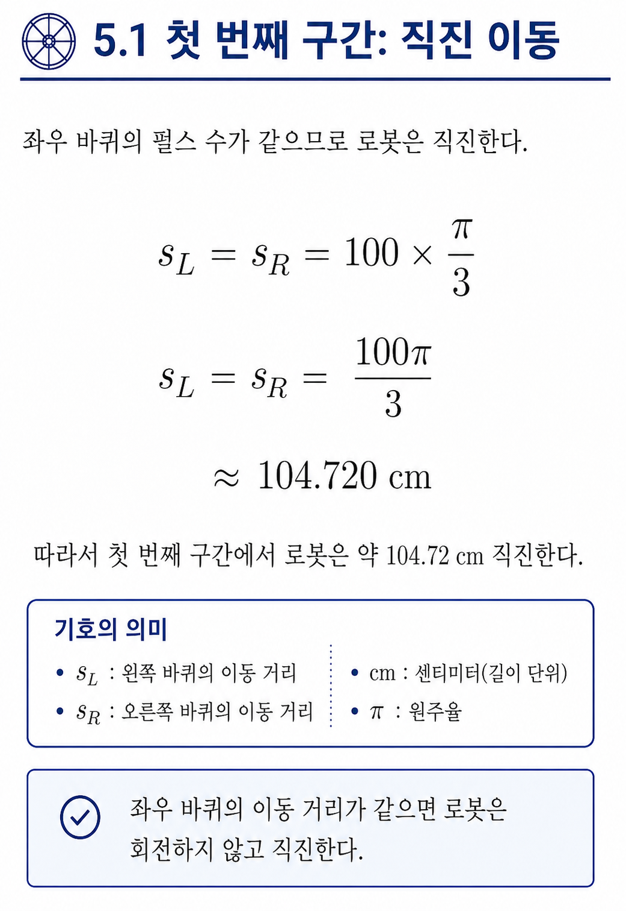
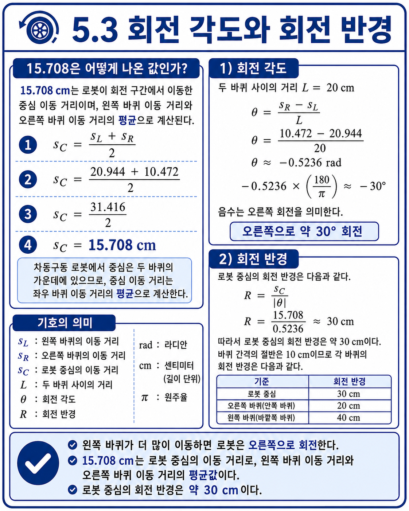
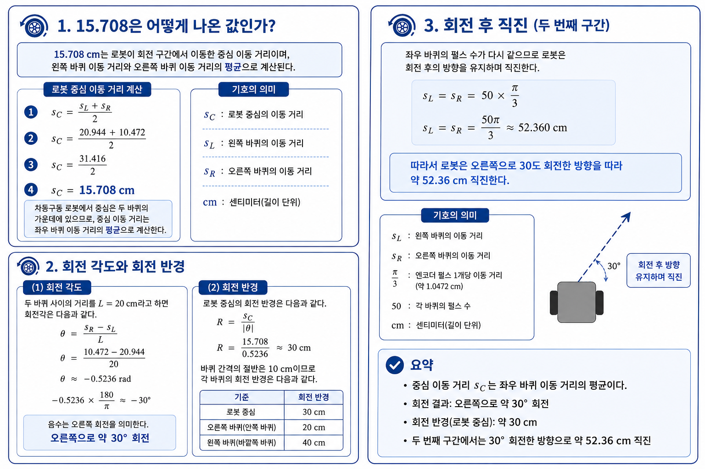

# 운반 로봇 제어 상황 분석

## 1. 수행 목표

특정 주행 상황에서 IR 센서와 바퀴 엔코더의 측정값을 이용하여 운반 로봇의 제어 상태를 분석한다. 또한 로봇의 이동 거리, 회전 각도 및 회전 반경을 계산한다.

---

## 2. 로봇 사양

| 항목 | 값 |
|---|---:|
| 바퀴 지름 | 10 cm |
| 엔코더 해상도 | 바퀴 1회전당 30펄스 |
| 두 바퀴 사이의 거리 | 20 cm |
| IR 센서 개수 | 왼쪽·중앙·오른쪽 3개 |
| 흰색 측정값 | 1 |
| 검은색 측정값 | 0 |
| 경로 색상 | 검은색 |
| 센서의 전방 감지 거리 | 약 5 cm |

### 추가 가정

- 센서값은 왼쪽, 중앙, 오른쪽 순서로 표시한다.
- `100`은 왼쪽 센서가 흰색, 중앙과 오른쪽 센서가 검은색을 감지한 상태이다.
- 바퀴가 미끄러지지 않는다고 가정한다.
- 좌우 바퀴의 지름과 엔코더 성능은 동일하다고 가정한다.
- 두 바퀴의 이동 거리 평균을 로봇 중심의 이동 거리로 사용한다.

---

# 3. IR 센서값 변화에 따른 경로 제어

## 3.1 센서값의 의미

IR 센서 배열의 측정값을 다음과 같이 해석한다.

| 센서값 | 센서 감지 상태 | 로봇의 상태 | 필요한 제어 |
|---|---|---|---|
| `000` | 왼쪽·중앙·오른쪽 센서가 모두 검은색 감지 | 로봇이 검은색 경로 위에 위치 | 현재 방향으로 직진 |
| `100` | 왼쪽 센서는 흰색, 중앙·오른쪽 센서는 검은색 감지 | 로봇이 경로의 왼쪽으로 치우침 | 오른쪽으로 방향 보정 |
| `001` | 왼쪽·중앙 센서는 검은색, 오른쪽 센서는 흰색 감지 | 로봇이 경로의 오른쪽으로 치우침 | 왼쪽으로 방향 보정 |
| `111` | 모든 센서가 흰색 감지 | 검은색 경로를 완전히 잃음 | 정지하거나 마지막으로 감지한 방향으로 경로 탐색 |

> 이 문서에서는 센서 순서를 `왼쪽-중앙-오른쪽`으로 가정한다.

## 3.2 `000`에서 `100`으로 바뀐 상황

정상 주행 중 센서값이 `000`이었다는 것은 세 센서가 모두 검은색 경로 위에 있었다는 의미이다.

이후 센서값이 `100`으로 바뀌었다.

```text
왼쪽 센서   중앙 센서   오른쪽 센서
    1           0            0
  흰색        검은색       검은색
```

왼쪽 센서만 흰색을 감지하므로 검은색 경로가 센서 배열의 오른쪽 방향에 더 많이 위치한다. 따라서 로봇이 경로의 왼쪽으로 벗어나고 있는 것으로 판단할 수 있다.

로봇은 경로를 다시 중앙에 두기 위해 오른쪽으로 회전해야 한다.

## 3.3 단계별 제어 절차

1. **센서값 읽기**  
   마이크로컨트롤러가 왼쪽, 중앙, 오른쪽 IR 센서값을 읽는다.

2. **현재 상태 판단**  
   측정값이 `100`이므로 검은색 경로가 로봇의 오른쪽에 있다고 판단한다.

3. **오차 방향 결정**  
   경로가 오른쪽에 있으므로 로봇의 진행 방향을 오른쪽으로 수정해야 한다.

4. **좌우 모터 속도 조절**  
   오른쪽으로 회전하기 위해 왼쪽 바퀴를 상대적으로 빠르게 하고 오른쪽 바퀴를 느리게 한다.

   ```text
   왼쪽 모터 속도  >  오른쪽 모터 속도
   ```

   예시는 다음과 같다.

   ```text
   왼쪽 모터 PWM  = 150
   오른쪽 모터 PWM = 90
   ```

5. **저속 보정 수행**  
   센서가 경로보다 약 5 cm 앞을 측정하므로 너무 급격히 회전하지 않고 짧은 시간 동안 속도 차이를 준다.

6. **센서값 재측정**  
   모터를 조절한 뒤 센서값을 다시 읽는다.

7. **정상 상태 복귀 확인**  
   센서값이 다시 `000`이 되면 좌우 모터 속도를 같게 설정하여 직진한다.

8. **경로를 찾지 못한 경우 처리**  
   일정 시간 동안 `100`이 계속되거나 `111`로 바뀌면 속도를 낮추고 오른쪽 방향으로 천천히 탐색한다. 그래도 경로가 발견되지 않으면 안전을 위해 정지한다.

## 3.4 제어 흐름

```text
IR 센서값 측정
      ↓
센서값이 100인가?
      ↓ 예
검은색 경로가 오른쪽에 있다고 판단
      ↓
왼쪽 모터 속도 증가
오른쪽 모터 속도 감소
      ↓
로봇이 오른쪽으로 회전
      ↓
센서값 재측정
      ↓
000으로 복귀하면 좌우 속도를 같게 설정
```

---

# 4. 엔코더 측정값을 이용한 이동 분석

## 4.1 바퀴 한 바퀴의 이동 거리

바퀴의 지름이 10 cm이므로 원주는 다음과 같다.

\[
C = \pi d
\]

\[
C = \pi \times 10 = 10\pi \approx 31.416\text{ cm}
\]

따라서 바퀴가 한 바퀴 회전하면 약 31.416 cm 이동한다.

| 기호·단위 | 명칭 | 의미 |
|---|---|---|
| \(C\) | 원주 | 바퀴가 한 바퀴 회전했을 때 이동하는 거리 |
| \(\pi\) | 원주율 | 원의 둘레와 지름의 비율이며 약 3.1416 |
| \(d\) | 지름 | 바퀴의 한쪽 끝에서 중심을 지나 반대쪽 끝까지의 길이 |
| cm | 센티미터 | 길이를 나타내는 단위 |
| \(10\pi\text{ cm}\) | 정확한 원주 | 지름이 10cm인 바퀴의 원주를 원주율로 표현한 값 |
| \(31.416\text{ cm}\) | 근삿값 | \(10\pi\)를 소수로 계산한 바퀴의 한 바퀴 이동 거리 |



## 4.2 펄스 1개당 이동 거리

엔코더는 바퀴 1회전당 30펄스를 출력한다.

\[
\text{펄스 1개당 이동 거리}
= \frac{10\pi}{30}
= \frac{\pi}{3}
\approx 1.0472\text{ cm}
\]

| 펄스 수 | 바퀴 이동 거리 |
|---:|---:|
| 1펄스 | 약 1.0472 cm |
| 10펄스 | 약 10.472 cm |
| 20펄스 | 약 20.944 cm |
| 50펄스 | 약 52.360 cm |
| 100펄스 | 약 104.720 cm |


---

# 5. 구간별 이동 계산

## 5.1 첫 번째 구간: 좌우 바퀴 각각 100펄스

좌우 바퀴의 펄스 수가 같으므로 로봇은 직진한다.

\[
s_L=s_R=100\times\frac{\pi}{3}
\]

\[
s_L=s_R=\frac{100\pi}{3}
\approx104.720\text{ cm}
\]



따라서 첫 번째 구간에서 로봇은 약 104.72 cm 직진한다.

---

## 5.2 두 번째 구간: 왼쪽 20펄스, 오른쪽 10펄스

### 왼쪽 바퀴 이동 거리

\[
s_L=20\times\frac{\pi}{3}
=\frac{20\pi}{3}
\approx20.944\text{ cm}
\]

### 오른쪽 바퀴 이동 거리

\[
s_R=10\times\frac{\pi}{3}
=\frac{10\pi}{3}
\approx10.472\text{ cm}
\]

왼쪽 바퀴가 오른쪽 바퀴보다 더 많이 이동했으므로 로봇은 **오른쪽으로 회전**한다.

### 로봇 중심의 이동 거리

차동구동 로봇 중심의 이동 거리는 좌우 바퀴 이동 거리의 평균으로 계산한다.

\[
s_C=\frac{s_L+s_R}{2}
\]

\[
s_C=\frac{20.944+10.472}{2}
\approx15.708\text{ cm}
\]

.png)

### 회전 각도

두 바퀴 사이의 거리를 \(L=20\text{ cm}\)라고 하면 회전각은 다음과 같다.

\[
\theta=\frac{s_R-s_L}{L}
\]

\[
\theta=\frac{10.472-20.944}{20}
\]

\[
\theta\approx-0.5236\text{ rad}
\]

라디안을 각도로 변환하면 다음과 같다.

\[
-0.5236\times\frac{180}{\pi}\approx-30^\circ
\]

음수는 오른쪽 회전을 의미한다.

\[
\boxed{\text{오른쪽으로 약 }30^\circ\text{ 회전}}
\]

### 회전 반경

로봇 중심의 회전 반경은 다음과 같다.

\[
R=\frac{s_C}{|\theta|}
\]

\[
R=\frac{15.708}{0.5236}\approx30\text{ cm}
\]

따라서 로봇 중심의 회전 반경은 약 30 cm이다.

바퀴 간격의 절반은 10 cm이므로 각 바퀴의 회전 반경은 다음과 같다.

| 기준 | 회전 반경 |
|---|---:|
| 로봇 중심 | 30 cm |
| 오른쪽 바퀴(안쪽 바퀴) | 20 cm |
| 왼쪽 바퀴(바깥쪽 바퀴) | 40 cm |



---

## 5.3 세 번째 구간: 좌우 바퀴 각각 50펄스

좌우 바퀴의 펄스 수가 다시 같으므로 로봇은 회전 후의 방향을 유지하며 직진한다.

\[
s_L=s_R=50\times\frac{\pi}{3}
\]

\[
s_L=s_R=\frac{50\pi}{3}
\approx52.360\text{ cm}
\]

따라서 로봇은 오른쪽으로 30도 회전한 방향을 따라 약 52.36 cm 직진한다.


---

# 6. 전체 이동 설명

로봇의 전체 이동은 다음 세 단계로 구성된다.

```text
1. 약 104.72 cm 직진
2. 중심 반경 30 cm의 원호를 따라 오른쪽으로 30° 회전
3. 변경된 방향으로 약 52.36 cm 직진
```

## 6.1 전체 주행 경로 길이

로봇 중심이 이동한 전체 경로 길이는 다음과 같다.

\[
s_{\text{total}}
=104.720+15.708+52.360
\]

\[
s_{\text{total}}\approx172.788\text{ cm}
\]

\[
\boxed{\text{전체 경로 길이}\approx172.79\text{ cm}}
\]

## 6.2 최종 방향

처음 진행 방향을 0도라고 하면 두 번째 구간에서 오른쪽으로 30도 회전했으므로 최종 진행 방향은 다음과 같다.

\[
\boxed{-30^\circ}
\]

즉, 로봇은 처음 방향을 기준으로 오른쪽으로 30도 기울어진 방향을 바라본다.

## 6.3 이동 형태

```text
출발
  ────────────────→ 약 104.72 cm 직진
                    \
                     ) 오른쪽으로 30° 회전
                      \
                       ─────────→ 약 52.36 cm 직진
```

---

# 7. 계산 결과 요약

| 구간 | 왼쪽 펄스 | 오른쪽 펄스 | 로봇 중심 이동 거리 | 이동 형태 |
|---|---:|---:|---:|---|
| 첫 번째 구간 | 100 | 100 | 약 104.72 cm | 직진 |
| 두 번째 구간 | 20 | 10 | 약 15.71 cm | 오른쪽 30° 회전 |
| 세 번째 구간 | 50 | 50 | 약 52.36 cm | 변경된 방향으로 직진 |

| 계산 항목 | 결과 |
|---|---:|
| 펄스 1개당 이동 거리 | 약 1.0472 cm |
| 회전 구간의 왼쪽 바퀴 이동 거리 | 약 20.94 cm |
| 회전 구간의 오른쪽 바퀴 이동 거리 | 약 10.47 cm |
| 회전 각도 | 오른쪽 약 30° |
| 로봇 중심의 회전 반경 | 약 30 cm |
| 안쪽 바퀴 회전 반경 | 약 20 cm |
| 바깥쪽 바퀴 회전 반경 | 약 40 cm |
| 전체 경로 길이 | 약 172.79 cm |
| 최종 진행 방향 | 처음 방향에서 오른쪽 30° |

---

# 8. 결론

IR 센서값이 `000`에서 `100`으로 변경된 것은 검은색 경로가 로봇의 오른쪽에 위치하기 시작했다는 의미로 해석할 수 있다. 따라서 왼쪽 바퀴를 빠르게 하고 오른쪽 바퀴를 느리게 하여 로봇을 오른쪽으로 보정해야 한다. 센서값이 다시 정상 상태인 `000`으로 돌아오면 좌우 바퀴 속도를 같게 하여 직진한다.

엔코더 측정 결과를 분석하면 로봇은 처음에 약 104.72 cm 직진한 뒤, 왼쪽 바퀴가 오른쪽 바퀴보다 더 많이 이동하여 중심 반경 약 30 cm의 원호를 따라 오른쪽으로 약 30도 회전하였다. 이후 변경된 방향으로 약 52.36 cm 직진하였다. 로봇 중심을 기준으로 한 전체 이동 경로의 길이는 약 172.79 cm이다.
