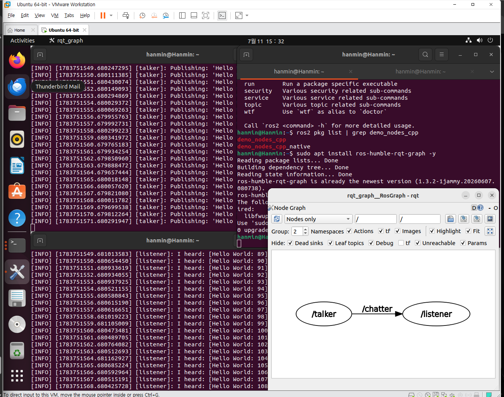
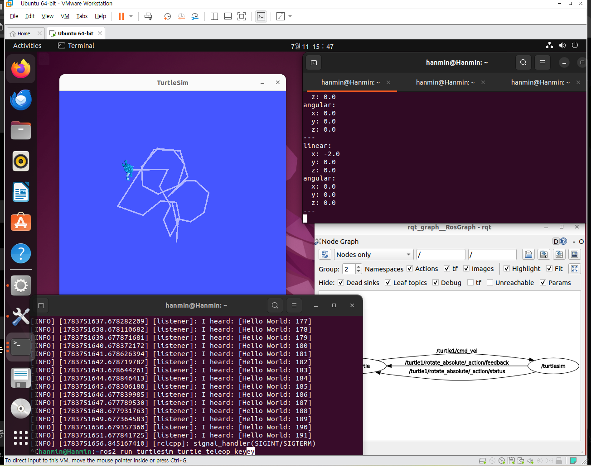

# ROS2 노드(Node)와 rqt_graph 실습

## 1. 수행목표

ROS2에서 노드(node)의 개념을 학습하고, ROS2 데모 프로그램인 `talker`, `listener` 노드와 `turtlesim_node`, `turtle_teleop_key` 노드를 실행하여 노드 간의 관계를 확인한다. 또한 `rqt_graph`, `ros2 node list`, `ros2 node info` 명령을 사용하여 ROS2 노드의 연결 구조와 정보를 확인한다.

---

## 2. ROS2에서 노드란 무엇인가?

ROS2에서 노드(node)는 하나의 기능을 수행하는 실행 단위이다. 로봇 시스템은 여러 기능으로 나누어져 있는데, 각각의 기능을 하나의 노드로 만들어 실행할 수 있다.

예를 들어 이동 로봇을 만든다고 하면 다음과 같이 여러 노드로 나눌 수 있다.

| 노드 예시 | 역할 |
|---|---|
| 카메라 노드 | 카메라 영상을 읽는다. |
| 라이다 노드 | 라이다 거리 데이터를 읽는다. |
| 모터 제어 노드 | 바퀴 모터를 제어한다. |
| 위치 추정 노드 | 센서 데이터를 이용해 로봇 위치를 계산한다. |
| 경로 계획 노드 | 목적지까지 이동 경로를 계산한다. |

즉, ROS2에서 노드는 로봇을 구성하는 각각의 프로그램 단위라고 볼 수 있다.

---

## 3. 노드가 필요한 이유

로봇은 센서, 모터, 카메라, 라이다, 알고리즘 등 여러 기능이 동시에 동작해야 한다. 하나의 큰 프로그램 안에 모든 기능을 넣으면 관리가 어렵고, 오류가 발생했을 때 원인을 찾기 어렵다.

ROS2에서는 기능을 여러 노드로 나누어 실행할 수 있다. 이렇게 하면 다음과 같은 장점이 있다.

| 장점 | 설명 |
|---|---|
| 기능 분리 | 센서, 제어, 판단 기능을 각각 따로 만들 수 있다. |
| 유지보수 쉬움 | 문제가 생긴 노드만 수정할 수 있다. |
| 재사용 가능 | 이미 만든 노드를 다른 로봇에서도 사용할 수 있다. |
| 동시 실행 가능 | 여러 노드가 동시에 동작하면서 데이터를 주고받을 수 있다. |
| 분산 실행 가능 | 여러 컴퓨터에서 노드를 나누어 실행할 수 있다. |

따라서 ROS2에서 노드는 로봇 시스템을 구성하는 기본 단위이다.

---

## 4. ROS2 노드 간 통신

ROS2 노드는 혼자 동작하기도 하지만, 보통 다른 노드와 데이터를 주고받으면서 동작한다. 대표적인 통신 방식은 토픽(topic), 서비스(service), 액션(action)이 있다.

| 통신 방식 | 설명 | 예시 |
|---|---|---|
| 토픽 | 한 노드가 데이터를 보내고 다른 노드가 구독하는 방식 | 카메라 영상, 센서값, 속도 명령 |
| 서비스 | 요청과 응답 방식의 통신 | 특정 기능 실행 요청 |
| 액션 | 시간이 오래 걸리는 작업을 목표, 피드백, 결과로 처리 | 목적지 이동, 로봇팔 동작 |

이번 실습에서 사용하는 `talker`와 `listener`는 토픽 통신을 사용한다.

```text
talker 노드 → /chatter 토픽 → listener 노드
```

`turtlesim_node`와 `turtle_teleop_key`도 토픽 통신을 사용한다.

```text
turtle_teleop_key 노드 → /turtle1/cmd_vel 토픽 → turtlesim_node 노드
```

---

## 5. rqt_graph란?

`rqt_graph`는 ROS2에서 실행 중인 노드와 토픽의 관계를 그래프 형태로 보여주는 도구이다. 즉, 어떤 노드가 어떤 토픽을 발행하고, 어떤 노드가 그 토픽을 구독하는지 시각적으로 확인할 수 있다.

실행 명령은 다음과 같다.

```bash
rqt_graph
```

`rqt_graph`를 실행하면 노드와 토픽 관계가 그래프 형태로 나타난다. 노드 간의 관계를 확인하려면 보기 옵션에서 `Nodes only` 모드를 사용할 수 있다. 만약 최근 실행 상태가 바로 보이지 않으면 리로드 버튼을 눌러 화면을 새로 고친다.

---

## 6. talker/listener 노드 실행

### 6.1 실행 전 환경 설정

ROS2 명령을 사용하려면 터미널에서 ROS2 환경 설정이 적용되어 있어야 한다.

```bash
source /opt/ros/humble/setup.bash
```

매번 터미널을 열 때 자동으로 적용하고 싶다면 다음 명령을 사용할 수 있다.

```bash
echo "source /opt/ros/humble/setup.bash" >> ~/.bashrc
source ~/.bashrc
```

환경 설정이 정상적으로 적용되었는지 확인하려면 다음 명령을 사용한다.

```bash
printenv ROS_DISTRO
```

정상적으로 설정되어 있다면 다음과 같이 출력된다.

```text
humble
```

---

### 6.2 talker 노드 실행

첫 번째 터미널에서 다음 명령을 실행한다.

```bash
ros2 run demo_nodes_cpp talker
```

`talker` 노드는 `/chatter` 토픽으로 `Hello World` 메시지를 계속 발행한다.

예상 출력은 다음과 같다.

```text
[INFO] [talker]: Publishing: 'Hello World: 1'
[INFO] [talker]: Publishing: 'Hello World: 2'
[INFO] [talker]: Publishing: 'Hello World: 3'
```

---

### 6.3 listener 노드 실행

두 번째 터미널에서 다음 명령을 실행한다.

```bash
ros2 run demo_nodes_cpp listener
```

`listener` 노드는 `/chatter` 토픽을 구독하여 `talker`가 보낸 메시지를 출력한다.

예상 출력은 다음과 같다.

```text
[INFO] [listener]: I heard: [Hello World: 1]
[INFO] [listener]: I heard: [Hello World: 2]
[INFO] [listener]: I heard: [Hello World: 3]
```

---

### 6.4 talker/listener 노드 관계

`talker`와 `listener`의 관계는 다음과 같다.

| 구성 요소 | 역할 |
|---|---|
| `talker` 노드 | 메시지를 발행하는 노드 |
| `/chatter` 토픽 | 두 노드 사이에서 메시지가 이동하는 통신 통로 |
| `listener` 노드 | 메시지를 구독하는 노드 |

관계는 다음과 같이 표현할 수 있다.

```text
/talker → /chatter → /listener
```

---

## 7. talker/listener 실행 상태에서 rqt_graph 확인

`talker`와 `listener`를 실행한 상태에서 새 터미널을 열고 다음 명령을 실행한다.

```bash
rqt_graph
```

`rqt_graph` 화면에서 `Nodes only` 모드를 선택하면 `/talker` 노드와 `/listener` 노드의 관계를 확인할 수 있다.



위 캡처에서 `/talker` 노드가 `/chatter` 토픽을 발행하고, `/listener` 노드가 해당 토픽을 구독하는 구조를 확인할 수 있다.

---

## 8. ros2 node list 명령

`ros2 node list` 명령은 현재 실행 중인 ROS2 노드 목록을 확인하는 명령이다.

실행 명령은 다음과 같다.

```bash
ros2 node list
```

`talker`와 `listener`가 실행 중이라면 다음과 비슷한 결과가 나온다.

```text
/listener
/talker
```

이 결과는 `rqt_graph`에서 보이는 노드 목록과 일치해야 한다. 즉, `rqt_graph`에서 `/talker`, `/listener`가 보인다면 `ros2 node list`에서도 같은 노드가 출력되어야 한다.

---

## 9. ros2 node info 명령

`ros2 node info` 명령은 특정 노드가 어떤 토픽을 발행하고 구독하는지, 어떤 서비스와 액션을 사용하는지 확인하는 명령이다.

기본 형식은 다음과 같다.

```bash
ros2 node info /노드이름
```

---

### 9.1 talker 노드 정보 확인

```bash
ros2 node info /talker
```

예상되는 주요 내용은 다음과 같다.

| 항목 | 설명 |
|---|---|
| Publications | 노드가 발행하는 토픽 목록 |
| Subscriptions | 노드가 구독하는 토픽 목록 |
| Services | 노드가 제공하거나 사용하는 서비스 목록 |

`talker`는 `/chatter` 토픽을 발행한다.

```text
/talker → /chatter
```

---

### 9.2 listener 노드 정보 확인

```bash
ros2 node info /listener
```

`listener`는 `/chatter` 토픽을 구독한다.

```text
/chatter → /listener
```

따라서 `talker`와 `listener`는 `/chatter` 토픽을 통해 연결된다.

---

## 10. turtlesim 노드 실행

`turtlesim`은 ROS2와 함께 제공되는 간단한 데모 로봇 패키지이다. 화면에 거북이 로봇이 나타나고, 키보드로 거북이를 움직일 수 있다.

기존에 실행 중인 `talker`와 `listener`를 종료한 후 turtlesim 실습을 진행한다.

종료는 각 터미널에서 다음 키를 누르면 된다.

```text
Ctrl + C
```

---

### 10.1 turtlesim_node 실행

첫 번째 터미널에서 다음 명령을 실행한다.

```bash
ros2 run turtlesim turtlesim_node
```

그러면 turtlesim 창이 열리고 거북이 로봇이 화면에 나타난다.

---

### 10.2 turtle_teleop_key 실행

두 번째 터미널에서 다음 명령을 실행한다.

```bash
ros2 run turtlesim turtle_teleop_key
```

이 노드는 키보드 입력을 받아 거북이에게 속도 명령을 보낸다.

실행 후 방향키를 누르면 거북이가 움직인다.

| 키 | 동작 |
|---|---|
| ↑ | 앞으로 이동 |
| ↓ | 뒤로 이동 |
| ← | 왼쪽 회전 |
| → | 오른쪽 회전 |

---



## 11. turtlesim 노드 간 관계

`turtlesim_node`와 `turtle_teleop_key`의 관계는 다음과 같다.

| 구성 요소 | 역할 |
|---|---|
| `turtlesim_node` | 거북이 로봇을 화면에 표시하고 움직임을 처리하는 노드 |
| `turtle_teleop_key` | 키보드 입력을 받아 속도 명령을 보내는 노드 |
| `/turtle1/cmd_vel` | 거북이에게 전달되는 속도 명령 토픽 |

관계는 다음과 같이 표현할 수 있다.
| 구분     | 이름                                          | 역할                             | 방향                            |
| ------ | ------------------------------------------- | ------------------------------ | ----------------------------- |
| 노드     | `/teleop_turtle`                            | 키보드 입력을 받아 거북이 제어 명령을 생성하는 노드  | 명령 송신                         |
| 노드     | `/turtlesim`                                | 거북이 시뮬레이션을 실행하고 명령을 받아 움직이는 노드 | 명령 수신                         |
| 토픽     | `/turtle1/cmd_vel`                          | 거북이의 선속도와 각속도 명령을 전달하는 토픽      | `/teleop_turtle → /turtlesim` |
| 액션 피드백 | `/turtle1/rotate_absolute/_action/feedback` | 절대 각도 회전 동작의 진행 상황을 전달         | `/turtlesim → /teleop_turtle` |
| 액션 상태  | `/turtle1/rotate_absolute/_action/status`   | 절대 각도 회전 동작의 현재 상태를 전달         | `/turtlesim → /teleop_turtle` |


```text
/turtle_teleop_key → /turtle1/cmd_vel → /turtlesim
```

즉, 사용자가 키보드 방향키를 누르면 `turtle_teleop_key` 노드가 속도 명령을 만들고, 이 명령이 `/turtle1/cmd_vel` 토픽을 통해 `turtlesim_node`에 전달된다. `turtlesim_node`는 이 명령을 받아 화면 속 거북이를 움직인다.

---

## 12. turtlesim 실행 상태에서 rqt_graph 확인

`turtlesim_node`와 `turtle_teleop_key`를 실행한 상태에서 새 터미널을 열고 다음 명령을 실행한다.

```bash
rqt_graph
```

`Nodes only` 모드를 선택하거나 옵션을 조정하여 두 노드 사이의 관계가 잘 보이도록 설정한다. 화면이 갱신되지 않으면 리로드 버튼을 누른다.

이때 그래프에는 `turtle_teleop_key`가 `/turtle1/cmd_vel` 토픽을 발행하고, `turtlesim_node`가 이를 구독하는 흐름이 나타난다.

---

## 13. ros2 node list로 turtlesim 노드 확인

`turtlesim_node`와 `turtle_teleop_key`가 실행 중인 상태에서 다음 명령을 실행한다.

```bash
ros2 node list
```

예상 결과는 다음과 같다.

```text
/teleop_turtle
/turtlesim
```

실제 출력 이름은 ROS2 버전이나 실행 상태에 따라 약간 다를 수 있다. 중요한 것은 `rqt_graph`에 보이는 노드와 `ros2 node list` 명령 결과가 일치하는지 확인하는 것이다.

---

## 14. ros2 node info로 turtlesim 노드 정보 확인

### 14.1 turtlesim 노드 정보

```bash
ros2 node info /turtlesim
```

`turtlesim` 노드는 `/turtle1/cmd_vel` 토픽을 구독하여 거북이를 움직인다.

---

### 14.2 teleop 노드 정보

```bash
ros2 node info /teleop_turtle
```

`teleop_turtle` 노드는 키보드 입력을 바탕으로 `/turtle1/cmd_vel` 토픽을 발행한다.

정리하면 다음과 같다.

```text
/teleop_turtle → /turtle1/cmd_vel → /turtlesim
```

---

## 15. 실습 결과 정리

이번 실습에서는 ROS2의 노드 개념과 노드 간 통신 구조를 확인하였다.

첫 번째로 `demo_nodes_cpp` 패키지의 `talker` 노드와 `listener` 노드를 실행하였다. `talker`는 `/chatter` 토픽으로 메시지를 발행하고, `listener`는 `/chatter` 토픽을 구독하여 메시지를 수신하였다. `rqt_graph`와 `ros2 node list`를 통해 두 노드가 실행 중임을 확인할 수 있었다.

두 번째로 `turtlesim` 패키지의 `turtlesim_node`와 `turtle_teleop_key` 노드를 실행하였다. `turtle_teleop_key`는 키보드 입력을 받아 `/turtle1/cmd_vel` 토픽으로 속도 명령을 발행하고, `turtlesim_node`는 이 명령을 받아 거북이 로봇을 움직였다.

이를 통해 ROS2에서 노드는 각각의 기능을 담당하는 실행 단위이며, 노드들은 토픽을 통해 데이터를 주고받으면서 하나의 로봇 시스템을 구성한다는 것을 확인할 수 있었다.

---

## 16. 참고자료

| 소제목 | 참고 링크 |
|---|---|
| ROS2 Humble 공식 문서 | https://docs.ros.org/en/humble/ |
| ROS2 노드 개념 | https://docs.ros.org/en/humble/Tutorials/Beginner-CLI-Tools/Understanding-ROS2-Nodes/Understanding-ROS2-Nodes.html |
| ROS2 토픽 개념 | https://docs.ros.org/en/humble/Tutorials/Beginner-CLI-Tools/Understanding-ROS2-Topics/Understanding-ROS2-Topics.html |
| rqt_graph 사용 | https://docs.ros.org/en/humble/Tutorials/Beginner-CLI-Tools/Introspection-With-Rqt-Graph/Introspection-With-Rqt-Graph.html |
| ros2 node 명령 | https://docs.ros.org/en/humble/Tutorials/Beginner-CLI-Tools/Understanding-ROS2-Nodes/Understanding-ROS2-Nodes.html |
| turtlesim 튜토리얼 | https://docs.ros.org/en/humble/Tutorials/Beginner-CLI-Tools/Introducing-Turtlesim/Introducing-Turtlesim.html |
