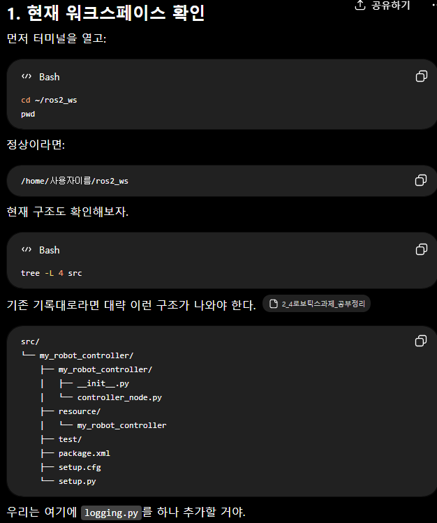
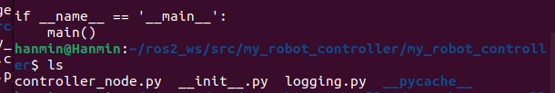
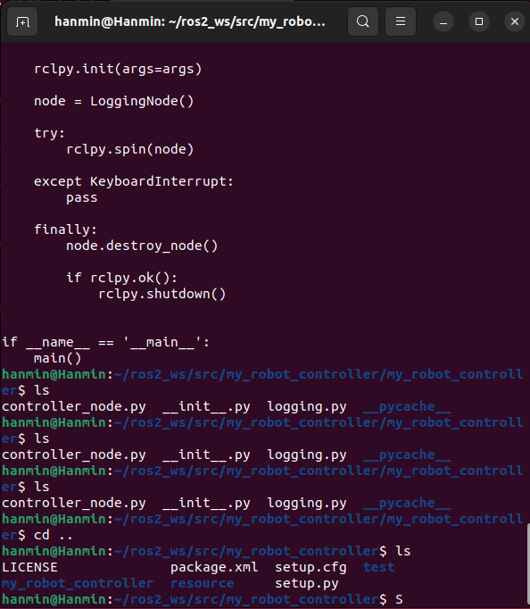
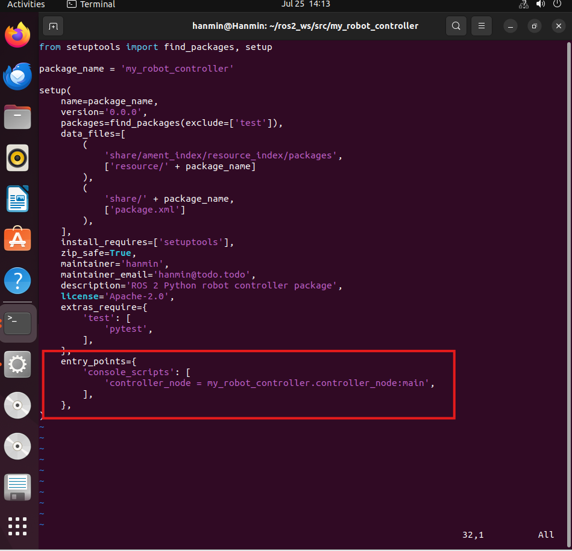
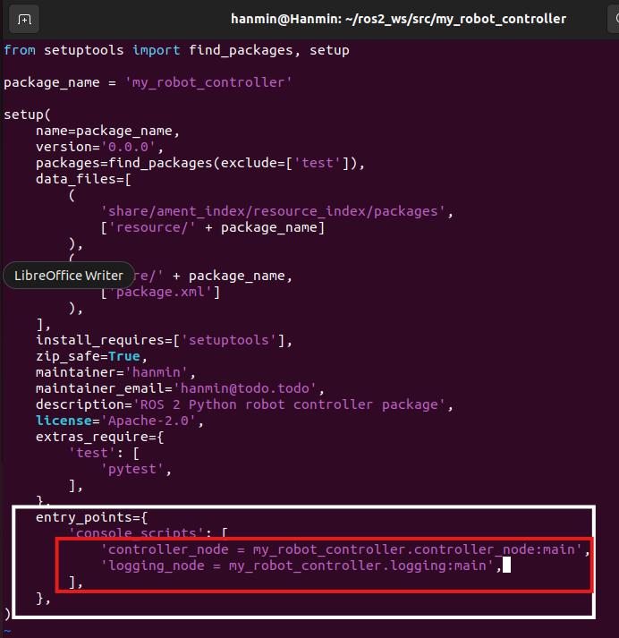
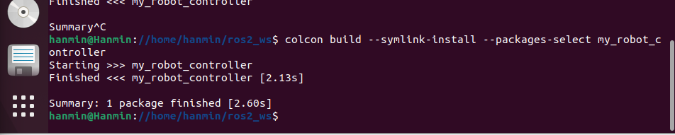
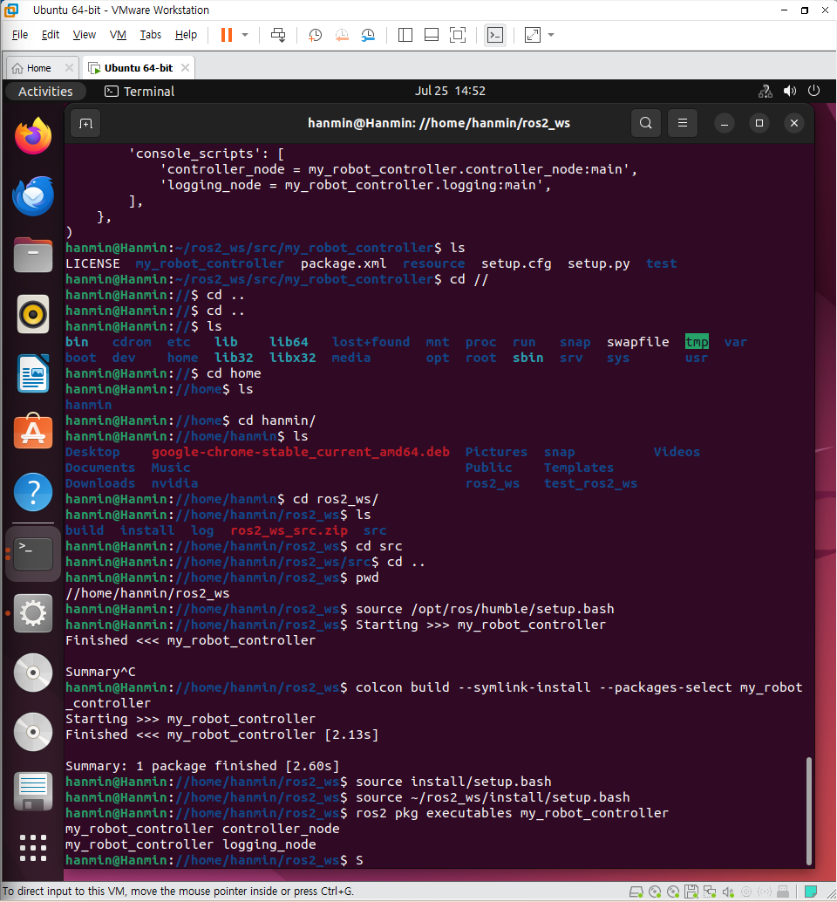
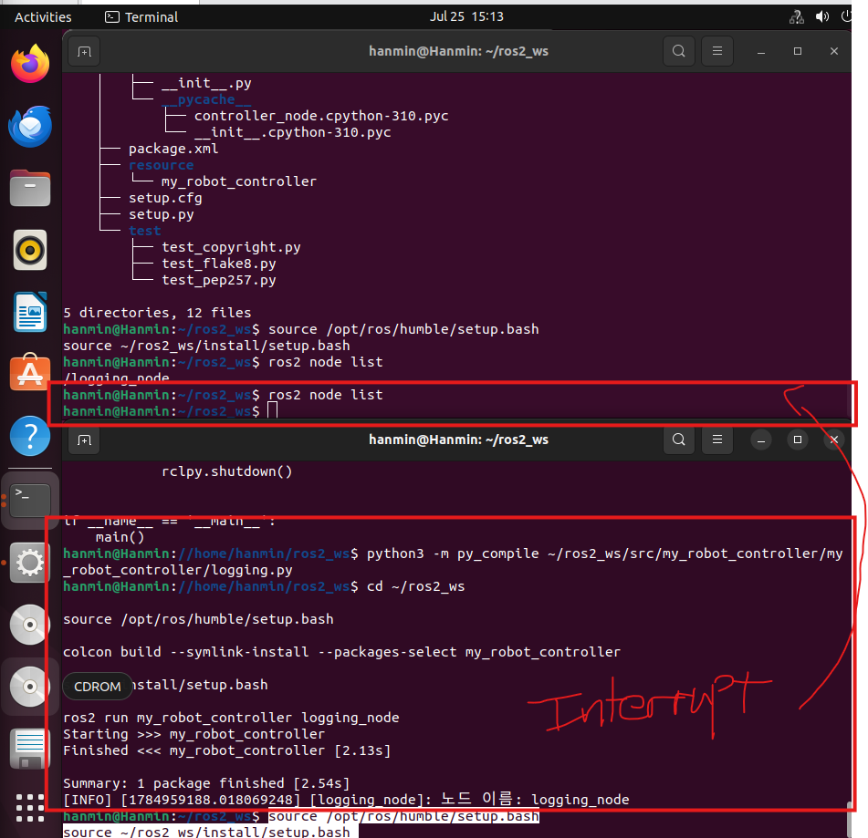
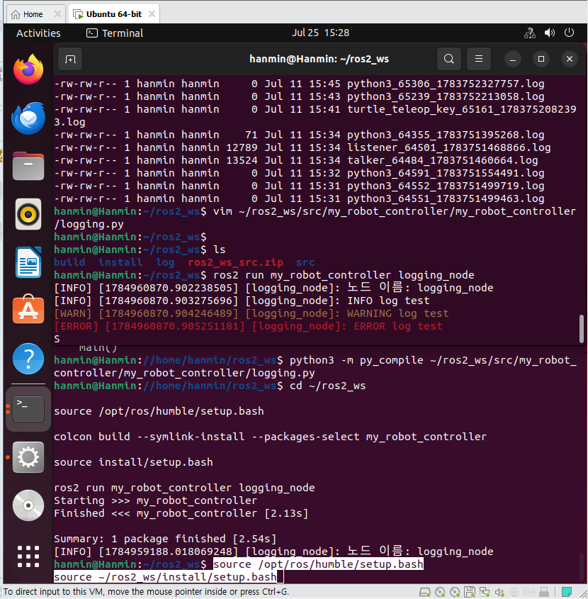
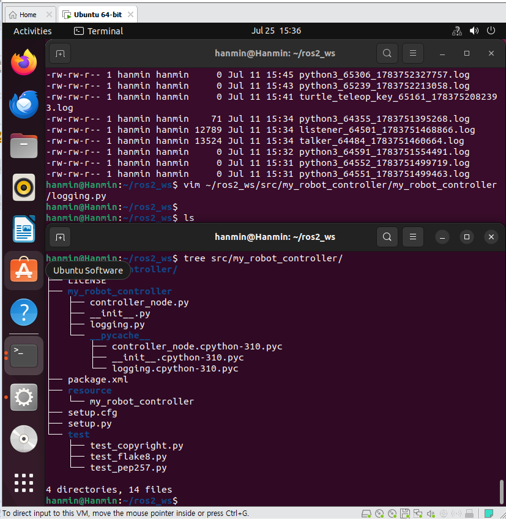

# 5. ROS2 Python 노드 생성 및 로그 기록

## 1. 수행 목표

ROS2 Humble 환경에서 Python을 사용하여 ROS2 노드를 작성하고 실행한다.

이번 실습에서는 다음 내용을 수행한다.

- `rclpy.node.Node` 클래스를 상속하여 ROS2 노드 작성
- 노드 객체 생성
- `rclpy.init()`, `rclpy.spin()`, `rclpy.shutdown()` 사용
- ROS2 Logger를 이용한 정보 수준(INFO) 로그 출력
- `setup.py`에 실행 파일 등록
- `colcon build --symlink-install`을 이용한 빌드
- 빌드된 워크스페이스 환경 적용
- `ros2 run`을 이용한 노드 실행
- ROS2 로그 저장 위치 확인

---

## 2. 개발 환경

- 운영체제: Ubuntu 22.04
- ROS2 배포판: Humble
- Shell: bash
- Workspace: `~/ros2_ws`
- Package: `my_robot_controller`
- Python Node File: `logging.py`
- ROS2 Node Name: `logging_node`

---

## 3. ROS2 Python 노드의 기본 구조

ROS2에서 하나의 기능 단위를 **노드(Node)** 라고 한다.

Python으로 ROS2 노드를 작성할 때는 `rclpy.node` 모듈의 `Node` 클래스를 상속받아 새로운 노드 클래스를 정의한다.

기본 형태는 다음과 같다.

```python
# ROS2의 Python 클라이언트 라이브러리인 rclpy를 불러온다.
import rclpy

# ROS2 노드를 만들기 위해 Node 클래스를 불러온다.
from rclpy.node import Node


# Node 클래스를 상속받아 MyNode라는 새로운 ROS2 노드 클래스를 만든다.
class MyNode(Node):

    # MyNode 객체가 생성될 때 자동으로 실행되는 생성자 함수이다.
    def __init__(self):

        # 부모 클래스인 Node의 생성자를 호출한다.
        # 이때 ROS2에서 사용할 노드 이름을 'my_node'로 지정한다.
        super().__init__('my_node')


# 프로그램이 시작될 때 실행되는 main 함수이다.
# args=None은 외부에서 전달되는 ROS2 명령행 인자를 받을 수 있도록 한다.
def main(args=None):

    # rclpy를 초기화한다.
    # ROS2 노드를 사용하기 전에 반드시 먼저 실행해야 한다.
    rclpy.init(args=args)

    # 위에서 정의한 MyNode 클래스의 객체를 생성한다.
    # 이 시점에서 'my_node'라는 ROS2 노드가 만들어진다.
    node = MyNode()

    # 노드가 계속 실행되도록 유지한다.
    # 메시지, 서비스, 타이머 등의 이벤트가 발생하면 처리할 수 있도록 대기한다.
    rclpy.spin(node)

    # spin이 종료된 이후 생성했던 노드 객체를 제거한다.
    # 주로 Ctrl+C 등으로 프로그램 실행을 종료할 때 수행된다.
    node.destroy_node()

    # 사용 중이던 ROS2 Python 통신 환경을 정상적으로 종료한다.
    rclpy.shutdown()


# 현재 Python 파일을 직접 실행했을 때만 아래의 main() 함수를 실행한다.
# 다른 Python 파일에서 이 파일을 import한 경우에는 main()이 자동 실행되지 않는다.
if __name__ == '__main__':

    # 위에서 정의한 main 함수를 호출하여 ROS2 프로그램을 시작한다.
    main()

```

`super().__init__('my_node')`는 부모 클래스인 `Node`의 생성자를 호출하면서 ROS2에서 사용할 노드 이름을 지정한다.

---

## 4. Node 클래스 객체 생성

작성한 노드 클래스의 객체는 일반적인 Python 클래스와 동일하게 생성한다.

예를 들어 다음과 같이 `LoggingNode` 클래스를 작성했다면,

```python
class LoggingNode(Node):

    def __init__(self):
        super().__init__('logging_node')
```

다음 명령으로 객체를 생성한다.

```python
node = LoggingNode()
```

이 객체는 ROS2에서 실제로 동작하는 하나의 노드가 된다.

---

## 5. rclpy.init(), rclpy.spin(), rclpy.shutdown()

### 5.1 rclpy.init()

```python
rclpy.init(args=args)
```

ROS2 Python Client Library인 `rclpy`를 초기화한다.

ROS2 노드를 생성하거나 통신 기능을 사용하기 전에 먼저 실행해야 한다.

---

### 5.2 rclpy.spin()

```python
rclpy.spin(node)
```

노드가 종료되지 않고 계속 실행되도록 유지한다.

ROS2에서는 Subscriber, Timer, Service 등의 이벤트가 발생하면 Callback 함수가 실행되는데, `spin()`은 이러한 이벤트를 계속 기다리면서 처리할 수 있도록 한다.

이번 실습에서는 별도의 Subscriber나 Timer가 없더라도 `spin()`을 사용하여 로봇 프로그램처럼 노드가 계속 실행 상태를 유지하도록 한다.

---

### 5.3 rclpy.shutdown()

```python
rclpy.shutdown()
```

ROS2 Python 통신 시스템을 정상적으로 종료한다.

일반적으로 프로그램을 종료할 때 호출한다.

전체 실행 순서는 다음과 같다.

```text
rclpy.init()
      ↓
노드 객체 생성
      ↓
rclpy.spin()
      ↓
Ctrl+C
      ↓
노드 제거
      ↓
rclpy.shutdown()
```

---

## 6. ROS2 로그 기록 방법

일반적인 Python 프로그램에서는 다음과 같이 `print()`를 사용할 수 있다.

```python
print("Hello ROS2")
```

하지만 실제 로봇은 모니터가 연결되어 있지 않은 경우가 많기 때문에 ROS2에서는 Logger를 사용하는 것이 일반적이다.

Node 클래스에서는 다음과 같이 Logger를 얻을 수 있다.

```python
self.get_logger()
```

정보 수준의 로그를 출력하려면 다음과 같이 작성한다.

```python
self.get_logger().info('메시지')
```

주요 로그 수준은 다음과 같다.

| 로그 수준 | 사용 예 |
|---|---|
| DEBUG | 개발 및 디버깅 정보 |
| INFO | 일반적인 실행 정보 |
| WARN | 주의가 필요한 상태 |
| ERROR | 오류 발생 |
| FATAL | 프로그램 실행이 어려운 치명적 오류 |

예:

```python
self.get_logger().info('logging_node가 실행되었습니다.')
```

---

## 7. logging.py 작성

기존 패키지가 다음 위치에 있다고 가정한다.

```text
~/ros2_ws/src/my_robot_controller
```

Python 파일을 작성할 위치는 다음과 같다.

```text
~/ros2_ws/src/my_robot_controller/my_robot_controller/logging.py
```

터미널에서 이동한다.

```bash
cd ~/ros2_ws/src/my_robot_controller/my_robot_controller
```

파일을 생성한다.

```bash
nano logging.py
```

다음 코드를 작성한다.

```python
import rclpy
from rclpy.node import Node


class LoggingNode(Node):

    def __init__(self):
        super().__init__('logging_node')

        self.get_logger().info(
            f'노드 이름: {self.get_name()}'
        )


def main(args=None):
    rclpy.init(args=args)

    node = LoggingNode()

    try:
        rclpy.spin(node)

    except KeyboardInterrupt:
        pass

    finally:
        node.destroy_node()

        if rclpy.ok():
            rclpy.shutdown()


if __name__ == '__main__':
    main()
```

이 프로그램은 실행될 때 현재 노드 이름을 INFO 수준의 로그로 출력한 뒤 `rclpy.spin()`에서 계속 실행 상태를 유지한다.

종료하려면 터미널에서 다음 키를 누른다.

```text
Ctrl + C
```

---

## 8. setup.py 수정

ROS2에서

```bash
ros2 run 패키지이름 실행파일이름
```

형태로 Python 프로그램을 실행하기 위해서는 `setup.py`의 `console_scripts`에 프로그램을 등록해야 한다.

파일을 연다.

```bash
cd ~/ros2_ws/src/my_robot_controller
nano setup.py
```

`entry_points` 부분을 다음과 같이 수정한다.

```python
entry_points={
    'console_scripts': [
        'controller_node = my_robot_controller.controller_node:main',
        'logging_node = my_robot_controller.logging:main',
    ],
},
```

이번 실습에서 중요한 부분은 다음 한 줄이다.

```python
'logging_node = my_robot_controller.logging:main',
```

각 항목의 의미는 다음과 같다.

```text
logging_node
      │
      └── ros2 run에서 사용할 실행 이름

my_robot_controller
      │
      └── Python 패키지 이름

logging
      │
      └── logging.py 파일

main
      │
      └── 실행할 함수
```

따라서 다음 명령으로 실행할 수 있게 된다.

```bash
ros2 run my_robot_controller logging_node
```

---

## 9. --symlink-install 옵션

워크스페이스 루트로 이동한다.

```bash
cd ~/ros2_ws
```

빌드한다.

```bash
colcon build --symlink-install
```

특정 패키지만 빌드하려면 다음 명령도 사용할 수 있다.

```bash
colcon build --symlink-install --packages-select my_robot_controller
```

`--symlink-install`은 Python 코드나 설정 파일 등을 install 디렉토리로 단순 복사하는 대신 가능한 경우 **심볼릭 링크(Symbolic Link)** 로 연결하는 옵션이다.

일반 빌드:

```text
src의 파일
   ↓ 복사
install의 파일
```

`--symlink-install`:

```text
install의 파일
     │
     └──── 링크 ────> src의 원본 파일
```

따라서 Python 소스 파일을 수정했을 때 매번 전체 파일을 복사하는 방식보다 개발과 테스트가 편리하다.

단, `setup.py`의 `console_scripts`를 수정하거나 새로운 실행 항목을 추가한 경우에는 다시 빌드하는 것이 안전하다.

---

## 10. setuptools 오류 발생 시

과제 참고사항에 따라 `--symlink-install` 사용 시 setuptools 관련 오류가 발생하면 다음 명령을 실행한다.

```bash
pip3 install setuptools==58.2.0
```

설치 후 다시 빌드한다.

```bash
cd ~/ros2_ws
colcon build --symlink-install
```

---

## 11. 빌드 결과 적용

ROS2는 빌드했다고 바로 새로운 패키지를 현재 터미널에서 인식하는 것은 아니다.

먼저 ROS2 Humble 환경을 적용한다.

```bash
source /opt/ros/humble/setup.bash
```

이후 현재 워크스페이스의 빌드 결과를 적용한다.

```bash
source ~/ros2_ws/install/setup.bash
```

또는 워크스페이스 루트에서 다음과 같이 실행할 수 있다.

```bash
source install/setup.bash
```

환경 적용 후 실행 파일이 등록되었는지 확인한다.

```bash
ros2 pkg executables my_robot_controller
```

정상적으로 등록되었다면 다음과 비슷한 결과를 확인할 수 있다.

```text
my_robot_controller controller_node
my_robot_controller logging_node
```

---

## 12. logging_node 실행

다음 명령을 실행한다.

```bash
ros2 run my_robot_controller logging_node
```

정상적으로 실행되면 다음과 유사한 로그가 출력된다.

```text
[INFO] [xxxxxxxxxx.xxxxxxxx] [logging_node]: 노드 이름: logging_node
```

로그를 출력한 후에도 프로그램은 종료되지 않는다.

이는 코드에서 다음 명령을 실행하고 있기 때문이다.

```python
rclpy.spin(node)
```

---

## 13. 실행 중인 노드 확인

`logging_node`를 실행한 상태에서 새로운 터미널을 하나 더 연다.

ROS2 환경을 적용한다.

```bash
source /opt/ros/humble/setup.bash
source ~/ros2_ws/install/setup.bash
```

현재 실행 중인 노드를 확인한다.

```bash
ros2 node list
```

결과:

```text
/logging_node
```

노드의 상세 정보를 확인하려면 다음 명령을 사용할 수 있다.

```bash
ros2 node info /logging_node
```

---

## 14. ROS2 로그 파일 확인

ROS2에서 실행된 노드의 로그 파일은 기본적으로 다음 위치에 저장된다.

```bash
~/.ros/log
```

확인한다.

```bash
ls ~/.ros/log
```

최근 실행과 관련된 로그 디렉토리를 확인할 수도 있다.

```bash
ls -lt ~/.ros/log
```

ROS2 Logger는 터미널 출력뿐만 아니라 ROS2의 로그 관리 체계와 연동되어 실행 상태와 오류를 추적하는 데 사용된다.

---

## 15. 실습 전체 명령 순서

### 15.1 logging.py 작성

```bash
cd ~/ros2_ws/src/my_robot_controller/my_robot_controller
nano logging.py
```

---

### 15.2 setup.py 수정

```bash
cd ~/ros2_ws/src/my_robot_controller
nano setup.py
```

추가:

```python
'logging_node = my_robot_controller.logging:main',
```

---

### 15.3 빌드

```bash
cd ~/ros2_ws

source /opt/ros/humble/setup.bash

colcon build --symlink-install
```

---

### 15.4 환경 적용

```bash
source ~/ros2_ws/install/setup.bash
```

---

### 15.5 실행 파일 확인

```bash
ros2 pkg executables my_robot_controller
```

---

### 15.6 노드 실행

```bash
ros2 run my_robot_controller logging_node
```

---

### 15.7 노드 확인

새 터미널:

```bash
source /opt/ros/humble/setup.bash
source ~/ros2_ws/install/setup.bash

ros2 node list
```

결과:

```text
/logging_node
```

---

## 16. 전체 디렉토리 구조

실습 완료 후 주요 구조는 다음과 같다.

```text
ros2_ws/
├── build/
├── install/
├── log/
└── src/
    └── my_robot_controller/
        ├── my_robot_controller/
        │   ├── __init__.py
        │   ├── controller_node.py
        │   └── logging.py
        ├── resource/
        │   └── my_robot_controller
        ├── test/
        ├── package.xml
        ├── setup.cfg
        └── setup.py
```

---

## 17. 프로젝트 제출 디렉토리

과제 조건에 따라 프로젝트 루트 아래에 다음 디렉토리를 생성한다.

```bash
mkdir -p 2/5
```

작성한 문서를 다음 이름으로 저장한다.

```text
2/5/5_ros2_python_node.md
```

예를 들어 현재 문서를 복사한다면 다음과 같이 구성할 수 있다.

```text
프로젝트루트/
└── 2/
    └── 5/
        ├── 5_ros2_python_node.md
        └── ros2_ws.zip
```

---

## 18. 워크스페이스 압축

워크스페이스를 제출해야 하므로 압축 파일을 생성한다.

워크스페이스 상위 디렉토리로 이동한다.

```bash
cd ~
```

전체 워크스페이스를 압축하려면:

```bash
zip -r ros2_ws.zip ros2_ws
```

파일 용량을 줄이기 위해 빌드 결과를 제외하고 소스 중심으로 제출할 경우에는 과제 및 평가 기준에 따라 `build`, `install`, `log` 디렉토리를 제외할 수도 있다.

```bash
zip -r ros2_ws.zip ros2_ws \
    -x "ros2_ws/build/*" \
       "ros2_ws/install/*" \
       "ros2_ws/log/*"
```

생성된 압축 파일을 과제 디렉토리로 이동한다.

```bash
mv ~/ros2_ws.zip 프로젝트루트/2/5/
```

---

## 19. 실습 결과

Python의 `rclpy` 라이브러리를 사용하여 `logging_node`라는 ROS2 노드를 생성하였다.

`LoggingNode` 클래스는 `rclpy.node.Node` 클래스를 상속하여 구현하였으며 생성자에서 `get_logger().info()`를 사용해 자신의 노드 이름을 INFO 수준의 로그로 출력하도록 작성하였다.

노드 실행 전 `rclpy.init()`으로 ROS2 통신 환경을 초기화하고, 노드 객체를 생성한 뒤 `rclpy.spin()`을 이용하여 프로그램이 지속적으로 실행되도록 하였다.

또한 `setup.py`의 `console_scripts` 항목에 `logging_node`를 등록하고 `colcon build --symlink-install` 명령을 사용해 패키지를 빌드하였다.

빌드 완료 후 `source ~/ros2_ws/install/setup.bash` 명령으로 새로운 실행 정보를 현재 Shell 환경에 적용하고 다음 명령으로 노드를 정상적으로 실행하였다.

```bash
ros2 run my_robot_controller logging_node
```

실행 중 `ros2 node list` 명령을 통해 `/logging_node`가 ROS2 시스템에 등록되어 동작하고 있음을 확인하였다.

---

## 20. 참고 자료

- ROS2 Humble Documentation  
  https://docs.ros.org/en/humble/

- ROS2 rclpy API  
  https://docs.ros2.org/

- Gazebo  
  https://gazebosim.org/

## 21.실습시작


### logging py 추가하기
```
vim logging.py
```

```python
import rclpy
from rclpy.node import Node


class LoggingNode(Node):

    def __init__(self):
        super().__init__('logging_node')

        self.get_logger().info(
            f'노드 이름: {self.get_name()}'
        )


def main(args=None):

    rclpy.init(args=args)

    node = LoggingNode()

    try:
        rclpy.spin(node)

    except KeyboardInterrupt:
        pass

    finally:
        node.destroy_node()

        if rclpy.ok():
            rclpy.shutdown()


if __name__ == '__main__':
    main()
```
```
: + wq #(write+quit) 저장하고 나간다 뜻
```



위처럼 위에 ls(list)를 입력하였을때 생긴 모습을 확인할 수 있다

### loggin.py 의 코드가 어떤 코드인지 흐름도
```
프로그램 시작
     ↓
rclpy.init()
     ↓
LoggingNode 객체 생성
     ↓
노드 이름 = logging_node
     ↓
INFO 로그 출력
     ↓
rclpy.spin()
     ↓
계속 실행
     ↓
Ctrl+C
     ↓
노드 삭제
     ↓
ROS2 종료
```

특히 이 부분:
```python
super().__init__('logging_node')
```
때문에 ROS2 내부 노드 이름은:
```
/logging_node
```
가 된다.

그리고
```python
self.get_logger().info(
    f'노드 이름: {self.get_name()}'
)
```
떄문에 
```
노드 이름 : logging_node
```
라는 로그가 뜬다.

### 바로 ROS2 run 하면 오류가난다.
ex)
```
ros2 run my_robot_controller logging_node
```
를 실행하면 아마 못 찾을 거야.
왜냐하면 아직 setup.py에
```
"logging_node" 를 등록하지 않았기 때문에 컴퓨터는 인식불가
그렇기떄문에 등록을 해줘야 한다.
```
지난 실습에서도 controller_node.py를 setup.py의 console_scripts 에 등록해서 ros2 run 으로 실행했었다.
지난번의 실습을 참고해서 한번 setup.py 에 등록을 해보도록하자

### setup.py 수정

```
대략 /home/[사용자이름]/ros2_ws/src/my_robot_controller
이안에 들어가보면 위의 이미지 처럼 파일 목록들이 보입니다.

그중에 setup.py 를 한번 수정해봅시다.
```

```bash
vim setup.py
```

빨간 네모가 있는 구간이 맨처음 ros2에서 여기에 무슨 노드가
생길거니까 인식하세요 라는 구간입니다.

```python
entry_points={
    'console_scripts': [
        'controller_node = my_robot_controller.controller_node:main',
        'logging_node = my_robot_controller.logging:main',
    ],
},
```


#### 추가한 내용의 의미가 무엇이냐 하면
```python
'logging_node = my_robot_controller.logging:main',
```
안의 내용을 분해해서 설명하면
```
logging_node
      ↓
ros2 run에서 사용할 실행 이름


my_robot_controller
      ↓
Python 패키지


logging
      ↓
logging.py


main
      ↓
logging.py 안의 main() 실행
```

이렇게 설정하면 나중에
```
ros2 run my_robot_controller logging_node
```
가 저장이 가능하다

```
vim 으로 저장할때는 먼저 ':' 을 한후 위에 설명처럼 wq를 사용하면 된다.

그다음 vim 에서 나와서 간단하게 
"cat setup.py" 로 수정됬는지 확인하는 과정을 거쳐봅시다.
```

확인이 되었다면 워크스페이스로 이동합시다

그다음 
```bash
source /opt/ros/humble/setup.bash
```
다시 적용합시다.

### 이번에는 --symlink-install로 빌드하기
```bash
colcon build --symlink-install --packages-select my_robot_controller
```
정상적으로 성공과정을 겪으면
```
Starting >>> my_robot_controller
Finished <<< my_robot_controller

Summary: 1 package finished
```

이런형태로 뜨게 됩니다. 


#### 근데 여기서 오류가 납니다.
```bash
import rclpy
from rclpy.node import Node


class LoggingNode(Node):

    def __init__(self):
        super().__init__('logging_node')

        self.get_logger().info(
            f'노드 이름: {self.get_name()}'
        )


def main(args=None):

    rclpy.init(args=args)

    node = LoggingNode()

    try:
        rclpy.spin(node)

    except KeyboardInterrupt:
        pass

    finally:
        node.destroy_node()

        if rclpy.ok():
            rclpy.shutdown()


class LoggingNode(Node):

    def __init__(self):
        super().__init__('logging_node')

        self.get_logger().info(
            f'노드 이름: {self.get_name()}'
        )


def main(args=None):

    rclpy.init(args=args)

    node = LoggingNode()

    try:
        rclpy.spin(node)

    except KeyboardInterrupt:
        pass

    finally:
        node.destroy_node()

        if rclpy.ok():
            rclpy.shutdown()


if __name__ == '__main__':
    main()_ == '__main__':
    main()import rclpy
from rclpy.node import Node


class LoggingNode(Node):

    def __init__(self):
        super().__init__('logging_node')

        self.get_logger().info(
            f'노드 이름: {self.get_name()}'
        )


def main(args=None):

    rclpy.init(args=args)

    node = LoggingNode()

    try:
        rclpy.spin(node)

    except KeyboardInterrupt:
        pass

    finally:
        node.destroy_node()

        if rclpy.ok():
            rclpy.shutdown()


if __name__ == '__main__':
    main()

```

내가 지금 여기서 코드를 중복되게 많이 써서 symlink 할때 명령어는 정상적으로 동작했는데 다음 단계로 넘어가서 오류가 나니 이부분을 다시 원래 코드로 바꾸고 동작을 시켰다.

#### 만약 -symlink-install 부분에서 오류가 난다?
```bash
pip3 install setuptools==58.2.0
```
한다음 다시
```bash
cd ~/ros2_ws

colcon build --symlink-install --packages-select my_robot_controller
```

#### 빌드했다고 바로 실행NO! source
```bash
source install/setup.bash

source ~/ros2_ws/install/setup.bash
```
둘은 지금 위치가 ~/ros2_ws 라면 사실상 같은 역할로 동작됨
혹시 모르니 두개 다 입력해보도록하자

#### Ros2가 logging_node를 인식했는지 확인
바로 실행NO!! 먼저 검사하는 습관을 들이자

```bash
ros2 pkg executables my_robot_controller
```



기존에는:
```
my_robot_controller controller_node
```
하나만 나왔을텐데

이번빌드 이후에는:
```
my_robot_controller controller_node
my_robot_controller logging_node
``` 
이렇게 2개가 나올거다 실습해보자.

#### logging_node 실행
```bash
ros2 run my_robot_controller logging_node
```

#### logging_node 실행
```bash
ros2 run my_robot_controller logging_node
```
실행한다.

정상이라면:
```
[INFO] [........] [logging_node]: 노드 이름: logging_node
```
비슷하게 뜬다. 그리고 로그 한줄 출력된 다음 터미널이 멈춘거처럼 보이는게 정상입니다.

이유:
```python
rclpy.spin(node) #실제로 동작하고 있습니다== 유지되고있습니다. 를 보여줍니다.
```
가 실행중이기 때문이다.

실제로는:
```
logging_node
      ↓
실행 중
      ↓
ROS2 이벤트 기다리는 중
      ↓
계속 살아 있음
```
인 상태다.

#### 새로운 터미널 열고 작업 GOGO
현재 터미널을 터미널1 이라고 하자.

##### 터미널1
```bash
ros2 run my_robot_controller logging_node
```
이상태로 놔둔다
그리고 새 터미널 2를 연다

#### 터미널2에서 환경다시 불러오기
새 터미널에서는 source 가 초기화되서 다시 지정
```bash
source /opt/ros/humble/setup.bash
source ~/ros2_ws/install/setup.bash
```

#### 현재 살아있는 노드 확인
```bash
ros2 node list
```
정상이면 :
```
/logging_node
```
라고 나오게 된다.
이건 굉장히 중요한 실습결과이다.

즉:
```
setup.py 실행 이름
logging_node

ROS2 내부 노드 이름
/logging_node
```
가 된 상태이다.

#### 노드 상세 정보 확인
```bash
ros2 node info /logging_node
```
아마 Publisher, Subscriber, Serice 등의 정보가 나오게된다.

현재 우리가 별도의 Publisher나 Subscriber는 만들지 않았기 뗴문에 실제 로봇기능은 거의 없다.
```
/logging_node
```
라는 ROS2 Node 자체는 정상적으로 존재한다.

#### 다시 터미널 1로 돌아가기

```
(현재 상태)
#터미널1
logging_node 실행중

#터미널2
ros2 node list

(rclpy.spin() 부분 실행)
#터미널 1
Ctrl+ c
를 눌리자
```
그러면 rclpy.spin() 이 끝나면서 프로그램이 종료된다.


#### 종료됐는지 터미널2에서 다시 확인

```bash
ros2 node list
```
이번에는 :
```
/logging_node
```
가 사라져야 한다.

즉:
```
실행 전
ros2 node list
→ 없음

실행 중
ros2 node list
→ /logging_node

Ctrl+C 이후
ros2 node list
→ 없음
```
이 흐름을 직접 확인하면 rclpy.spin()이 왜 필요한지도 바로 이해됀다

#### ROS2 로그 저장위치 확인
과제에서:
```
ROS2 로봇 또는 프로그램이 남긴 로그를 확인하는 방법
```
도 조사하라고 하였다.

확인:
```bash
ls ~/.ros
```
그리고:
```bash
ls ~/.ros/log
```
최근 순서로 보면:
```bash
ls -lt ~/.ros/log
```
ROS2 관련 로그들이 저장되어 있는 것을 볼 수 있다.
```
log 목록들
hanmin@Hanmin:~/ros2_ws$ ros2 node list
hanmin@Hanmin:~/ros2_ws$ ls ~/.ros
log  rosdep
hanmin@Hanmin:~/ros2_ws$ ls ~/.ros/log
listener_2137_1784024441990.log   python3_8197_1784025983373.log
listener_64501_1783751468866.log  talker_2125_1784024435658.log
python3_18448_1784959187894.log   talker_64484_1783751460664.log
python3_18484_1784959527123.log   turtlesim_node_2806_1784024544488.log
python3_18485_1784959527462.log   turtlesim_node_2830_1784024557490.log
python3_2055_1784024395413.log    turtlesim_node_65139_1783752071061.log
python3_2056_1784024395870.log    turtlesim_node_8154_1784025946279.log
python3_2860_1784024580378.log    turtlesim_node_8238_1784026007785.log
python3_5661_1784281295082.log    turtlesim_node_8377_1784026043471.log
python3_5662_1784281295404.log    turtle_teleop_key_2793_1784024542599.log
python3_5688_1784281349935.log    turtle_teleop_key_2848_1784024559736.log
python3_64355_1783751395268.log   turtle_teleop_key_65161_1783752082393.log
python3_64551_1783751499463.log   turtle_teleop_key_8173_1784025949031.log
python3_64552_1783751499719.log   turtle_teleop_key_8257_1784026011917.log
python3_64591_1783751554491.log   turtle_teleop_key_8405_1784026050360.log
python3_65239_1783752213058.log   turtle_teleop_key_8418_1784026064890.log
python3_65306_1783752327757.log
hanmin@Hanmin:~/ros2_ws$ ls -lt ~/.ros/log
total 96
-rw-rw-r-- 1 hanmin hanmin     0 Jul 25 15:05 python3_18485_1784959527462.log
-rw-rw-r-- 1 hanmin hanmin     0 Jul 25 15:05 python3_18484_1784959527123.log
-rw-rw-r-- 1 hanmin hanmin    74 Jul 25 14:59 python3_18448_1784959187894.log
-rw-rw-r-- 1 hanmin hanmin    92 Jul 17 18:42 python3_5688_1784281349935.log
-rw-rw-r-- 1 hanmin hanmin     0 Jul 17 18:41 python3_5662_1784281295404.log
-rw-rw-r-- 1 hanmin hanmin     0 Jul 17 18:41 python3_5661_1784281295082.log
-rw-rw-r-- 1 hanmin hanmin     0 Jul 14 19:47 turtle_teleop_key_8418_1784026064890.log
-rw-rw-r-- 1 hanmin hanmin     0 Jul 14 19:47 turtle_teleop_key_8405_1784026050360.log
-rw-rw-r-- 1 hanmin hanmin   205 Jul 14 19:47 turtlesim_node_8377_1784026043471.log
-rw-rw-r-- 1 hanmin hanmin   205 Jul 14 19:46 turtlesim_node_8238_1784026007785.log
-rw-rw-r-- 1 hanmin hanmin     0 Jul 14 19:46 turtle_teleop_key_8257_1784026011917.log
-rw-rw-r-- 1 hanmin hanmin    71 Jul 14 19:46 python3_8197_1784025983373.log
-rw-rw-r-- 1 hanmin hanmin    71 Jul 14 19:46 python3_2860_1784024580378.log
-rw-rw-r-- 1 hanmin hanmin   205 Jul 14 19:45 turtlesim_node_8154_1784025946279.log
-rw-rw-r-- 1 hanmin hanmin     0 Jul 14 19:45 turtle_teleop_key_8173_1784025949031.log
-rw-rw-r-- 1 hanmin hanmin   407 Jul 14 19:22 turtlesim_node_2830_1784024557490.log
-rw-rw-r-- 1 hanmin hanmin     0 Jul 14 19:22 turtle_teleop_key_2848_1784024559736.log
-rw-rw-r-- 1 hanmin hanmin   205 Jul 14 19:22 turtlesim_node_2806_1784024544488.log
-rw-rw-r-- 1 hanmin hanmin     0 Jul 14 19:22 turtle_teleop_key_2793_1784024542599.log
-rw-rw-r-- 1 hanmin hanmin  6347 Jul 14 19:22 listener_2137_1784024441990.log
-rw-rw-r-- 1 hanmin hanmin  6852 Jul 14 19:22 talker_2125_1784024435658.log
-rw-rw-r-- 1 hanmin hanmin     0 Jul 14 19:19 python3_2056_1784024395870.log
-rw-rw-r-- 1 hanmin hanmin     0 Jul 14 19:19 python3_2055_1784024395413.log
-rw-rw-r-- 1 hanmin hanmin  5443 Jul 11 15:46 turtlesim_node_65139_1783752071061.log
-rw-rw-r-- 1 hanmin hanmin     0 Jul 11 15:45 python3_65306_1783752327757.log
-rw-rw-r-- 1 hanmin hanmin     0 Jul 11 15:43 python3_65239_1783752213058.log
-rw-rw-r-- 1 hanmin hanmin     0 Jul 11 15:41 turtle_teleop_key_65161_1783752082393.log
-rw-rw-r-- 1 hanmin hanmin    71 Jul 11 15:34 python3_64355_1783751395268.log
-rw-rw-r-- 1 hanmin hanmin 12789 Jul 11 15:34 listener_64501_1783751468866.log
-rw-rw-r-- 1 hanmin hanmin 13524 Jul 11 15:34 talker_64484_1783751460664.log
-rw-rw-r-- 1 hanmin hanmin     0 Jul 11 15:32 python3_64591_1783751554491.log
-rw-rw-r-- 1 hanmin hanmin     0 Jul 11 15:31 python3_64552_1783751499719.log
-rw-rw-r-- 1 hanmin hanmin     0 Jul 11 15:31 python3_64551_1783751499463.log
```

#### 이번에는 로그 수준을 직접 실험해봐도 좋음
logging.py를 다시연다.
```bash
nano ~/ros2_ws/src/my_robot_controller/my_robot_controller/logging.py
```

기존:
```python
self.get_logger().info(
    f'노드 이름: {self.get_name()}'
)
```

아래처럼 코드를 수정해서 동작해보도록하자.
```python
def __init__(self):
    super().__init__('logging_node')

    self.get_logger().info(
        f'노드 이름: {self.get_name()}'
    )

    self.get_logger().info('INFO 로그 테스트')
    self.get_logger().warning('WARNING 로그 테스트')
    self.get_logger().error('ERROR 로그 테스트')
```

#### --symlink-install의 의미를 직접 느껴보기
우리가:
```bash
colcon build --symlink-install
```
을 했잖아.

Python 소스 코드의 경우 원본과 install 쪽을 심볼릭 링크로 연결하기 때문에 코드 수정 테스트가 더 편해진다. 네 이전 실습에서도 이 옵션을 패키지 빌드에 사용하고 있었어.

수정 후:
```bash
ros2 run my_robot_controller logging_node
```
를 다시해보자.

로그가:
```
[INFO] ... 노드 이름: logging_node
[INFO] ... INFO 로그 테스트
[WARN] ... WARNING 로그 테스트
[ERROR] ... ERROR 로그 테스트
```
실습이미지


#### 최종적으로 네 폴더 구조 확인
```bash
cd ~/ros2_ws

tree src/my_robot_controller
```

최소한 이렇게 되어야 한다.


#### 지금 네 실습흐름만 압축하면
```bash
# 1. 기존 패키지로 이동
cd ~/ros2_ws/src/my_robot_controller/my_robot_controller

# 2. 새로운 노드 작성
nano logging.py

# 3. setup.py 위치
cd ..

# 4. logging_node 실행 항목 등록
nano setup.py

# 5. 워크스페이스 이동
cd ~/ros2_ws

# 6. 기본 ROS2 환경
source /opt/ros/humble/setup.bash

# 7. 빌드
colcon build --symlink-install --packages-select my_robot_controller

# 8. 내가 빌드한 환경 적용
source install/setup.bash

# 9. 실행 프로그램 확인
ros2 pkg executables my_robot_controller

# 10. 노드 실행
ros2 run my_robot_controller logging_node
```

