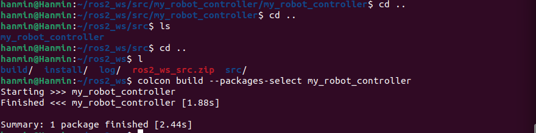
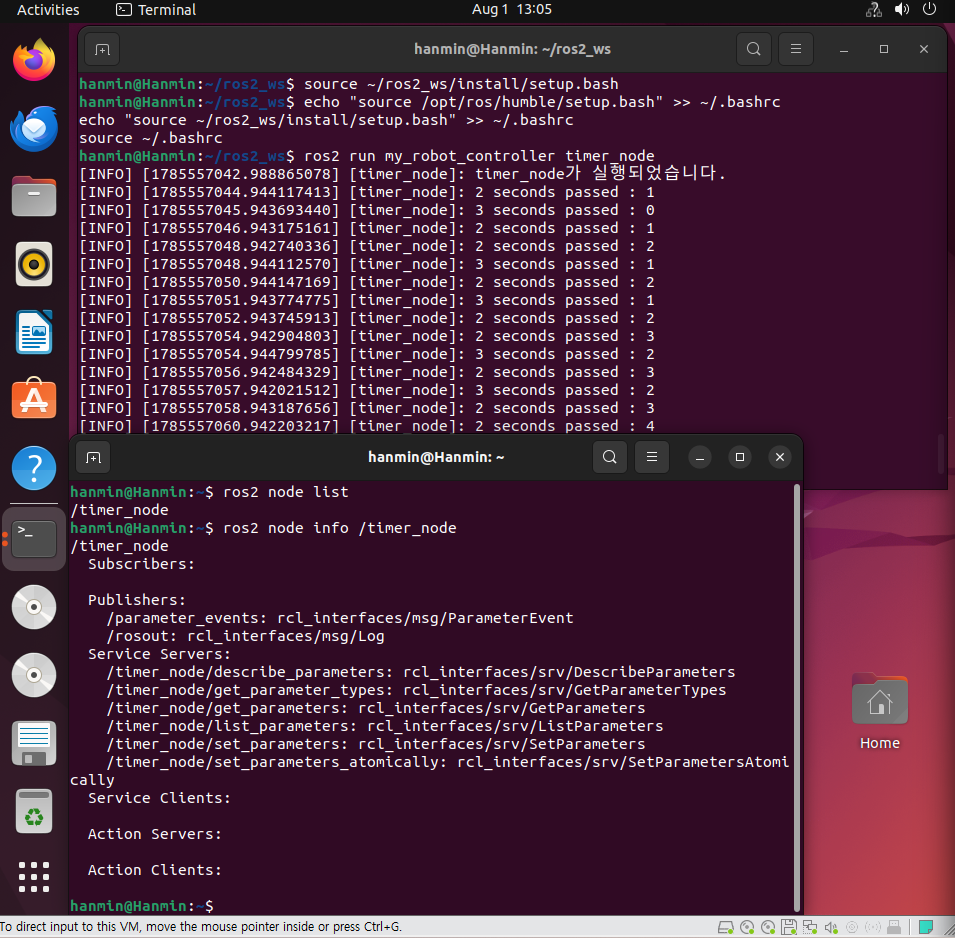
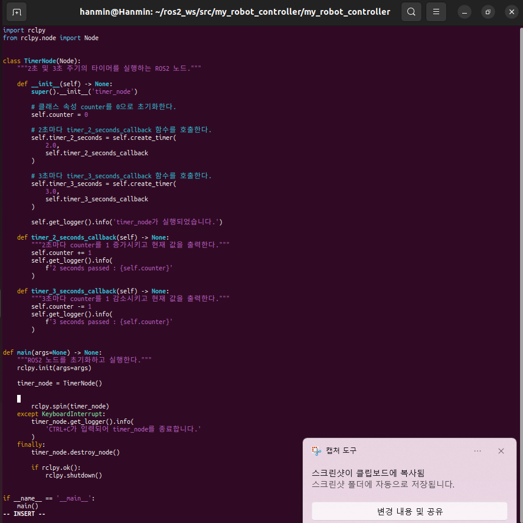
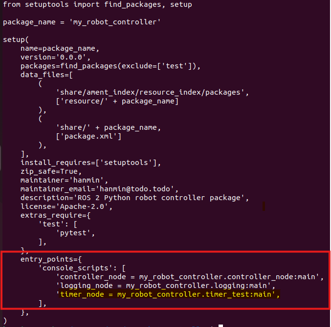
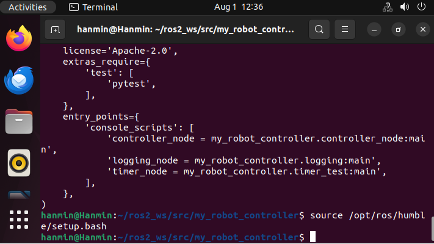

# 6. ROS2 타이머와 콜백 함수

## 1. 수행목표

ROS2에서 지속적으로 동작하는 노드를 구현하기 위해 타이머와 콜백 함수의 개념을 학습한다.

- ROS2 타이머의 개념을 이해한다.
- `create_timer()`를 사용하여 일정한 주기로 함수를 실행한다.
- 콜백 함수의 개념과 실행 방식을 이해한다.
- 2초 타이머와 3초 타이머를 동시에 실행한다.
- 클래스 속성인 `counter` 값을 증가시키고 감소시킨다.
- ROS2 로그를 이용하여 타이머 동작 결과를 확인한다.

---

## 2. 개발환경

| 구분 | 내용 |
|---|---|
| 운영체제 | Ubuntu 22.04.x |
| 셸 | Bash |
| ROS2 배포판 | ROS2 Humble |
| 프로그래밍 언어 | Python 3 |
| 빌드 도구 | colcon |
| 패키지 빌드 타입 | ament_python |

---

## 3. ROS2 타이머 개념

ROS2의 타이머는 일정한 시간 간격으로 지정된 함수를 반복 실행하는 기능이다.

로봇 프로그램은 센서 데이터를 계속 확인하거나, 모터 명령을 반복해서 보내거나, 현재 상태를 일정 주기로 출력해야 한다. 이러한 반복 작업을 구현할 때 ROS2 타이머를 사용할 수 있다.

Python 기반 ROS2 노드에서는 `Node` 클래스의 `create_timer()` 메서드를 사용한다.

```python
self.create_timer(주기, 콜백함수)
```

예를 들어 다음 코드는 2초마다 `timer_callback` 함수를 실행한다.

```python
self.timer = self.create_timer(2.0, self.timer_callback)
```

여기서 `2.0`은 초 단위의 실행 주기이며, `self.timer_callback`은 타이머 주기가 되었을 때 호출할 함수이다.

### 타이머의 주요 특징

1. 지정한 시간마다 콜백 함수가 반복 호출된다.
2. 프로그램이 종료되기 전까지 계속 동작한다.
3. 하나의 노드에서 여러 개의 타이머를 생성할 수 있다.
4. `rclpy.spin()`이 실행 중이어야 타이머 콜백이 처리된다.
5. 타이머 객체는 클래스 속성으로 저장하는 것이 안전하다.

---

## 4. 콜백 함수 개념

콜백 함수는 특정 사건이나 조건이 발생했을 때 자동으로 호출되는 함수이다.

일반적인 함수는 개발자가 직접 호출한다.

```python
my_function()
```

반면 콜백 함수는 개발자가 직접 반복 호출하지 않는다. 타이머, 메시지 수신, 서비스 요청 등의 이벤트가 발생하면 ROS2 실행기가 자동으로 호출한다.

```python
def timer_callback(self):
    self.get_logger().info('Timer callback called')
```

위 함수는 코드에서 직접 호출하지 않아도, `create_timer()`에 등록하면 지정된 시간마다 ROS2가 실행한다.

### ROS2에서 콜백 함수가 사용되는 예

- 타이머 주기가 되었을 때
- 토픽 메시지를 수신했을 때
- 서비스 요청을 받았을 때
- 액션 요청 또는 결과를 처리할 때
- 파라미터 값이 변경되었을 때

---

## 5. 프로그램 동작 설계

이번 프로그램은 하나의 노드에 두 개의 타이머를 생성한다.

| 타이머 | 실행 주기 | 처리 내용 |
|---|---:|---|
| 첫 번째 타이머 | 2초 | `counter`를 1 증가시키고 로그 출력 |
| 두 번째 타이머 | 3초 | `counter`를 1 감소시키고 로그 출력 |

초기 `counter` 값은 0이다.

```text
counter = 0
```

2초 타이머가 실행되면 다음과 같이 처리한다.

```text
counter = counter + 1
```

3초 타이머가 실행되면 다음과 같이 처리한다.

```text
counter = counter - 1
```

2초와 3초의 최소공배수는 6초이므로, 약 6초마다 두 타이머가 비슷한 시점에 실행될 수 있다. 실제 출력 순서는 ROS2 실행기와 시스템 스케줄링 상황에 따라 조금 달라질 수 있다.

---

## 6. 패키지 및 파일 구조

기존 ROS2 워크스페이스가 `~/ros2_ws`이고 패키지 이름이 `my_robot_controller`인 경우 다음과 같이 구성한다.

```text
~/ros2_ws/
├── src/
│   └── my_robot_controller/
│       ├── my_robot_controller/
│       │   ├── __init__.py
│       │   └── timer_test.py
│       ├── package.xml
│       ├── resource/
│       │   └── my_robot_controller
│       ├── setup.cfg
│       └── setup.py
└── ...
```

프로젝트 제출 디렉토리는 다음과 같이 구성한다.

```text
프로젝트_루트/
└── 2/
    └── 6/
        ├── 6_callback.md
        └── src.zip
```

---

## 7. timer_test.py 작성

파일 생성 위치:

```bash
cd ~/ros2_ws/src/my_robot_controller/my_robot_controller
nano timer_test.py
```

다음 코드를 작성한다.

```python
import rclpy
from rclpy.node import Node


class TimerNode(Node):
    """2초 및 3초 주기의 타이머를 실행하는 ROS2 노드."""

    def __init__(self) -> None:
        super().__init__('timer_node')

        # 클래스 속성 counter를 0으로 초기화한다.
        self.counter = 0

        # 2초마다 timer_2_seconds_callback 함수를 호출한다.
        self.timer_2_seconds = self.create_timer(
            2.0,
            self.timer_2_seconds_callback
        )

        # 3초마다 timer_3_seconds_callback 함수를 호출한다.
        self.timer_3_seconds = self.create_timer(
            3.0,
            self.timer_3_seconds_callback
        )

        self.get_logger().info('timer_node가 실행되었습니다.')

    def timer_2_seconds_callback(self) -> None:
        """2초마다 counter를 1 증가시키고 현재 값을 출력한다."""
        self.counter += 1
        self.get_logger().info(
            f'2 seconds passed : {self.counter}'
        )

    def timer_3_seconds_callback(self) -> None:
        """3초마다 counter를 1 감소시키고 현재 값을 출력한다."""
        self.counter -= 1
        self.get_logger().info(
            f'3 seconds passed : {self.counter}'
        )


def main(args=None) -> None:
    """ROS2 노드를 초기화하고 실행한다."""
    rclpy.init(args=args)

    timer_node = TimerNode()

    try:
        rclpy.spin(timer_node)
    except KeyboardInterrupt:
        timer_node.get_logger().info(
            'CTRL+C가 입력되어 timer_node를 종료합니다.'
        )
    finally:
        timer_node.destroy_node()

        if rclpy.ok():
            rclpy.shutdown()


if __name__ == '__main__':
    main()
```

---

## 8. 코드 설명

### 8.1 Node 클래스 상속

```python
class TimerNode(Node):
```

ROS2 Python 노드를 만들기 위해 `rclpy.node.Node` 클래스를 상속받는다.

### 8.2 노드 이름 설정

```python
super().__init__('timer_node')
```

ROS2 시스템에서 표시되는 노드 이름을 `timer_node`로 지정한다.

### 8.3 counter 초기화

```python
self.counter = 0
```

두 개의 타이머 콜백 함수가 공동으로 사용할 클래스 속성이다.

### 8.4 2초 타이머 생성

```python
self.timer_2_seconds = self.create_timer(
    2.0,
    self.timer_2_seconds_callback
)
```

2초마다 `timer_2_seconds_callback()` 함수를 호출한다.

### 8.5 3초 타이머 생성

```python
self.timer_3_seconds = self.create_timer(
    3.0,
    self.timer_3_seconds_callback
)
```

3초마다 `timer_3_seconds_callback()` 함수를 호출한다.

### 8.6 2초 콜백 함수

```python
def timer_2_seconds_callback(self) -> None:
    self.counter += 1
    self.get_logger().info(
        f'2 seconds passed : {self.counter}'
    )
```

호출될 때마다 `counter` 값을 1 증가시키고 현재 값을 출력한다.

### 8.7 3초 콜백 함수

```python
def timer_3_seconds_callback(self) -> None:
    self.counter -= 1
    self.get_logger().info(
        f'3 seconds passed : {self.counter}'
    )
```

호출될 때마다 `counter` 값을 1 감소시키고 현재 값을 출력한다.

### 8.8 노드 반복 실행

```python
rclpy.spin(timer_node)
```

ROS2 실행기가 타이머 이벤트를 계속 처리하도록 노드를 대기 상태로 유지한다.

### 8.9 CTRL+C 종료 처리

```python
except KeyboardInterrupt:
```

터미널에서 `CTRL+C`를 입력하면 예외를 처리하고 노드를 정상적으로 종료한다.

---

## 9. setup.py 등록

`ros2 run` 명령으로 실행하려면 `setup.py`의 `console_scripts`에 실행 파일을 등록해야 한다.

파일 열기:

```bash
cd ~/ros2_ws/src/my_robot_controller
nano setup.py
```

`entry_points` 부분을 다음과 같이 작성한다.

```python
entry_points={
    'console_scripts': [
        'timer_node = my_robot_controller.timer_test:main',
    ],
},
```

기존에 다른 실행 노드가 등록되어 있다면 삭제하지 않고 아래와 같이 추가한다.

```python
entry_points={
    'console_scripts': [
        'controller_node = my_robot_controller.controller_node:main',
        'logging_node = my_robot_controller.logging_node:main',
        'timer_node = my_robot_controller.timer_test:main',
    ],
},
```

---

## 10. 빌드 방법

### 10.1 ROS2 환경 설정

```bash
source /opt/ros/humble/setup.bash
```

### 10.2 워크스페이스 이동

```bash
cd ~/ros2_ws
```

### 10.3 패키지 빌드

```bash
colcon build --packages-select my_robot_controller
```

### 10.4 빌드 결과 적용

```bash
source ~/ros2_ws/install/setup.bash
```

매번 새 터미널을 열 때 환경 설정을 자동으로 적용하려면 다음 내용을 `~/.bashrc`에 추가할 수 있다.

```bash
echo "source /opt/ros/humble/setup.bash" >> ~/.bashrc
echo "source ~/ros2_ws/install/setup.bash" >> ~/.bashrc
source ~/.bashrc
```

### 10.5 빌드 확인 이미지

아래 이미지는 `2_6_colcon_build.png` 파일로, `colcon build` 실행 결과를 보여준다.



---

## 11. 실행 방법

```bash
ros2 run my_robot_controller timer_node
```

실행 중인 노드를 확인하려면 새 터미널에서 다음 명령을 사용한다.

```bash
ros2 node list
```

예상 결과:

```text
/timer_node
```

노드 정보를 확인하려면 다음 명령을 사용한다.

```bash
ros2 node info /timer_node
```

프로그램을 종료하려면 실행 중인 터미널에서 다음 키를 누른다.

```text
CTRL+C
```

---

## 12. 실행 결과 예시

실행 시 다음과 유사한 로그가 출력된다.

```text
[INFO] [timer_node]: timer_node가 실행되었습니다.
[INFO] [timer_node]: 2 seconds passed : 1
[INFO] [timer_node]: 3 seconds passed : 0
[INFO] [timer_node]: 2 seconds passed : 1
[INFO] [timer_node]: 2 seconds passed : 2
[INFO] [timer_node]: 3 seconds passed : 1
[INFO] [timer_node]: 2 seconds passed : 2
[INFO] [timer_node]: 3 seconds passed : 1
[INFO] [timer_node]: 2 seconds passed : 2
```

아래 이미지는 `2_6_ros2_node_info.png` 파일로, 실행 중인 ROS2 노드 정보를 보여준다.



실제 ROS2 로그에는 타임스탬프와 로그 레벨, 노드 이름이 함께 표시된다.

```text
[INFO] [1733642355.107553349] [timer_node]: 2 seconds passed : 1
[INFO] [1733642356.093989288] [timer_node]: 3 seconds passed : 0
```

운영체제의 스케줄링 상태에 따라 두 타이머가 같은 시점에 가까이 실행될 경우 로그 출력 순서가 예시와 다를 수 있다. 이는 오류가 아니며, 각 타이머가 2초와 3초 주기로 계속 실행되면 정상이다.

---

## 13. 동작 확인 항목

- [ ] `timer_node` 노드가 정상적으로 실행되는가?
- [ ] 2초마다 로그가 출력되는가?
- [ ] 2초 콜백에서 `counter`가 1 증가하는가?
- [ ] 3초마다 로그가 출력되는가?
- [ ] 3초 콜백에서 `counter`가 1 감소하는가?
- [ ] 두 콜백 함수가 변경된 `counter` 값을 출력하는가?
- [ ] `CTRL+C` 입력 시 프로그램이 정상적으로 종료되는가?

---

## 14. 오류 해결

### 14.1 실행 파일을 찾을 수 없는 경우

오류 예시:

```text
No executable found
```

확인 사항:

1. `setup.py`의 `console_scripts` 등록 여부를 확인한다.
2. 패키지를 다시 빌드한다.
3. `install/setup.bash`를 다시 적용한다.

```bash
cd ~/ros2_ws
colcon build --packages-select my_robot_controller
source install/setup.bash
ros2 run my_robot_controller timer_node
```

### 14.2 Python 모듈을 찾을 수 없는 경우

오류 예시:

```text
ModuleNotFoundError
```

확인 사항:

```text
my_robot_controller/
└── my_robot_controller/
    ├── __init__.py
    └── timer_test.py
```

`timer_test.py`가 패키지 내부 Python 모듈 디렉토리에 있는지 확인한다.

### 14.3 코드 수정 후 내용이 반영되지 않는 경우

이전 빌드 결과가 남아 있을 수 있으므로 다시 빌드한다.

```bash
cd ~/ros2_ws
rm -rf build/my_robot_controller
rm -rf install/my_robot_controller
colcon build --packages-select my_robot_controller
source install/setup.bash
```

### 14.4 CTRL+C 종료 시 오류가 발생하는 경우

`rclpy.shutdown()`이 중복 호출되면 오류가 발생할 수 있다. 따라서 다음과 같이 ROS2 상태를 확인한 후 종료한다.

```python
if rclpy.ok():
    rclpy.shutdown()
```

---

## 15. src 디렉토리 압축 방법

과제 지시에서는 워크스페이스의 `src` 디렉토리를 압축하여 문서와 함께 게시해야 한다.

### ZIP 형식

```bash
cd ~/ros2_ws
zip -r src.zip src
```

`zip` 명령이 설치되어 있지 않다면 다음 명령으로 설치한다.

```bash
sudo apt update
sudo apt install zip -y
```

### tar.gz 형식

```bash
cd ~/ros2_ws
tar -czvf src.tar.gz src
```

과제에서 특별한 압축 형식을 지정하지 않았다면 일반적으로 `src.zip`을 사용하면 확인하기 편리하다.

---

## 16. 제출 디렉토리 생성 및 파일 복사

프로젝트 루트가 `~/robotics_project`라고 가정하면 다음 명령을 실행한다.

```bash
mkdir -p ~/robotics_project/2/6
```

마크다운 파일을 복사한다.

```bash
cp 6_callback.md ~/robotics_project/2/6/
```

워크스페이스의 `src` 디렉토리를 압축한다.

```bash
cd ~/ros2_ws
zip -r src.zip src
```

압축 파일을 제출 디렉토리로 복사한다.

```bash
cp ~/ros2_ws/src.zip ~/robotics_project/2/6/
```

최종 구조를 확인한다.

```bash
tree ~/robotics_project/2/6
```

예상 구조:

```text
2/6
├── 6_callback.md
└── src.zip
```

`tree` 명령이 없다면 다음 명령으로 확인할 수 있다.

```bash
ls -lh ~/robotics_project/2/6
```

---

## 17. GitHub 게시 방법

프로젝트 디렉토리로 이동한다.

```bash
cd ~/robotics_project
```

Git 저장소가 아직 없다면 초기화한다.

```bash
git init
```

파일을 추가하고 커밋한다.

```bash
git add 2/6/6_callback.md
git add 2/6/src.zip
git commit -m "Add ROS2 timer and callback assignment"
```

원격 저장소가 연결되어 있다면 업로드한다.

```bash
git push origin main
```

비공개 저장소를 사용하는 경우 평가자와 동료 학습자가 확인할 수 있도록 GitHub 저장소의 접근 권한을 설정해야 한다.

---

## 18. 학습 결과

이번 실습을 통해 ROS2 노드가 한 번 실행되고 종료되는 프로그램이 아니라, 이벤트를 기다리면서 지속적으로 동작하는 구조라는 것을 확인하였다.

`create_timer()`를 사용하면 일정한 시간 간격으로 콜백 함수를 실행할 수 있다. 또한 하나의 노드에서 여러 개의 타이머를 생성하고 동일한 클래스 속성에 접근할 수 있다는 점을 확인하였다.

2초 타이머는 `counter` 값을 증가시키고, 3초 타이머는 `counter` 값을 감소시킨다. 두 콜백 함수는 각각 실행된 직후의 값을 ROS2 로그로 출력한다.

이를 통해 다음 내용을 학습하였다.

1. ROS2 타이머 생성 방법
2. 콜백 함수의 개념
3. 여러 타이머를 하나의 노드에서 사용하는 방법
4. 클래스 속성을 콜백 함수 간에 공유하는 방법
5. `rclpy.spin()`을 이용한 이벤트 처리 방법
6. ROS2 로거를 이용한 실행 결과 확인 방법
7. `CTRL+C`를 이용한 노드 종료 방법

---

## 19. 참고자료

- ROS2 Humble 공식 문서: https://docs.ros.org/en/humble/
- rclpy API 문서: https://docs.ros2.org/foxy/api/rclpy/index.html
- Gazebo 공식 사이트: https://gazebosim.org/home


## 20. 실습(리눅스)
### 경로 및 vim

cd ~/ros2_ws/src/my_robot_controller/my_robot_controller
vim timer_test.py



### setup.py 등록
node를 등록해놔야지 새로운 노드가 들어왔다고 인식함
cd ~/ros2_ws/src/my_robot_controller
vim setup.py



### 빌드방법
```bash
source /opt/ros/humble/setup.bash
```



### 워크스페이스 이동 & 패키지 빌드 + 빌드 결과적용
``` bash
#ros 워크스페이스로 이동
cd ~/ros2_ws

#package build
colcon build -- packages-select my_robot_controller

#build 결과 적용
source ~/ros2_ws/install/setup.bash

```

### 진행중 오류
```bash
#오류코드
hanmin@Hanmin:~/ros2_ws/src/my_robot_controller$ cd ~/ros2_ws
hanmin@Hanmin:~/ros2_ws$ colcon build -- packages-select my_robot_controller
usage: colcon [-h] [--log-base LOG_BASE] [--log-level LOG_LEVEL]
              {build,extension-points,extensions,graph,info,list,metadata,test,test-result,version-check}
              ...
colcon: error: unrecognized arguments: -- packages-select my_robot_controller
hanmin@Hanmin:~/ros2_ws$ colcon build -- packages-select my_robot_controller
usage: colcon [-h] [--log-base LOG_BASE] [--log-level LOG_LEVEL]
              {build,extension-points,extensions,graph,info,list,metadata,test,test-result,version-check}
              ...
colcon: error: unrecognized arguments: -- packages-select my_robot_controller

```
```bash
#syntax error

입력한 명령어 : colcon build -- packages-select....
올바른 명령어 : colcon build --packges-select.....

위처럼 --와 packages는 중간에 띄어쓰기가 존재하면 안된다.

```
### 실패했다... 이유는?
```bash
timer_test.py 파일의 50번째 줄 근처에서 파이썬 들여쓰기 및  문법 규칙이 훼손 == syntax error

이번 오류는 파이썬 코드이 들여쓰기 문법 에러
```

```python
#먼저 만들었던 코드
def main(args=None) -> None:
    """ROS2 노드를 초기화하고 실행한다."""
    rclpy.init(args=args)

    timer_node = TimerNode()


        rclpy.spin(timer_node)
    except KeyboardInterrupt:
        timer_node.get_logger().info(
            'CTRL+C가 입력되어 timer_node를 종료합니다.'
        )
    finally:
        timer_node.destroy_node()

        if rclpy.ok():
            rclpy.shutdown()


if __name__ == '__main__':
    main()

```

```python
#수정한 코드
def main(args=None) -> None:
    """ROS2 노드를 초기화하고 실행한다."""
    rclpy.init(args=args)

    timer_node = TimerNode()
    
    
    try:
        rclpy.spin(timer_node)

    except KeyboardInterrupt:
        timer_node.get_logger().info(
            'CTRL+C가 입력되어 timer_node를 종료합니다.'
        )
    finally:
        timer_node.destroy_node()

        if rclpy.ok():
            rclpy.shutdown()


if __name__ == '__main__':
    main()

```
### 성공모습


### 빌드 결과를 적용
```bash
source ~/ros2_ws/install/setup.bash

#만약 터미널을 새로열때마다 적용하고싶다면?
echo "source /opt/ros/humble/setup.bash" >> ~/.bashrc
echo "source ~/ros2_ws/install/setup.bash" >> ~/.bashrc
source ~/.bashrc
```

### 실행 방법
```bash
ros2 run my_robot_controller timer_node

#실행 중인 노드를 확인하려면 새 터미널에서 다음 명령 실행

ros2 node list

#예상 결과
/timer_node

#노드정보확인
ros2 node info /timer_node

#프로그램 종료*(인터럽트)
Ctrl+c
```

### 실습화면


이로써 callback 함수(evnet trigger에대한 개념에 대해서 공부했다.)
-----


## 21. GPT에 대한 질문내용 정리본
# ROS2 콜백 함수 정리

## 1. 콜백 함수란?

콜백 함수도 문법적으로는 일반 함수와 같다.

차이는 함수의 내용이 아니라 **누가, 언제 호출하느냐**에 있다.

일반 함수는 개발자가 직접 호출한다.

```python
def check_sensor():
    print("센서를 확인합니다.")

check_sensor()
```

콜백 함수는 개발자가 직접 호출하지 않고 ROS2에 등록한다.

```python
self.create_timer(2.0, self.check_sensor)
```

위 코드는 다음 뜻이다.

> `check_sensor` 함수를 지금 실행하지 말고, 2초마다 ROS2가 호출해 달라.

---

## 2. 일반 함수와 콜백 함수의 차이

| 구분 | 일반 함수 | 콜백 함수 |
|---|---|---|
| 함수 자체 | 일반 함수 | 일반 함수 |
| 호출 주체 | 개발자가 작성한 코드 | ROS2 실행기 |
| 실행 시점 | 호출문에 도착했을 때 | 이벤트가 발생했을 때 |
| 주요 용도 | 정해진 순서의 작업 실행 | 시간, 메시지, 요청 등에 반응 |

핵심은 다음과 같다.

> 콜백은 특별한 함수가 아니라, ROS2에 등록해 두었다가 특정 사건이 발생했을 때 ROS2가 대신 호출하는 함수이다.

---

## 3. 함수 이름과 함수 호출의 차이

다음 두 표현은 의미가 다르다.

```python
self.timer_callback
```

- 함수 자체를 의미한다.
- 아직 실행되지 않는다.
- ROS2에 콜백으로 전달할 때 사용한다.

```python
self.timer_callback()
```

- 함수를 즉시 실행한다.

따라서 타이머 콜백은 다음처럼 등록한다.

```python
self.create_timer(2.0, self.timer_callback)
```

괄호를 붙이면 안 된다.

```python
self.create_timer(2.0, self.timer_callback())
```

괄호를 붙이면 함수가 타이머에 등록되기 전에 바로 실행된다.

---

## 4. 그냥 while문을 사용하면 안 되는가?

단순한 반복 작업이라면 `while`문으로도 가능하다.

```python
import time

while True:
    check_sensor()
    time.sleep(2)
```

하지만 `time.sleep(2)` 동안 현재 실행 흐름은 멈춘다.

실제 로봇은 여러 작업을 함께 처리해야 한다.

- 0.1초마다 장애물 확인
- 1초마다 위치 출력
- 2초마다 배터리 확인
- 토픽 메시지 수신
- 서비스 요청 처리

이를 단순한 `while`문으로 작성하면 다음처럼 된다.

```python
while True:
    check_obstacle()
    time.sleep(0.1)

    print_position()
    time.sleep(1.0)

    check_battery()
    time.sleep(2.0)
```

한 번 반복하는 데 약 3.1초가 걸린다.

원래 장애물을 0.1초마다 확인하려 했지만, 실제로는 다른 작업과 대기 시간이 끝난 뒤에야 다시 확인하게 된다.

---

## 5. ROS2 콜백을 사용하는 이유

ROS2에서는 각 작업을 독립적으로 등록한다.

```python
self.create_timer(0.1, self.check_obstacle)
self.create_timer(1.0, self.print_position)
self.create_timer(2.0, self.check_battery)
```

ROS2가 각 실행 시점을 확인하고 준비된 콜백을 실행한다.

```text
0.1초 경과 → 장애물 확인 콜백 실행
메시지 도착 → 메시지 수신 콜백 실행
1초 경과 → 위치 출력 콜백 실행
2초 경과 → 배터리 확인 콜백 실행
```

즉, 개발자가 하나의 `while`문에서 모든 작업의 시간과 순서를 직접 관리하지 않아도 된다.

---

## 6. 이벤트 기반 방식

콜백 방식은 이벤트 기반 프로그래밍이다.

이벤트란 프로그램이 반응해야 하는 사건이다.

| 이벤트 | 실행되는 콜백 |
|---|---|
| 일정 시간이 지남 | 타이머 콜백 |
| 토픽 메시지가 도착함 | 구독 콜백 |
| 서비스 요청이 도착함 | 서비스 콜백 |
| 액션 결과가 도착함 | 액션 콜백 |
| 파라미터가 변경됨 | 파라미터 콜백 |

전체 구조는 다음과 같다.

```text
콜백 함수 작성
    ↓
ROS2에 콜백 등록
    ↓
ROS2가 이벤트를 기다림
    ↓
이벤트 발생
    ↓
등록된 콜백 실행
```

---

## 7. rclpy.spin()의 역할

ROS2 노드는 다음 코드로 계속 실행된다.

```python
rclpy.spin(node)
```

`rclpy.spin()`은 타이머, 메시지, 서비스 요청 등의 이벤트를 계속 확인하고 준비된 콜백을 실행한다.

개념적으로는 다음과 비슷하다.

```python
while ROS2가_실행중:
    타이머_확인()
    메시지_확인()
    서비스_요청_확인()
    준비된_콜백_실행()
```

따라서 `rclpy.spin()`이 실행되지 않으면 등록한 콜백도 정상적으로 실행되지 않는다.

---

## 8. 이번 과제에서 2초와 3초를 사용하는 이유

이번 과제는 하나의 노드에 두 개의 타이머를 만든다.

| 타이머 | 주기 | 처리 |
|---|---:|---|
| 첫 번째 타이머 | 2초 | `counter`를 1 증가 |
| 두 번째 타이머 | 3초 | `counter`를 1 감소 |

초기값은 0이다.

```python
self.counter = 0
```

2초 콜백:

```python
def timer_2_seconds_callback(self):
    self.counter += 1
    self.get_logger().info(
        f'2 seconds passed : {self.counter}'
    )
```

3초 콜백:

```python
def timer_3_seconds_callback(self):
    self.counter -= 1
    self.get_logger().info(
        f'3 seconds passed : {self.counter}'
    )
```

이 실습의 목적은 숫자 계산 자체가 아니다.

다음 내용을 확인하기 위한 예제이다.

1. 하나의 노드에 여러 타이머를 만들 수 있다.
2. 서로 다른 주기의 콜백이 독립적으로 실행된다.
3. 여러 콜백이 같은 클래스 속성을 공유할 수 있다.
4. ROS2가 콜백 실행 시점을 관리한다.
5. `rclpy.spin()`이 이벤트를 처리한다.

2초와 3초는 결과를 빨리 확인하기 위한 예시 값일 뿐 특별한 의미는 없다.

---

## 9. 실행 흐름

| 시간 | 실행되는 콜백 | counter |
|---:|---|---:|
| 시작 | 없음 | 0 |
| 2초 | 2초 콜백 | 1 |
| 3초 | 3초 콜백 | 0 |
| 4초 | 2초 콜백 | 1 |
| 6초 | 2초·3초 콜백 | 실행 순서에 따라 로그 출력 |
| 8초 | 2초 콜백 | 증가 |
| 9초 | 3초 콜백 | 감소 |

6초는 2와 3의 공배수이므로 두 타이머가 거의 같은 시점에 실행될 준비가 된다.

하지만 콜백이 반드시 완전히 동시에 실행되는 것은 아니다.

기본 단일 스레드 실행기에서는 준비된 콜백을 보통 하나씩 처리한다.

---

## 10. 실제 로봇에서의 예

### 장애물 확인

```python
self.create_timer(0.1, self.check_obstacle)
```

```python
def check_obstacle(self):
    if self.distance < 0.3:
        self.stop_robot()
```

0.1초마다 장애물을 확인한다.

### 배터리 확인

```python
self.create_timer(2.0, self.check_battery)
```

```python
def check_battery(self):
    if self.battery_level < 20:
        self.get_logger().warn("배터리가 부족합니다.")
```

2초마다 배터리 상태를 확인한다.

### 라이다 메시지 수신

```python
self.subscription = self.create_subscription(
    LaserScan,
    '/scan',
    self.scan_callback,
    10
)
```

```python
def scan_callback(self, msg):
    self.get_logger().info(
        f'가장 가까운 거리: {min(msg.ranges)}'
    )
```

라이다 메시지가 도착할 때마다 콜백이 실행된다.

---

## 11. 콜백이 무조건 동시에 실행되는 것은 아니다

콜백을 사용한다고 모든 함수가 병렬로 동시에 실행되는 것은 아니다.

기본 `SingleThreadedExecutor`에서는 콜백을 하나씩 처리한다.

하나의 콜백이 너무 오래 걸리면 다른 콜백이 늦어질 수 있다.

```python
def slow_callback(self):
    time.sleep(10)
```

이런 콜백은 다른 타이머나 메시지 처리를 지연시킬 수 있다.

따라서 콜백 함수는 가능한 한 짧고 빠르게 작성하는 것이 좋다.

---

## 12. while문과 콜백의 최종 비교

| 구분 | while문 중심 방식 | ROS2 콜백 방식 |
|---|---|---|
| 실행 순서 | 개발자가 직접 관리 | ROS2가 이벤트 기준으로 관리 |
| 대기 처리 | `sleep()` 사용 가능 | 이벤트를 기다림 |
| 여러 작업 관리 | 복잡해질 수 있음 | 각각 등록 가능 |
| 센서·통신 처리 | 직접 검사해야 함 | 메시지 도착 시 자동 실행 |
| 로봇 프로그램 적합성 | 단순 반복에 적합 | 여러 사건 처리에 적합 |

---

## 13. 자주 묻는 질문

### Q1. 콜백도 그냥 함수 아닌가?

맞다. 콜백도 일반 함수이다.

차이는 개발자가 직접 호출하지 않고 ROS2가 이벤트 발생 시 호출한다는 점이다.

### Q2. 일반 함수 호출과 무엇이 다른가?

일반 함수는 개발자가 실행 시점을 정한다.

콜백은 ROS2에 등록하고 ROS2가 실행 시점을 정한다.

### Q3. while문으로도 만들 수 있지 않은가?

작업이 하나뿐이라면 가능하다.

하지만 실제 로봇은 타이머, 센서 메시지, 사용자 명령, 서비스 요청을 함께 처리해야 하므로 콜백 구조가 더 적합하다.

### Q4. 왜 2초와 3초를 쓰는가?

서로 다른 주기의 두 타이머가 독립적으로 동작하는지 확인하기 위한 실습 예시이다.

### Q5. 왜 counter를 증가시키고 감소시키는가?

두 콜백이 같은 클래스 속성을 공유하고 수정할 수 있는지 확인하기 위해서이다.

### Q6. rclpy.spin()은 왜 필요한가?

ROS2가 이벤트를 계속 확인하고 준비된 콜백을 실행하도록 노드를 유지하기 위해 필요하다.

### Q7. 콜백은 무조건 동시에 실행되는가?

아니다. 기본 단일 스레드 실행기에서는 보통 하나씩 처리한다.

---

## 14. 최종 결론

콜백 함수는 특별한 함수가 아니다.

다만 개발자가 직접 호출하는 대신 ROS2에 등록해 두고, 시간 경과, 센서 메시지 수신, 서비스 요청 같은 이벤트가 발생했을 때 ROS2가 호출한다.

`for`문이나 `while`문은 개발자가 전체 실행 순서를 직접 관리하는 방식이고, 콜백은 ROS2가 여러 이벤트를 관리하도록 맡기는 방식이다.

실제 로봇은 여러 센서와 명령에 계속 반응해야 하므로 콜백 방식이 필요하다.
