# [ ROS2 학습일지 ]

## 7. Topic (토픽) 학습

---

## 1. 수행 목표

ROS2의 Topic 개념과 Publisher / Subscriber 구조를 이해하고, 실제 명령어 및 실습을 통해 동작 방식을 확인한다.

---

## 2. ROS2 Topic 개념 정리

ROS2에서 **Topic**은 노드(Node) 간 데이터를 주고받기 위한 통신 채널이다.

* **Publisher (게시자)**: 데이터를 보내는 노드
* **Subscriber (구독자)**: 데이터를 받는 노드
* **Message**: 전달되는 데이터 형태

👉 즉,

> Topic = 데이터가 흐르는 "통로"
> Node = 데이터를 보내거나 받는 "주체"

---

## 3. demo_nodes_cpp 실습

### 3.1 노드 실행

```bash
ros2 run demo_nodes_cpp talker
ros2 run demo_nodes_cpp listener
```

---

### 3.2 rqt_graph 확인

```bash
rqt_graph
```

* 모드 변경: `Nodes only` → `Nodes/Topics (active)`
* 확인 내용:

  * `/talker` → `/chatter` → `/listener`
  * 화살표 방향: Publisher → Topic → Subscriber

📌 의미:

* talker가 `/chatter` 토픽에 메시지를 발행
* listener가 해당 메시지를 구독

---

## 4. Topic 명령어 실습

### 4.1 Topic 목록 확인

```bash
ros2 topic list
```

출력 예:

```
/chatter
/parameter_events
/rosout
```

👉 현재 시스템에서 사용 중인 토픽 목록 확인

---

### 4.2 Topic 상세 정보

```bash
ros2 topic info /chatter
```

출력 예:

```
Type: std_msgs/msg/String
Publisher count: 1
Subscription count: 1
```

📌 의미:

* 메시지 타입: 문자열(String)
* Publisher: 1개 (talker)
* Subscriber: 1개 (listener)

---

### 4.3 Topic 데이터 확인

```bash
ros2 topic echo /chatter
```

출력 예:

```
data: Hello World: 1
data: Hello World: 2
```

👉 실시간으로 메시지 내용 확인 가능

---

## 5. ROS2 기본 메시지 타입

ROS2에서 자주 사용하는 기본 메시지:

| 메시지 타입                  | 설명    |
| ----------------------- | ----- |
| std_msgs/msg/String     | 문자열   |
| std_msgs/msg/Int32      | 정수    |
| std_msgs/msg/Float32    | 실수    |
| geometry_msgs/msg/Twist | 로봇 속도 |
| sensor_msgs/msg/Image   | 이미지   |

---

## 6. Publisher / Subscriber 변화 실험

### 6.1 talker 1 / listener 2

```
Publisher: 1
Subscriber: 2
```

👉 하나의 데이터를 여러 노드가 동시에 수신 가능

---

### 6.2 talker 2 / listener 1

```
Publisher: 2
Subscriber: 1
```

👉 여러 노드가 하나의 토픽에 데이터를 보낼 수 있음

---

### 6.3 talker 2 / listener 2

```
Publisher: 2
Subscriber: 2
```

👉 완전 다대다 통신 구조 가능

---

📌 핵심 정리:

> ROS2 Topic은 1:1이 아니라 **N:N 구조 통신**이다

---

## 7. turtlesim 실습

### 7.1 노드 실행

```bash
ros2 run turtlesim turtlesim_node
ros2 run turtlesim turtlesim_node
ros2 run turtlesim turtle_teleop_key
```

---

### 7.2 동작 확인

* 키보드 입력 시
* **두 개의 turtlesim이 동시에 움직임**

📌 이유:

* 하나의 `/turtle1/cmd_vel` 토픽을
* 두 turtlesim_node가 동시에 구독

---

## 8. /turtle1/cmd_vel 분석

```bash
ros2 topic info /turtle1/cmd_vel
```

출력 예:

```
Type: geometry_msgs/msg/Twist
Publisher count: 1
Subscription count: 2
```

---

### 8.1 토픽 정보

| 항목         | 내용                      |
| ---------- | ----------------------- |
| 토픽명        | /turtle1/cmd_vel        |
| 메시지 타입     | geometry_msgs/msg/Twist |
| Publisher  | turtle_teleop_key       |
| Subscriber | turtlesim_node (2개)     |

---

### 8.2 메시지 내용 확인

```bash
ros2 topic echo /turtle1/cmd_vel
```

출력 예:

```
linear:
  x: 2.0
angular:
  z: 1.0
```

---

## 9. 전체 동작 흐름 정리

```
[키보드 입력]
        ↓
[turtle_teleop_key]
        ↓ (Publish)
  /turtle1/cmd_vel
        ↓ (Subscribe)
[turtlesim_node 1]
[turtlesim_node 2]
```

📌 의미:

* 하나의 입력 → 여러 로봇 동시 제어 가능
* Topic 기반 브로드캐스트 구조

---

## 10. 최종 정리

* ROS2 Topic은 노드 간 데이터 전달 통로이다
* Publisher / Subscriber 구조로 동작한다
* Topic은 다대다(N:N) 통신을 지원한다
* 동일한 토픽을 여러 노드가 동시에 사용할 수 있다
* 실시간 데이터 흐름 확인은 `ros2 topic echo`로 가능하다

---

## 11. 결론

ROS2의 Topic은 단순한 통신이 아니라
**확장성과 유연성을 가진 분산 메시지 시스템**이다.

이를 통해:

* 하나의 센서 데이터를 여러 노드에서 활용 가능
* 여러 제어 노드가 동시에 명령 전달 가능

👉 실제 로봇 시스템에서 매우 중요한 핵심 구조이다.

---

# 실습시작

## demo_nodes_cpp talker(listener)
먼저 찾아보도록하자 이 파일이 어디있는지 모르면 말짝 도루묵

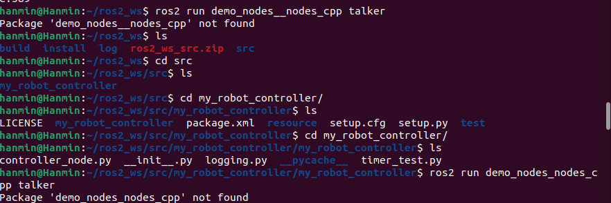
```bash
실제로 안의 이미지를 보면
명령어를 입력했을때 (파일명을 잘못입력함 -> 그랬어도 오류가 난다. 그 폴더내에는 실행파일 미존재)

ros2 run demo_nodes_cpp talker(listener)

검색했을때

error : Package ' demo_nodes_cpp talker not found
보이지 않는다며 오류를 냅니다.
```

## sudo find /opt -name "demo_node_cpp*"

전체경로(최상위 루트 부터 찾기)
```bash
find / -name "test.txt" 
최상위 경로에서 test.txt 찾기
```

현재 있는 폴더에서부터 탐색
```bash
find , -name "*.log" 
현재 폴더에서 뒤에 log로 끝나는 파일찾기
```

```bash
현재 상태를 쭉 훑어보면 
sudo find /opt -name "demo_code_cpp*" 
관리자 권한으로 /opt 라는 경로에서부터 시작해서 demo_code_cpp 의 모든 파일을 다 search 하세요.
```

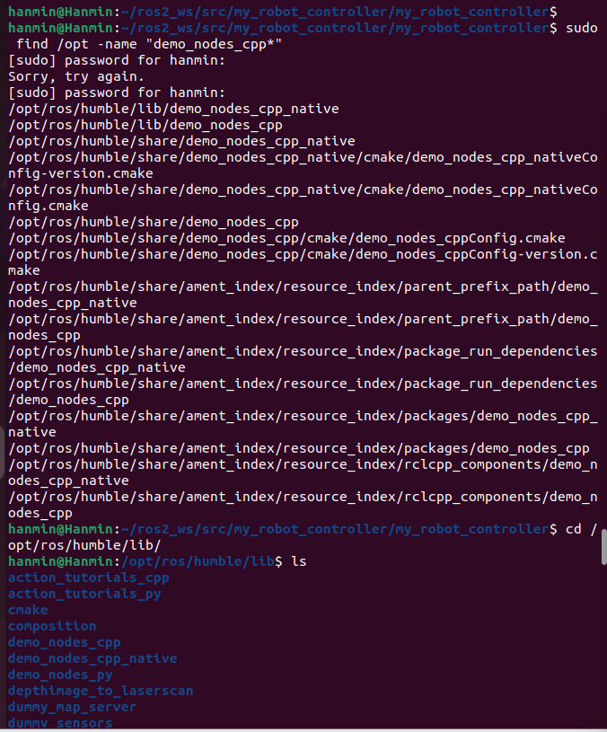
밑에 demo_node_cpp 라고해서 파란색 글씨로 되어있죠?

### !!linux 글자색깔별 의미 집중!!
```bash
리눅스는 글자별로 폴더나 파일을 명을 나타내게 됩니다.
여기서 저희는 linux 화면을 보면 알수있듯이

흰색색글자 : 정보(notice), 경로 등등 일반파일
파란색글자 : Directory(폴더)
하늘색글자(청록색) : Symbolik link
초록색글자 : 실행파일
노란색글자 : 정지파일
분홍색/자주색글자 : 이미지 파일 또는 소켓 파일
빨간색글자 : 압축 파일 및 아카이브(.tar, .gz, .zip)
```

## 확인했으니 다시 시작!
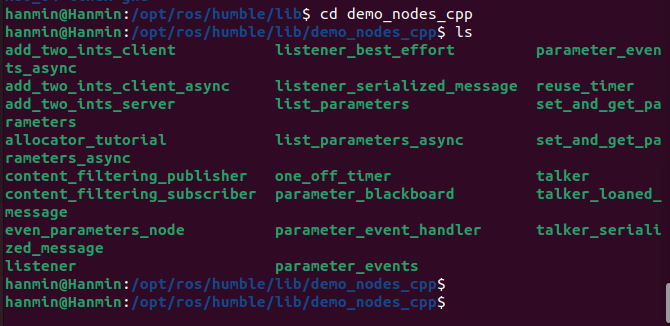
여기보면 초록색 파일로 talker, listener 가 존재합니다.
한번 실행시켜 봅시다

```bash
ros2 run demo_nodes_cpp talker
ros2 run demo_nodes_cpp listener

입력해봅시다(터미널은 2개로 동작 )
```

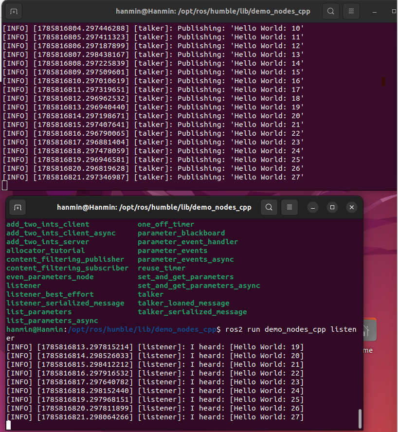
동작 성공입니다 그러면 우리 터미널 하나만 더열어서

```bash
rqt_graph 
명령어를 통해서 노드들의 유기적인 상관관계를 다이어그램으로 봅시다.
```

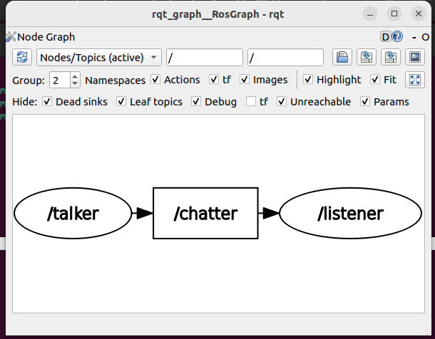

```bash
- 모드 변경 : nodes only -> nodes/Topics (active)
- 확인 내용:
    - /talker -> /chatter -> /listener
    - 화살표 방향 : Publisher -> Topic -> Subsciber

★의미:
- talker가 /chatter 토픽에 메세지를 발행
- listener가 해당 메세지를 구독
```

## Topic 목록 확인
```bash
ros2 topic list

예상출력 결과:
/chatter
/parameter_events
/rosout
```

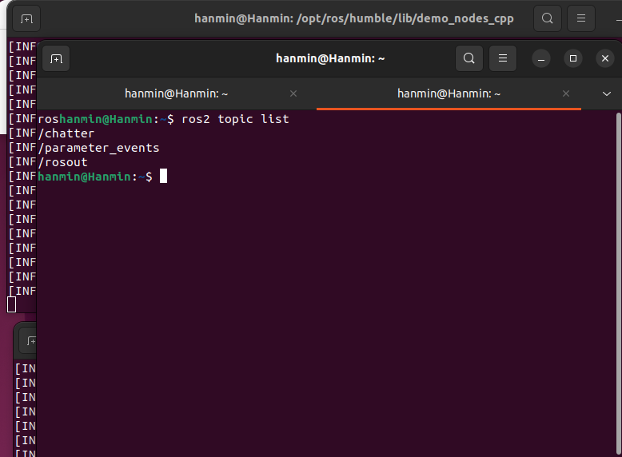

각각의 설명을 볼까요?

```
- /chatter
- std_msgs/msg/String
- talker가 메세지를 발행(Publish)
- listener가 메세지를 구독(Subscribe)

ex)
Hello World : 1
Hello World : 2
Hello World : 3
.
.
.
Hello World : n

이런 데이터들이 계속해서 전송되고 통신된다.
```
---

```

- /parameter_events
이건 노드의 파라미터(Parameter)가 변경될 때 알려주는 토픽이다.
ROS2 의 모든 노드는 설정값(Parameter)을 가질 수 있다.

ex)
카메라 FPS = 30
속도 = 0.5
센서 사용 여부 = true

이런 값들이 전부 Parameter이다.

만약 실행 중에
속도 : 0.5 -> 1.0
변경되면 그 변경사실을
/parameter_events
토픽으로 모든 노드에게 알려준다.

즉,
Parameter 변경
        |
        ▼
/Parameter_events
        |
        ▼
필요한 노드들이 변경 내용을 확인

쉽게 말하면
"설정값이 바뀌었다" 라는걸 알려주는 방송채널
이라고 생각하면 된다.
```
```bash
- 파라미터 바뀌는 예시
/parameter_events 는 노드의 파라미터(설정값)가 변경될 때 변경 내용을 전달하는 시스템 토픽이다. 예를 들어 tutlesim 에서 다음 명령으로 배경색 파라미터를 변경하면, 해당 변경 이벤트가 /parameter_events 토픽을 통해 전달된다.

ros2 param set /turtlesim background_r 255

설명 : background_r 값이 69 -> 255 변경됬다는 정보가
/parameter_events 에 게시(publish)된다.

```


---
```
- /rosout
로그(log)를 출력하기 위한 "토픽"
ex)
python
self.get_logger().info("Hello")

를 작성하면, 터미널에도 출력되고
[INFO] Hello
동시에
/rosout
토픽에도 게시된다

그렇기 떄문에
ros2 topic echo /rosout
를 실행하면

name: talker
msg : publishing : Hello World: 10
level: INFO
같은 로그들이 계속 출력된다.

```

---

## ROS2 기본 메세지 타입
ROS2에서 자주 사용하는 기본 메세지:
```
| 메세지 타입               |        설명        |
------------------------------------------------
|std_msgs/msg/String      |        문자열       |
------------------------------------------------
|std_msgs/msg/int32       |        정수         |
------------------------------------------------
|std_msgs/msg/float32     |        실수         |
------------------------------------------------
|geometry_msgs/msg/Twist  |        로봇 속도     |
------------------------------------------------
|sensor_msgs/msg/Image    |        이미지        |
------------------------------------------------

## Publisher /Subscriber 변화 실험
talker 1 / listener 2
publisher : 1
Subscriber : 2

-> 하나의 데이터를 여러노드가 동시에 수신가능

---
talker 2 / listener 1
publisher : 2
Subscriber : 1

-> 여러 노드가 하나의 토픽에 데이터를 보낼 수 있음

---
talker 2 / listener 2
publisher : 2
Subscriber : 2
-> 다대다 통신 구조 가능

---
```bash
★핵심 정리:
ROS2 Topic은 1:1 구조만이 아닌 N구조 통신을 구현할수 있다.
```

---

## 다대다 구현
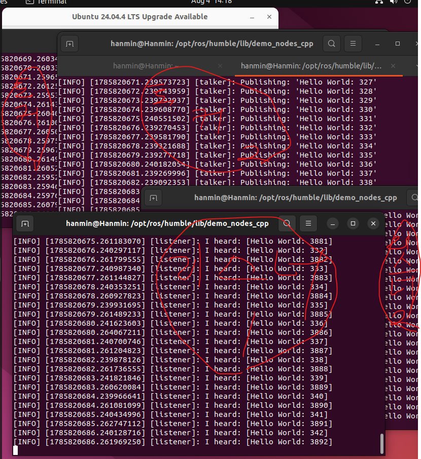
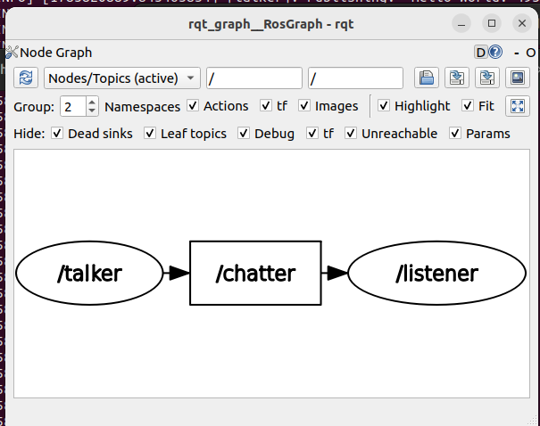
근데 뭐가 좀 이상해요 왜냐하면 지금 n:n으로 
talker:2, listener:2 각각 2개씩 노드를 만들었는데 그래프에는 하나밖에 안뜨는데 이유를 알아봅시다

```bash
demo_nodes_cpp의 talker를 두 번 실행하면 두 프로세스 모두 기본 노드 이름이 /talker이고, listener도 둘 다 /listener로 실행된다. rqt_graph는 같은 이름의 노드를 하나로 묶어 표시할 수 있어서 각각 따로 보이지 않는다.

각 노드를 따로 보이게 하려면 실행할 때 이름을 변경해야 한다.

ros2 run demo_nodes_cpp talker --ros-args -r __node:=talker1
ros2 run demo_nodes_cpp talker --ros-args -r __node:=talker2

ros2 run demo_nodes_cpp listener --ros-args -r __node:=listener1
ros2 run demo_nodes_cpp listener --ros-args -r __node:=listener2

그 후 rqt_graph를 새로고침하면 다음처럼 각각 표시된다.

/talker1 ─┐
          ├──> /chatter ──> /listener1
/talker2 ─┘               └─> /listener2

정리하면:

동일한 실행 파일을 여러 번 실행해도 노드 이름이 같으면 rqt_graph에서 하나처럼 표시될 수 있다. __node 리매핑으로 각 노드 이름을 다르게 지정하면 talker 2개와 listener 2개가 각각 구분되어 표시된다.

```

위의 명시대로 지금 talker와 listner 를 다 끄고 다시 저렇게 동작시켜봅시다.
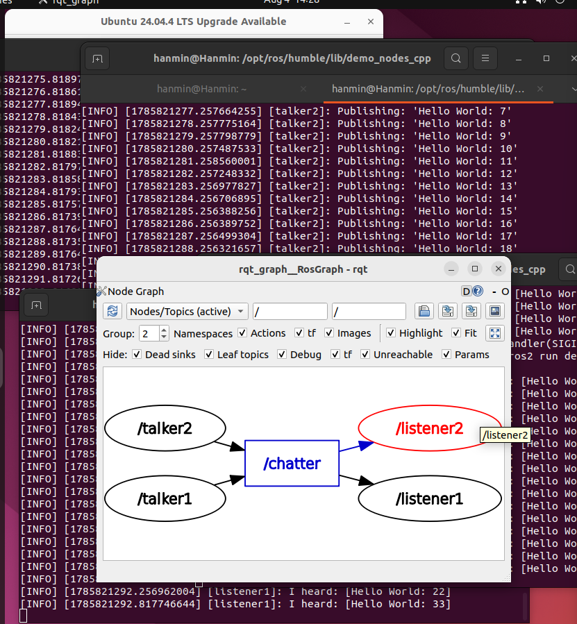

쩔죠? 이건 나도 처음봐서 신기방기 한데 다음이번에는 Turtlesim 가지고 실습해봅시다.

## Turtlesim 실습
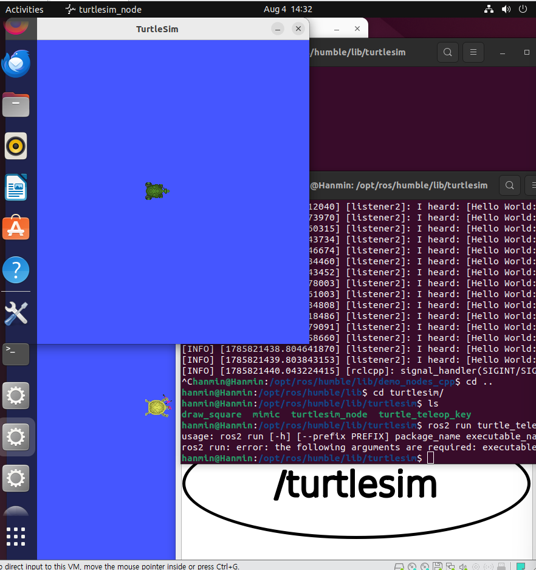
```bash
ros2 run turtlesim turtlesim_node
ros2 run turtlesim turtlesim_node
ros2 run turtlesim turtle_teleop_key

예측 : 키보드 입력시 이제 두개의 turtlesim 이 움직입니다.
이유 : 하나의 /turtle1/cmd_vel 토픽을 두 turtlesim_node가 동시에 구독

오류발생 : ros2 run turtle_teleop_key (명령어 잘못입력)
usage: ros2 run [-h] [--prefix PREFIX] package_name executable_name ...
ros2 run: error: the following arguments are required: executable_name, argv

```

명령어를 제대로 다시 입력해봅시다.
```bash
ros2 run turtlesim turtle_teleop_key
```
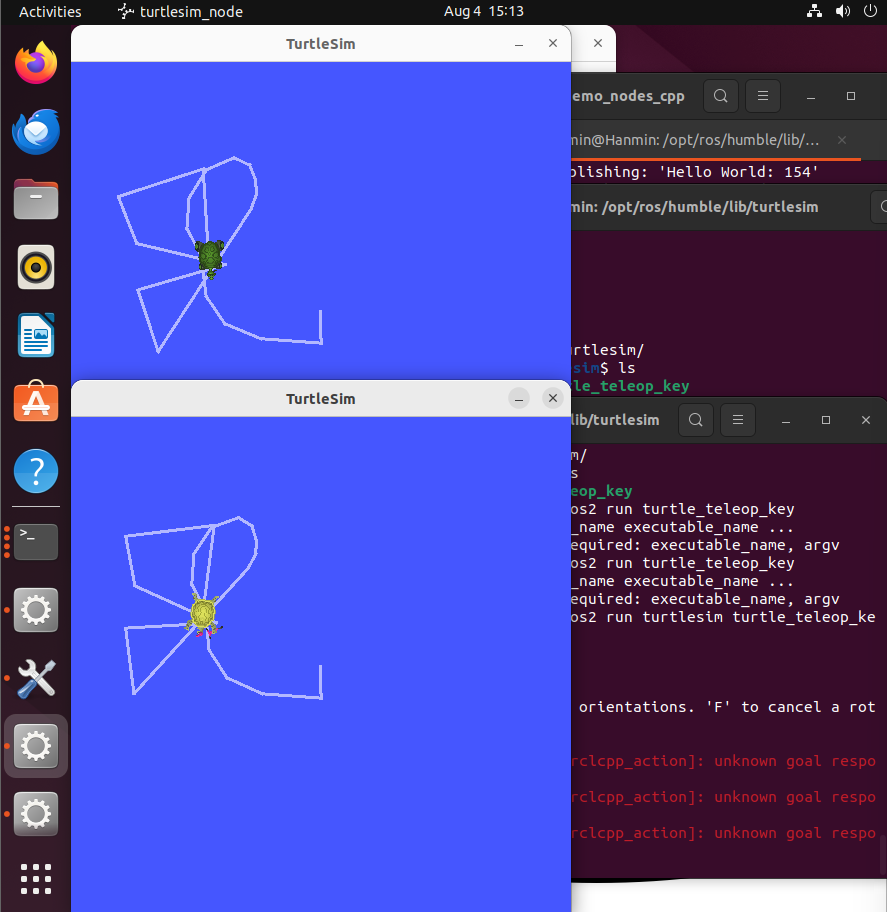
제대로 움직이죠? 그러면 rqt_graph 를 한번 보도록합시다.
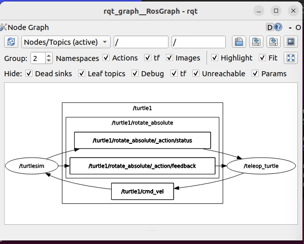
전에 학습했던대로 터틀심들은 유기적인 관계를 통틀어서 동작을 하네요

## /turtle1/cmd_vel 분석
```bash
ros2 topic info /turtle1/cmd_vel

ex) :
Type : geometry_msgs_msg/Twist
Publisher count : 1
Subscription count : 2

```
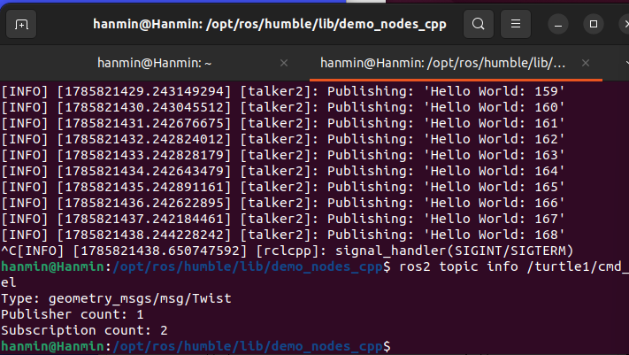

## 토픽 정보

```
항목             |           내용
---------------------------------------------
토픽명           |      /turtle1/cmd_vel
---------------------------------------------
메세지 타입       |     geometry_msgs/msg/Twist
----------------------------------------------
Publisher       |      turtle_teleop_key
----------------------------------------------
Subscriber      |       turtlesim_node(2개)  
-----------------------------------------------
```

## 메세지 내용 확인
ros2 topic echo /turtle1/cmd_vel

출력 ex)
linear:
    x:2.0
angular:
    z:1.0

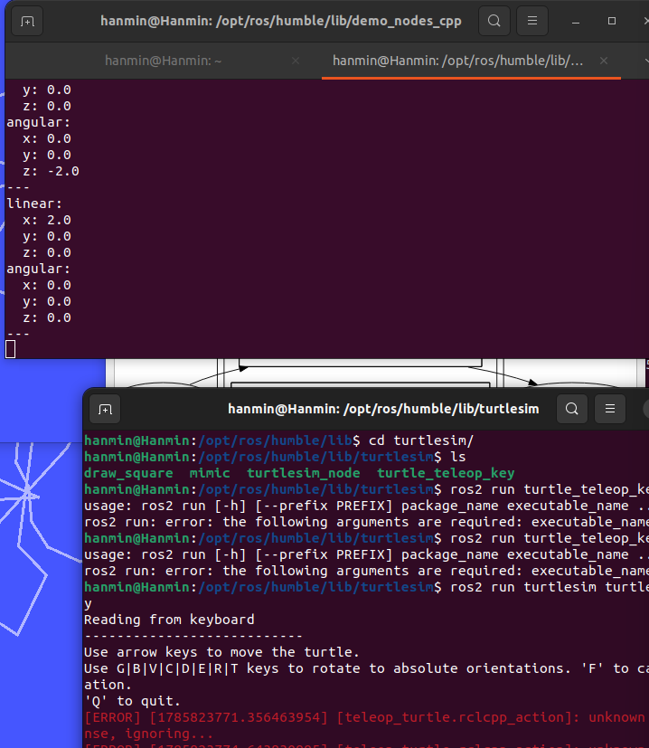 

## 전체 동작 흐름 정리

```
[키보드 입력]
      ↓
[turtle_teleop_key]
      ↓(publish)
  /turtle1/cmd_vel
      ↓(Subscribe)
[turtlesim_node 1]
[turtlesim_node 2]
``` 

★의미:
- 하나의 입력 -> 여러 로봇 동시 제어가능
- Topic 기반 브로드캐스트 구조

## 정리
- ROS2 토픽은 노드간 데이터 전달 통로
- Publisher /Subscriber 구조로 동작
- Topic은 다대다(N) 통신을 지원
- 동일한 토픽을 여러 노드가 동시에 사용가능
- 실시간 데이터 흐름 확인은 "ros2 topic echo" 로 가능

## 결론
```
ROS2 의 Topic 은 단순한 통신 X 
"확정성과 유연성을 가진 분산 메세지 시스템" 이다.
이를 통해:
- 하나의 센서 데ㅣ터를 여러 노드에 할용(할당) 가능
- 여러 제어 노드가 동시에 명령 전달 가능
→ 실제 로봇 시스템에서 매우 중요한 핵심 구조