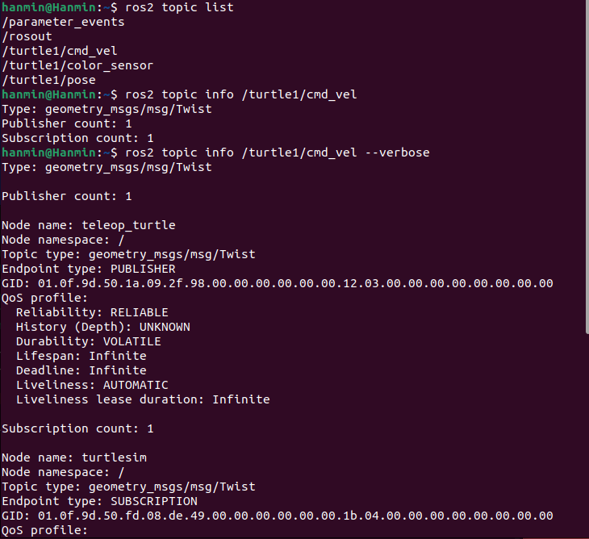
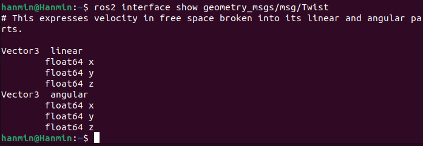

# 8. ROS2 퍼블리셔 구현 및 turtlesim 원운동 제어

## 1. 수행목표

ROS2의 퍼블리셔(Publisher)와 서브스크라이버(Subscriber)의 개념을 이해하고, Python과 `rclpy`를 사용하여 `geometry_msgs/msg/Twist` 메시지를 게시하는 퍼블리셔 노드를 구현한다.

구현한 노드는 turtlesim의 `/turtle1/cmd_vel` 토픽으로 선속도와 각속도를 반복적으로 전송하여 거북이가 원을 그리며 계속 이동하도록 한다.

---

## 2. 개발환경

| 구분 | 내용 |
|---|---|
| 운영체제 | Ubuntu 22.04.x LTS |
| 셸 | Bash |
| ROS2 배포판 | Humble Hawksbill |
| 언어 | Python 3 |
| ROS2 Python 클라이언트 | rclpy |
| 실습 패키지 | turtlesim |
| 메시지 형식 | geometry_msgs/msg/Twist |
| 워크스페이스 예시 | `~/ros2_ws` |
| Python 패키지 예시 | `my_robot_controller` |

> 패키지 이름이 다르면 아래 명령어의 `my_robot_controller`를 실제 패키지 이름으로 변경한다.

---

## 3. ROS2 노드와 토픽 통신

### 3.1 노드(Node)

ROS2에서 노드는 하나의 기능을 담당하는 실행 단위이다.

- `turtlesim_node`: 거북이 시뮬레이터 화면과 움직임을 관리한다.
- `turtle_teleop_key`: 키보드 입력을 받아 이동 명령을 만든다.
- `circle_turtle`: 일정한 선속도와 각속도를 반복적으로 게시한다.

### 3.2 토픽(Topic)

토픽은 노드 사이에서 메시지를 비동기적으로 전달하는 통신 채널이다.

| 역할 | 설명 |
|---|---|
| Publisher | 토픽에 메시지를 게시하는 노드 |
| Subscriber | 특정 토픽의 메시지를 구독하는 노드 |

퍼블리셔와 서브스크라이버는 직접 서로를 호출하지 않는다. 동일한 토픽 이름과 호환되는 메시지 자료형을 이용해 통신한다.

---

## 4. turtlesim_node와 turtle_teleop_key의 관계

`turtle_teleop_key`에서 방향키를 입력하면 이동 명령이 `/turtle1/cmd_vel` 토픽에 게시된다. `turtlesim_node`는 이 토픽을 구독하고 속도 명령에 따라 거북이를 움직인다.

```text
키보드 입력
    ↓
/teleop_turtle
    ↓ Publisher
/turtle1/cmd_vel
geometry_msgs/msg/Twist
    ↓ Subscriber
/turtlesim
    ↓
거북이 이동
```

| 구분 | 노드 또는 토픽 |
|---|---|
| 게시 노드 | `/teleop_turtle` |
| 구독 노드 | `/turtlesim` |
| 토픽 이름 | `/turtle1/cmd_vel` |
| 메시지 형식 | `geometry_msgs/msg/Twist` |

확인 명령:

```bash
ros2 node list
ros2 topic list
ros2 topic info /turtle1/cmd_vel
ros2 topic info /turtle1/cmd_vel --verbose
ros2 interface show geometry_msgs/msg/Twist
```

`Twist`의 구조:

```text
geometry_msgs/Vector3 linear
        float64 x
        float64 y
        float64 z
geometry_msgs/Vector3 angular
        float64 x
        float64 y
        float64 z
```

---

## 5. Twist 메시지의 의미

`Twist`는 선속도와 각속도를 함께 표현한다.

| 속성 | 의미 | turtlesim에서의 사용 |
|---|---|---|
| `linear.x` | x축 방향 선속도 | 전진·후진 |
| `linear.y` | y축 방향 선속도 | 일반적으로 사용하지 않음 |
| `linear.z` | z축 방향 선속도 | 2차원 환경이므로 사용하지 않음 |
| `angular.x` | x축 중심 각속도 | 사용하지 않음 |
| `angular.y` | y축 중심 각속도 | 사용하지 않음 |
| `angular.z` | z축 중심 각속도 | 좌회전·우회전 |

- `linear.x > 0`: 전진
- `linear.x < 0`: 후진
- `angular.z > 0`: 반시계 방향 회전
- `angular.z < 0`: 시계 방향 회전

| `linear.x` | `angular.z` | 움직임 |
|---:|---:|---|
| 0.0 | 0.0 | 정지 |
| 양수 | 0.0 | 직진 |
| 0.0 | 양수 | 제자리 반시계 회전 |
| 0.0 | 음수 | 제자리 시계 회전 |
| 양수 | 양수 | 반시계 방향 원운동 |
| 양수 | 음수 | 시계 방향 원운동 |

원운동 반지름은 다음 관계로 이해할 수 있다.

```text
반지름 r = 선속도 v / 각속도 ω
```

예:

```text
linear.x = 2.0
angular.z = 1.0
r ≈ 2.0
```

---

## 6. circle_turtle.py 구현

파일 위치:

```text
~/ros2_ws/src/my_robot_controller/my_robot_controller/circle_turtle.py
```

전체 코드:

```python
#!/usr/bin/env python3

import rclpy
from rclpy.node import Node
from geometry_msgs.msg import Twist


class CircleTurtle(Node):
    """turtlesim 거북이에게 원운동 속도 명령을 게시하는 노드."""

    def __init__(self):
        super().__init__('circle_turtle')

        self.publisher_ = self.create_publisher(
            Twist,
            '/turtle1/cmd_vel',
            10
        )

        timer_period = 0.1
        self.timer = self.create_timer(
            timer_period,
            self.timer_callback
        )

        self.get_logger().info(
            'circle_turtle 노드가 시작되었습니다.'
        )

    def timer_callback(self):
        msg = Twist()

        msg.linear.x = 2.0
        msg.linear.y = 0.0
        msg.linear.z = 0.0

        msg.angular.x = 0.0
        msg.angular.y = 0.0
        msg.angular.z = 1.0

        self.publisher_.publish(msg)

        self.get_logger().info(
            f'속도 게시: linear.x={msg.linear.x:.1f}, '
            f'angular.z={msg.angular.z:.1f}'
        )


def main(args=None):
    rclpy.init(args=args)
    node = CircleTurtle()

    try:
        rclpy.spin(node)
    except KeyboardInterrupt:
        node.get_logger().info('사용자 입력으로 종료합니다.')
    finally:
        stop_msg = Twist()
        node.publisher_.publish(stop_msg)
        node.destroy_node()

        if rclpy.ok():
            rclpy.shutdown()


if __name__ == '__main__':
    main()
```

### 코드 핵심

```python
self.create_publisher(Twist, '/turtle1/cmd_vel', 10)
```

- 메시지 형식: `Twist`
- 토픽: `/turtle1/cmd_vel`
- QoS 큐 깊이: `10`

```python
self.create_timer(0.1, self.timer_callback)
```

0.1초마다 콜백을 실행하므로 게시 주파수는 약 10 Hz이다.

```python
msg.linear.x = 2.0
msg.angular.z = 1.0
```

전진과 회전을 동시에 수행하여 원을 그린다.

---

## 7. 속성값 변경 실험

| 실험 | `linear.x` | `angular.z` | 결과 |
|---:|---:|---:|---|
| 1 | 2.0 | 0.0 | 직진 |
| 2 | 0.0 | 1.0 | 제자리 반시계 회전 |
| 3 | 0.0 | -1.0 | 제자리 시계 회전 |
| 4 | 2.0 | 1.0 | 반시계 원운동 |
| 5 | 2.0 | -1.0 | 시계 원운동 |
| 6 | 2.0 | 2.0 | 더 작은 원 |
| 7 | 3.0 | 1.0 | 더 큰 원 |
| 8 | -2.0 | 1.0 | 후진하며 회전 |

실험 결과:

- `linear.x`는 전진·후진 속도를 결정한다.
- `angular.z`는 회전 방향과 회전 속도를 결정한다.
- `angular.z`의 절댓값이 커지면 원의 반지름이 작아진다.
- `linear.x`가 커지면 같은 각속도에서 원의 반지름이 커진다.
- `angular.z`의 부호를 바꾸면 회전 방향이 반대로 바뀐다.

---

## 8. package.xml 의존성 추가

의존성을 추가한다는 것은 패키지를 실행하는 데 필요한 다른 ROS2 패키지를 선언하는 것이다.

추가 항목:

```xml
<exec_depend>rclpy</exec_depend>
<exec_depend>geometry_msgs</exec_depend>
<exec_depend>turtlesim</exec_depend>
```

이유:

- `rclpy`: Python ROS2 노드를 작성하고 실행하기 위해 필요하다.
- `geometry_msgs`: `Twist` 메시지를 사용하기 위해 필요하다.
- `turtlesim`: 구현 노드가 turtlesim 실행 환경을 대상으로 동작하므로 필요하다.

`package.xml` 예시:

```xml
<?xml version="1.0"?>
<?xml-model
  href="http://download.ros.org/schema/package_format3.xsd"
  schematypens="http://www.w3.org/2001/XMLSchema"?>

<package format="3">
  <name>my_robot_controller</name>
  <version>0.0.0</version>
  <description>ROS2 Python publisher practice package</description>

  <maintainer email="user@example.com">user</maintainer>
  <license>Apache-2.0</license>

  <exec_depend>rclpy</exec_depend>
  <exec_depend>geometry_msgs</exec_depend>
  <exec_depend>turtlesim</exec_depend>

  <test_depend>ament_copyright</test_depend>
  <test_depend>ament_flake8</test_depend>
  <test_depend>ament_pep257</test_depend>
  <test_depend>python3-pytest</test_depend>

  <export>
    <build_type>ament_python</build_type>
  </export>
</package>
```

> maintainer 이름과 이메일은 기존 파일의 본인 정보로 유지한다.

의존성 설치 확인:

```bash
cd ~/ros2_ws
rosdep install --from-paths src --ignore-src -r -y
```

---

## 9. setup.py entry_points 등록

```python
entry_points={
    'console_scripts': [
        'circle_turtle = my_robot_controller.circle_turtle:main',
    ],
},
```

의미:

```text
circle_turtle = my_robot_controller.circle_turtle:main
│               │                   │             │
│               │                   │             └ 실행 함수
│               │                   └ Python 모듈
│               └ Python 패키지
└ ros2 run에서 사용할 실행 이름
```

---

## 10. 빌드 및 적용

```bash
source /opt/ros/humble/setup.bash

cd ~/ros2_ws

colcon build \
  --packages-select my_robot_controller \
  --symlink-install

source ~/ros2_ws/install/setup.bash
```

등록 확인:

```bash
ros2 pkg executables my_robot_controller
```

예상 출력:

```text
my_robot_controller circle_turtle
```

---

## 11. 실행

### 터미널 1

```bash
source /opt/ros/humble/setup.bash
ros2 run turtlesim turtlesim_node
```

### 터미널 2

```bash
source /opt/ros/humble/setup.bash
source ~/ros2_ws/install/setup.bash

ros2 run my_robot_controller circle_turtle
```

### 터미널 3

```bash
source /opt/ros/humble/setup.bash

ros2 node list
ros2 topic list
ros2 topic info /turtle1/cmd_vel
ros2 topic echo /turtle1/cmd_vel
ros2 topic hz /turtle1/cmd_vel
ros2 node info /circle_turtle
ros2 node info /turtlesim
```

예상 메시지:

```text
linear:
  x: 2.0
  y: 0.0
  z: 0.0
angular:
  x: 0.0
  y: 0.0
  z: 1.0
---
```

---

## 12. rqt_graph 확인 및 저장

turtlesim과 `circle_turtle`이 실행 중인 상태에서:

```bash
source /opt/ros/humble/setup.bash
source ~/ros2_ws/install/setup.bash
rqt_graph
```

rqt_graph에서 표시 모드를 `Nodes/Topics (active)`로 변경한다.

정상 구조:

```text
/circle_turtle
      ↓
/turtle1/cmd_vel
      ↓
/turtlesim
```

저장 파일명:

```text
8_publisher_rqt_graph.png
```

저장 아이콘 사용이 어려우면:

```bash
gnome-screenshot -a \
  -f 8_publisher_rqt_graph.png
```

---

## 13. 문제 해결

### 실행 파일을 찾지 못하는 경우

```text
No executable found
```

다시 빌드:

```bash
cd ~/ros2_ws

rm -rf \
  build/my_robot_controller \
  install/my_robot_controller \
  log

colcon build \
  --packages-select my_robot_controller \
  --symlink-install

source install/setup.bash
```

### 패키지를 찾지 못하는 경우

```bash
source /opt/ros/humble/setup.bash
source ~/ros2_ws/install/setup.bash
ros2 pkg list | grep my_robot_controller
```

### geometry_msgs 오류

```bash
sudo apt update
sudo apt install ros-humble-geometry-msgs
source /opt/ros/humble/setup.bash
```

### 거북이가 움직이지 않는 경우

```bash
ros2 node list
ros2 topic info /turtle1/cmd_vel
ros2 topic echo /turtle1/cmd_vel
```

확인 사항:

- `turtlesim_node`가 실행 중인가?
- `circle_turtle`이 실행 중인가?
- 토픽 이름이 `/turtle1/cmd_vel`인가?
- 메시지 형식이 `geometry_msgs/msg/Twist`인가?
- 워크스페이스의 `install/setup.bash`를 적용했는가?

---

## 14. 워크스페이스 src 압축

```bash
cd ~/ros2_ws

zip -r \
  8_ros2_ws_src.zip \
  src
```

확인:

```bash
unzip -l 8_ros2_ws_src.zip
```

`build`, `install`, `log` 디렉토리는 다시 생성할 수 있으므로 일반적으로 압축하지 않는다.

---

## 15. 제출 디렉토리 구성

```bash
cd ~/프로젝트_루트
mkdir -p 2/8
```

산출물 복사:

```bash
cp 작성한_문서_경로/8_publisher.md 2/8/
cp ~/ros2_ws/8_ros2_ws_src.zip 2/8/
cp 그래프_이미지_경로/8_publisher_rqt_graph.png 2/8/
```

최종 구조:

```text
프로젝트_루트/
└── 2/
    └── 8/
        ├── 8_publisher.md
        ├── 8_publisher_rqt_graph.png
        └── 8_ros2_ws_src.zip
```

확인:

```bash
find 2/8 -maxdepth 2 -type f
```

---

## 16. GitHub 게시

```bash
cd ~/프로젝트_루트

git status

git add \
  2/8/8_publisher.md \
  2/8/8_publisher_rqt_graph.png \
  2/8/8_ros2_ws_src.zip

git commit \
  -m "Add ROS2 publisher assignment"

git push \
  origin \
  "$(git branch --show-current)"
```

비공개 저장소라면 동료 학습자와 평가자에게 접근 권한을 부여한다.

---

## 17. 수행 결과

Python과 `rclpy`를 이용하여 `circle_turtle` 퍼블리셔 노드를 구현하였다.

이 노드는 0.1초마다 `geometry_msgs/msg/Twist` 메시지를 생성하여 `/turtle1/cmd_vel` 토픽에 게시한다. `linear.x`를 2.0, `angular.z`를 1.0으로 설정하여 거북이가 전진과 회전을 동시에 수행하도록 하였으며, turtlesim 화면에서 반시계 방향의 원운동이 지속되는 것을 확인하였다.

`ros2 topic echo /turtle1/cmd_vel` 명령으로 게시되는 메시지를 확인하였고, `ros2 topic hz /turtle1/cmd_vel` 명령으로 약 10 Hz의 게시 주기를 확인하였다.

또한 `rqt_graph`에서 `/circle_turtle` 노드가 `/turtle1/cmd_vel` 토픽을 게시하고 `/turtlesim` 노드가 이를 구독하는 구조를 확인하였다.

---

## 18. 결론

ROS2 토픽 통신은 퍼블리셔가 토픽에 메시지를 게시하고 서브스크라이버가 같은 토픽을 구독하는 비동기 통신 방식이다.

`turtle_teleop_key`와 동일한 `/turtle1/cmd_vel` 토픽에 `Twist` 메시지를 게시하는 Python 노드를 직접 구현함으로써, 키보드 입력 없이도 거북이의 움직임을 지속적으로 제어할 수 있었다.

`Twist`의 `linear.x`는 전진·후진 속도를, `angular.z`는 평면상의 회전 속도와 방향을 결정한다. 두 값을 동시에 설정하면 원운동을 만들 수 있으며, 두 값의 비율에 따라 원의 반지름이 달라진다.

---

## 19. 참고자료

- ROS2 Humble 공식 문서: Writing a simple publisher and subscriber (Python)
- ROS2 Humble 공식 문서: Understanding topics
- ROS2 Humble 공식 문서: Using turtlesim, ros2, and rqt
- ROS2 Humble 공식 문서: Understanding nodes
- ROS2 공식 인터페이스: geometry_msgs/msg/Twist

# 실습
```bash
위의 명령어를 다입력했다
ros2 node list : node의 목록들을 쭉 나열함

ros2 topic list : topic 들의 리스트들 쭉나열
- 여기서 topic은 날라가는 메세지들(feedback 포함)

ros2 topic info /turtle1/cmd_Vel
- command velocity 의 줄임말
  cmd = commad, 명령
  vel = velocity, 속도
  위의 명령어는 turtle에게 이동 속도 명령을 보내는 토픽

ros2 topic info /turtle1/cmd_vel --verbose
- 게시*구독 노드 이름과 QoS 상세정보 
  ros2 : ros2 명령어
  topic : 토픽과관련된 기능
  info : 해당 토픽의 정보확인
  /turtle1/cmd_vel : 확인할 토픽이름
  --verbose : 더 자세히 출력하라는 옵션
  verbose : 영어로 상세한, 장환한 이라는 의미

ros2 interface show geometry_msgs_msg/Twist
- geometry_msgs/msg/Twist 메세지 안에 어떤 변수들이 들어있는지 보여주는것
  ros2 : ROS2 명령어
  interface : ROS2에서 사용하는 메세지*서비스*액션 형식
  show : 내부구조출력
  geometry_msgs/msg/Twist : 확인할 메세지 형식

전체의미:
  geometry_msgs/msg/Twist
    -geometry_msgs : 기하학적 정보를 제공하는 ROS2 패키지
    -msg : 메세지 인터페이스
    -Twist : 선속도&각속도를 담는 메세지 이름

```



---

## Twist 메세지의 의미

Twist는 선속도와 각속도를 함께 의미

## 5. Twist 메시지의 의미

`Twist`는 선속도와 각속도를 함께 표현하는 메시지이다.

| 속성 | 의미 | turtlesim에서의 사용 |
|---|---|---|
| `linear.x` | x축 방향 선속도 | 전진·후진 |
| `linear.y` | y축 방향 선속도 | 일반적으로 사용하지 않음 |
| `linear.z` | z축 방향 선속도 | 2차원 환경이므로 사용하지 않음 |
| `angular.x` | x축을 중심으로 회전하는 각속도 | 사용하지 않음 |
| `angular.y` | y축을 중심으로 회전하는 각속도 | 사용하지 않음 |
| `angular.z` | z축을 중심으로 회전하는 각속도 | 좌회전·우회전 |

- `linear.x > 0 ` : 전진
- `linear.x < 0 ` : 후진
- `linear.z > 0 ` : 반시계 방향 회전
- `linear.z < 0 ` : 시계 방향 회전

| `linear.x` | `angular.z` | 움직임 |
|---|---|---|
| 0.0 | 0.0 | 정지 |
| 양수 | 0.0 | 직진 |
| 0.0 | 양수 | 제자리 반시계 회전 |
| 0.0 | 음수 | 제자리 시계 회전 |
| 양수 | 양수 | 반시계 방향 원운동 |
| 양수 | 음수 | 시계 방향 원운동 |

원운동 반지름은 다음 관계로 이해할 수 있다.
반지름(r) = 선속도 v / 각속도 w
```bash
ex)
linear.x = 2.0
angular.z = 1.0
r ~= 2.0
```

왜이렇게 나오는가?(과제1_6 보기)

r = v/w
는 `로봇이 일정한 선속도와 각속도로 움직일 때 그리는 원의 반지름`을 계산하는식
여기서
- r : 원의반지름
- v : 선속도, 앞으로 이동하는 속도
- w : 각속도, 방향이 회전하는 속도

## 왜 이런 식이 나오는가?
로봇이 원을 따라 움직일 떄 이동한 거리는 원호의 길이로 표현할 수 있어
```bash
s = r*theta
```
- s : 원을 따라 이동한 거리
- r : 원의 반지름
- theta : 회전한 각도, 단위는 라디안
양쪽을 시간 t로 나누면?

```bash
s/t = r*theta / t
```